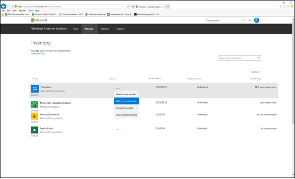
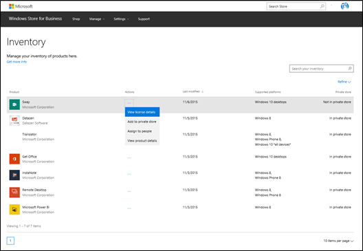
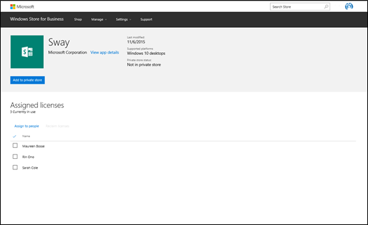
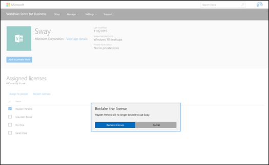

# App inventory management for Windows Store for Business

**Applies to**

-   Windows 10
-   Windows 10 Mobile

You can manage all apps that you've acquired on your **Inventory** page.

The **Inventory** page in Windows Store for Business shows all apps in your inventory. This includes all apps that you've acquired from Store for Business, and the line-of-business (LOB) apps that you've accepted into your inventory. After LOB apps are submitted to your organization, you'll see a notification on your **Inventory** page. On the **New line-of-business apps** page, you can accept, or reject the LOB apps. For more information on LOB apps, see [Working with line-of-business apps](working-with-line-of-business-apps.md).

All of these apps are treated the same once they are in your inventory and you can perform app lifecycle tasks for them: distribute apps, add apps to private store, review license details, and reclaim app licenses.

Store for Business shows this info for each app in your inventory:

-   Name

-   Access to actions for the app

-   Last modified date

-   Supported devices

-   Private store status

### Find apps in your inventory

There are a couple of ways to find specific apps, or groups of apps in your inventory.

**Search** - Use the Search box to search for an app.

**Refine** - Use **Refine** to scope your list of apps by one or more of these app attributes:

-   **License** - Online or offline licenses. For more info, see [Apps in Windows Store for Business](apps-in-windows-store-for-business.md#licensing-model).

-   **Platforms** - Lists the devices that apps in your inventory were originally written to support. This list is cumulative for all apps in your inventory.

-   **Source** - **Store**, for apps acquired from Store for Business, or LOB, for line-of-business apps.

-   **Private store** - **In private store**, or **Not in private store**, depending on whether or not you've added the app to your private store.

### Manage apps in your inventory

Each app in the Store for Business has an online, or an offline license. For more information on Store for Business licensing model, see [Apps in the Windows Store for Business](apps-in-windows-store-for-business.md#licensing-model). There are different actions you can take depending on the app license type. They're summarized in this table.

<table>
<colgroup>
<col width="33%" />
<col width="33%" />
<col width="33%" />
</colgroup>
<thead>
<tr class="header">
<th align="left">Action</th>
<th align="left">Online-licensed app</th>
<th align="left">Offline-licensed app</th>
</tr>
</thead>
<tbody>
<tr class="odd">
<td align="left">
Assign to employees
</td>
<td align="left">
X
</td>
<td align="left"></td>
</tr>
<tr class="even">
<td align="left">
Add to private store
</td>
<td align="left">
X
</td>
<td align="left"></td>
</tr>
<tr class="odd">
<td align="left">
Remove from private store
</td>
<td align="left">
X
</td>
<td align="left"></td>
</tr>
<tr class="even">
<td align="left">
View license details
</td>
<td align="left">
X
</td>
<td align="left"></td>
</tr>
<tr class="odd">
<td align="left">
View product details
</td>
<td align="left">
X
</td>
<td align="left">
X
</td>
</tr>
<tr class="even">
<td align="left">
Download for offline use
</td>
<td align="left"></td>
<td align="left">
X
</td>
</tr>
</tbody>
</table>

 

The actions in the table are how you distribute apps, and manage app licenses. We'll cover those in the next sections. Working with offline-licensed apps has different steps. For more information on distributing offline-licensed apps, see [Distribute offline apps](distribute-offline-apps.md).

### Distribute apps

For online-licensed apps, there are a couple of ways to distribute apps from your inventory:

-   Assign apps to people in your organization.

-   Add apps to your private store, and let people in your organization install the app.

If you use a management tool that supports Store for Business, you can distribute apps with your management tool. Once it is configured to work with Store for Business, your managment tool will have access to all apps in your inventory. For more information, see [Distribute apps with a management tool](distribute-apps-with-management-tool.md).

Once an app is in your private store, people in your org can install the app on their devices. For more information, see [Distribute apps using your private store](distribute-apps-from-your-private-store.md).

**To make an app in inventory available in your private store**

1.	Sign in to the [Store for Business](http://businessstore.microsoft.com).
2.	Click **Manage**, and then choose **Inventory**.
3.	Click **Refine**, and then choose **Online**. Store for Business will update the list of apps on the **Inventory** page.
4.	From an app in **Inventory**, click the ellipses under **Action**, and then choose **Add to private store**.

The value under Private store for the app will change to pending. It will take approximately twelve hours before the app is available in the private store. 

Employees can claim apps that admins added to the private store by doing the following.

**To claim an app from the private store**

1.	Sign in to your computer with your Azure Active Directory (AD) credentials, and start the Windows Store app.
2.	Click the private store tab.
3.	Click the app you want to install, and then click **Install**.

Another way to distribute apps is by assigning them to people in your organization.

If you decide that you don't want an app available for employees to install on their own, you can remove it from your private store.

**To remove an app from the private store**
 
1.  Sign in to the [Store for Business](http://businessstore.microsoft.com).
2.	Click **Manage**, and then choose **Inventory**.
3.	Find an app, click the ellipses under **Action**, and then choose **Remove from private store**, and then click **Remove**.

The app will still be in your inventory, but your employees will not have access to the app from your private store. 

**To assign an app to an employee**

1.	Sign in to the [Store for Business](http://businessstore.microsoft.com).
2.	Click **Manage**, and then choose **Inventory**.
3.	Find an app, click the ellipses under **Action**, and then choose **Assign to people**.
4.	Type the email address for the employee that you're assigning the app to, and click **Confirm**.

Employees will receive an email with a link that will install the app on their device. Click the link to start the Windows Store app, and then click **Install**. Also, in the Windows Store app, they can find the app under **My Library**.

### Manage app licenses

For each app in your inventory, you can view and manage license details. This give you another way to assign apps to people in your organization. It also allows you to reclaim app licenses after they've been assigned to people, or claimed by people in your organization.

**To view license details**

1.  Sign in to [Store for Business](http://go.microsoft.com/fwlink/p/?LinkId=691845)

2.  Click **Manage**, and then choose **Inventory**.

3.  Click the ellipses for and app, and then choose **View license details**.

    

    You'll see the names of people in your organization who have installed the app and are using one of the licenses.

    

    On **Assigned licenses**, you can do several things:

    -   Assign the app to other people in your organization.

    -   Reclaim app licenses.

    -   View app details.

    -   Add the app to your private store, if it is not in the private store.

    You can assign the app to more people in your organization, or reclaim licenses.

    **To assign an app to more people**

    -   Click Assign to people, type the email address for the employee that you're assigning the app to, and click **Assign**.

        

        Store for Business updates the list of assigned licenses.

    **To reclaim licenses**

    -   Choose the person you want to reclaim the license from, click **Reclaim licenses**, and then click **Reclaim licenses**.

        

        Store for Business updates the list of assigned licenses.

### Download offline-licensed app

Offline licensing is a new feature in Windows 10 and allows apps to be deployed to devices that are not connected to the Internet. This means organizations can deploy apps when users or devices do not have connectivity to the Store.

You can download offline-licensed apps from your inventory. You'll need to download these items:

-   App metadata

-   App package

-   App license

-   App framework

For more information about online and offline licenses, see [Apps in the Windows Store for Business](apps-in-windows-store-for-business.md#licensing-model).

For more information about downloading offline-licensed apps, see [Download offline apps](distribute-offline-apps.md).

 

 

