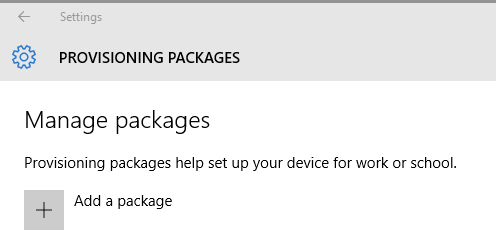
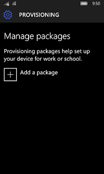
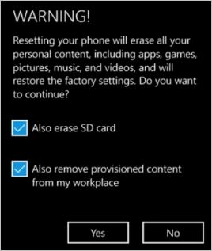

# Configure devices without MDM

**Applies to**

-   Windows 10
-   Windows 10 Mobile

Create a runtime provisioning package to apply settings, profiles, and file assets to a device running Windows 10 Pro, Windows 10 Enterprise, Windows 10 Education, Windows 10 Mobile, or Windows 10 Mobile Enterprise.

Sometimes mobile device management (MDM) isn't available to you for setting up a device because the device isn't connected to your network, or because an employee is remote and needs a fast replacement for a work device. You might not use MDM in your organization at all, but would like an easy way to place a standard configuration on multiple devices.

Rather than wiping a device and applying a new system image, in Windows 10 you can apply a provisioning package at any time. A provisioning package can include management instructions and policies, installation of specific apps, customization of network connections and policies, and more.

You can provide provisioning packages on a network shared folder that employees can access to configure their devices. Or you can put a provisioning package on a USB flash drive or SD card to hand out. 

Provisioning packages are simple for employees to install. And when they remove a provisioning package, policies that the package applied to their device are removed.

## Advantages

-   You can configure new devices without re-imaging.

-   Works on both mobile and desktop devices.

-   No network connectivity required.

-   Simple for people to apply.

-   Ensures compliance and security before a device is enrolled in MDM.

## Typical use cases

-   **Set up a new off-the-shelf device for an employee**

    Package might include edition upgrade, device name, company root certificate, Wi-Fi profile, domain join with service account, or company application.

-   **Configure an off-the-shelf mobile device to be used as a point of sale or inventory terminal**

    Package might include edition upgrade, device name, company root certificate, Wi-Fi profile, security policies, company application, or assigned access (also known as [kiosk mode](set-up-a-device-for-anyone-to-use.md).

-   **Help employees set up personally-owned devices to use for work**

    Package might include company root certificate, Wi-Fi profiles, security policies, or company application.

    **Note**  
    Test to make sure that removing the provisioning package from a personal device removes everything that the package installed. Some settings are not reverted when a provisioning package is removed from the device.

     

-   **Repurpose devices by returning the device to a specific state between users**

    Package might include computer name, company root certificate, Wi-Fi profile, or company application.

    **Note**  
    To return the **Start** menu to a specific state, you must reset the device. When you reset the device, you can apply the provisioning package during the first-run experience.

     

For details about the settings you can customize in provisioning packages, see [Windows Provisioning settings reference]( http://go.microsoft.com/fwlink/p/?LinkId=619012).

## Create a provisioning package 

Use the Windows Imaging and Configuration Designer (ICD) tool included in the Windows Assessment and Deployment Kit (ADK) for Windows 10 to create a runtime provisioning package. [Install the ADK.](http://go.microsoft.com/fwlink/p/?LinkId=526740)

When you run Windows ICD, you have several options for creating your package.

.

- Choose **Simple provisioning** to define a desired configuration in Windows ICD and then apply that configuration on target devices. The simple provisioning wizard makes the entire process quick and easy by guiding an IT administrator through common configuration settings in a step-by-step manner. 
- Choose **Provision school devices** to quickly create provisioning packages that configure settings and policies tailored for students. Learn more about using Windows ICD to provision student PCs (link tb added).
- Choose **Advanced provisioning** to create provisioning packages in the advanced settings editor and include classic (Win32) and Universal Windows Platform (UWP) apps for deployment on end-user devices.

### Using Simple provisioning

1. Open Windows ICD (by default, %windir%\\Program Files (x86)\\Windows Kits\\10\\Assessment and Deployment Kit\\Imaging and Configuration Designer\\x86\\ICD.exe).
2. Click **Simple provisioning**.
2. Name your project and click **Finish**.
3. In the **Set up device** step, enter a unique 15-character name for the device. For help generating a unique name, you can use %SERIAL%, which includes a hardware-specific serial number, or you can use %RAND:x%, which generates random characters of x length.
4. (Optional) You can upgrade the following editions of Windows 10 by providing a product key for the edition to upgrade to.
    - Home to Education
    - Pro to Education
    - Pro to Enterprise
    - Enterprise to Education
    - Mobile to Mobile Enterprise
5.  Click **Set up network**.
6. Toggle **On** or **Off** for wireless network connectivity. If you select **On**, enter the SSID, type, and (if required) password for the wireless network.
7. Click **Enroll into Active Directory**.
8. Toggle **Yes** or **No** for Active Directory enrollment. If you select **Yes**, enter the credentials for an account with permissions to enroll the device. (Optional) Enter a user name and password to create a local administrator account.
    > **Warning**: If you don't create a local administrator account and the device fails to enroll in Active Directory for any reason, you will have to reimage the device and start over. As a best practice, we recommend:
    - Use a least-privileged domain account to join the device to the domain.
    - Create a temporary administrator account to use for debugging or reprovisioning if the device fails to enroll successfully.
    - [Use Group Policy to delete the temporary administrator account](https://blogs.technet.microsoft.com/canitpro/2014/12/10/group-policy-creating-a-standard-local-admin-account/) after the device is enrolled in Active Directory.
9. Click **Finish**.
10. Review your settings in the summary. You can return to previous pages to change your selections. Then, toggle **Yes** or **No** to **Protect your package**. If you select **Yes**, enter a password. This password must be entered to apply this provisioning package.
11. Click **Create**.

### Using Advanced provisioning

1.  Open Windows ICD (by default, %windir%\\Program Files (x86)\\Windows Kits\\10\\Assessment and Deployment Kit\\Imaging and Configuration Designer\\x86\\ICD.exe).
2.  Click **Advanced provisioning**.
3. Choose **New provisioning package**.
3.  Name your project, and click **Next**.
4.  Choose **All Windows editions**, **All Windows desktop editions**, or **All Windows mobile editions**, depending on the devices you intend to provision, and click **Next**.
5.  On **New project**, click **Finish**. The workspace for your package opens.
6.  Configure settings. [Learn more about specific settings in provisioning packages.]( http://go.microsoft.com/fwlink/p/?LinkId=615916)
7.  On the **File** menu, select **Save.**
8.  On the **Export** menu, select **Provisioning package**.
9.  Change **Owner** to **IT Admin**, which will set the precedence of this provisioning package higher than provisioning packages applied to this device from other sources, and then select **Next.**
10. Set a value for **Package Version**.
    > **Tip**  
    You can make changes to existing packages and change the version number to update previously applied packages.
  
11. Optional. In the **Provisioning package security** window, you can choose to encrypt the package and enable package signing.
    -   **Enable package encryption** - If you select this option, an auto-generated password will be shown on the screen.
    -   **Enable package signing** - If you select this option, you must select a valid certificate to use for signing the package. You can specify the certificate by clicking **Select...** and choosing the certificate you want to use to sign the package.
       > **Important**  
        We recommend that you include a trusted provisioning certificate in your provisioning package. When the package is applied to a device, the certificate is added to the system store and any package signed with that certificate thereafter can be applied silently.
        
12. Click **Next** to specify the output location where you want the provisioning package to go once it's built. By default, Windows ICD uses the project folder as the output location.
    Optionally, you can click **Browse** to change the default output location.
13. Click **Next**.
14. Click **Build** to start building the package. The project information is displayed in the build page and the progress bar indicates the build status.
    If you need to cancel the build, click **Cancel**. This cancels the current build process, closes the wizard, and takes you back to the **Customizations Page**.
15. If your build fails, an error message will show up that includes a link to the project folder. You can scan the logs to determine what caused the error. Once you fix the issue, try building the package again.
    If your build is successful, the name of the provisioning package, output directory, and project directory will be shown.
    -   If you choose, you can build the provisioning package again and pick a different path for the output package. To do this, click **Back** to change the output package name and path, and then click **Next** to start another build.
    -   If you are done, click **Finish** to close the wizard and go back to the **Customizations Page**.
16. Select the **output location** link to go to the location of the package. You can provide that .ppkg to others through any of the following methods:
    -   Shared network folder
    -   SharePoint site
    -   Removable media (USB/SD)
    -   Email
    -   USB tether (mobile only)

Learn more: [Build and apply a provisioning package](http://go.microsoft.com/fwlink/p/?LinkID=629651)

## Apply package

On a desktop computer, the employee goes to **Settings** &gt; **Accounts** &gt; **Work access** &gt; **Add or remove a management package** &gt; **Add a package**, and selects the package to install. The user can also add a provisioning package simply by double-clicking the .ppkg file in email, in local storage, on removable media, or at a URL.

On a mobile device, the employee goes to **Settings** &gt; **Accounts** &gt; **Provisioning.** &gt; **Add a package**, and selects the package on removable media to install. The user can also add a provisioning package simply by double-tapping the .ppkg file in email.

## Manage a package

-   Users can view details or delete package (if policy allows deletion); only user-installed packages are listed.

-   Deleting a package removes settings, profiles, certificates, and apps it contains.

-   Use policies to disable manual deletion of packages, installation of unsigned packages, or the installation of any additional packages.

-   Update content by installing a new package with same name and new version number.

-   Optionally, keep packages when you reset a mobile device. When you reset a desktop, runtime packages are removed.

    

## Learn more

-   [Provisioning Windows 10 Devices with New Tools](http://go.microsoft.com/fwlink/p/?LinkId=615921)

-   [Windows 10 for Mobile Devices: Provisioning Is Not Imaging](http://go.microsoft.com/fwlink/p/?LinkId=615922)

 

 

