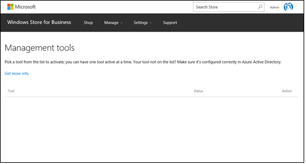

# Configure an MDM provider

**Applies to**

-   Windows 10
-   Windows 10 Mobile

For companies or organizations using mobile device management (MDM) tools, those tools can synchronize with Windows Store for Business inventory to manage apps with offline licenses. Store for Business management tool services work with your third-party management tool to manage content.

Your management tool needs to be installed and configured with Azure AD, in the same directory that you are using for Store for Business. Once that's done, you can configure it to work with Store for Business

**To configure a management tool in Azure AD**

1.  Sign in to the Azure Portal as an Administrator.

2.  Click **Active Directory**, and then choose your directory. 

3.  Click **Applications**, find the application, and add it to your directory.

After your management tool is added to your Azure AD directory, you can configure it to work with Store for Business.

**To configure a management tool in Store for Business**

1.  Log in to Store for Business.

2.  Click **Settings**, and then choose **Management tool**.

    You'll see a list of available MDM tools.

    

3.  Choose the MDM tool you want to synchronize with Store for Business, and then click **Activate.**

Your MDM tool is ready to use with Store for Business. Consult docs for your management tool to learn how to distribute apps from your synchronized inventory.

 

 

