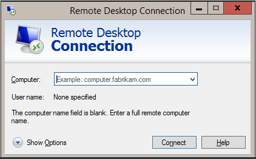
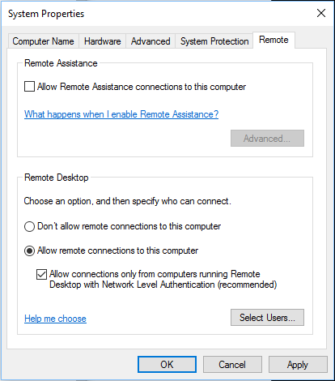

# Connect to remote Azure Active Directory-joined PC

**Applies to**

-   Windows 10

From its release, Windows 10 has supported remote connections to PCs that are joined to Active Directory. Starting in Windows 10, version 1607, you can also connect to a remote PC that is joined to Azure Active Directory (Azure AD).

## Set up

- Both PCs (local and remote) must be running Windows 10, version 1607. Remote connection to an Azure AD-joined PC that is running earlier versions of Windows 10 is not supported.

- On the PC that you want to connect to:
  1. Open system properties for the remote PC. 
  2. Enable **Allow remote connections to this computer** and select **Allow connections only from computers running Remote Desktop with Network Level Authentication**. 

   

  3. If the user who joined the PC to Azure AD is the only one who is going to connect remotely, no additional configuration is needed. To allow additional users, click **Select Users**.
  4. Enter **Authenticated Users**, then click **Check Names**. If the **Name Not Found** window opens, click **Locations** and select this PC.

-  A windows RS1 feature called ‘Remote CredGuard’ must be disabled on the client
 
## Supported configurations
 
Federated Organizations
-          RDP from domain joined device to AAD joined device using
o   Password
o   Smartcards
o   Password for Work (PFW) if the organization has their domain managed by SCCM
-          RDP from AAD device to domain joined device when the AAD joined device is on the corp network using
o   Password
o   Smartcards
o   PFW if the organization has a MDM subscription. MDM enrolls for certificates here
o   PFW without MDM subscription, requires at least some Server 2016 DCs and AAD key-back sync. On the client side X509Hints reg key needs to be enabled (SOFTWARE\Policies\Microsoft\Windows\SmartCardCredentialProvider\X509HintsNeeded to 1). When the PFW Credential provider comes up it will have the UserName Hint dialog box. Here the NT4 style name for the user like <domainName>\<username> should be entered. Please check with Venkatesh/Karanbir if this will be supported for this release
-          RDP between 2 AAD joined devices using
o   Password
o   Smartcard
o   Passport for Work(PWF) with or without MDM subscription
 
Non-Federated Organizations, Pure AAD
-          RDP between 2 AAD joined devices using
o   Password
o   Passport for Work(PWF) with or without MDM subscription

## Related topics

 

 

