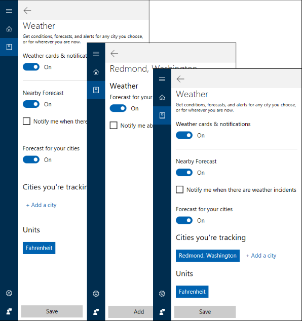
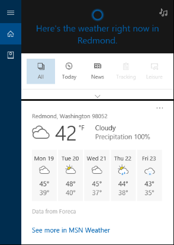
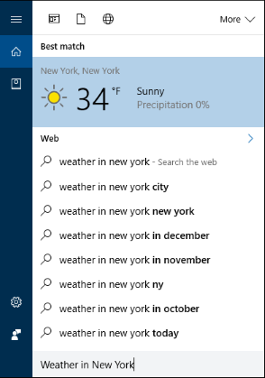

# Testing scenarios using Cortana in your business or organization
**Applies to:**

-   Windows 10, Windows Insider Program 
-   Windows 10 Mobile, Windows Insider Program

We've come up with a list of suggested testing scenarios that you can use to test Cortana in your organization. After you complete all the scenarios, you should be able to:

- Sign-in to Cortana using Azure AD, manage entries in the notebook, and search for content across your device, Bing, and the cloud, using Cortana.

- Set a reminder and have it remind you when you’ve reached a specific location.

- Search for your upcoming meetings on your work calendar.

- Send an email to a co-worker from your work email app.

- Use WIP to secure content on a device and then try to manage your organization’s entries in the notebook.

>[!IMPORTANT]
>The data created as part of these scenarios will be uploaded to Microsoft’s Cloud to help Cortana learn and help your employees. This is the same info that Cortana uses in the consumer offering.

## Test Scenario 1: Sign-in to Azure AD and use Cortana to manage the notebook
This scenario turns on Azure AD, letting your employee use Cortana to manage an entry in the notebook.

**To turn on Azure AD**
1.	Click on the **Cortana** icon in the taskbar, click the **Notebook**, and then click **About Me**.

2.	Click your email address.

    A dialog box appears, showing the associated account info.

3.	Click your email address again, and then click **Sign out**.

    This signs out the Microsoft account, letting you continue to add and use the Azure AD account.

4.	Click the **Search** box and then the **Notebook** icon in the left rail. This will start the sign-in request.

5.	Click **Sign-In** and follow the instructions.

6.	When you’re asked to sign in, you’ll need to choose an Azure AD account, which will look like kelliecarlson@contoso.com.

    >[!IMPORTANT]
    >If there’s no Azure AD account listed, you’ll need to go to W**indows Settings > Accounts > Email & app accounts**, and then click **Add a work or school account** to add it.

**To use Cortana to manage the notebook content**
1.	Click on the **Cortana** icon in the taskbar, click the **Notebook**, scroll down and click **Weather**.

2.	In the **Weather** settings, scroll down to the **Cities your tracking** area, and then click **Add a city**.

3.	Add *Redmond, Washington*, double-click the search result, click **Add**, and then click **Save**.

    
 
4.	Click on the **Home** icon and scroll to the weather forecast for Redmond, Washington.

        

## Test Scenario 2: Perform a quick search with Cortana
This scenario helps you perform a quick search using Cortana, both typing and through voice commands.

**To search using Cortana**
1. Click on the **Cortana** icon in the taskbar, and then click in the **Search** bar.

2. Type *Weather in New York*.

    You should see the weather in New York, New York at the top of the search results.

        
 
**To create a reminder for a specific location by using voice commands**
1. Click on the **Cortana** icon in the taskbar, and then click the **Microphone** icon (to the right of the **Search** box).

2.	Say *What's the weather in Chicago?* Cortana tells you and shows you the current weather in Chicago.

        
 	 
## Test Scenario 3: Set a reminder for a specific location
This scenario helps you set up and review a reminder based on a location. For example, reminding yourself to grab your expense report receipts before you leave the house.

>[!NOTE]
>You can set each reminder location individually as you create the reminders, or you can go into the **About me** screen and add both **Work** and **Home** addresses as favorites. Make sure that you use real addresses since you’ll need to go to these locations to complete your testing scenario.
>Additionally, if you’ve turned on the **Meeting & reminder cards & notifications** option (in the **Meetings & reminders** option of your Notebook), you’ll also see your pending reminders on the Cortana **Home** page.

