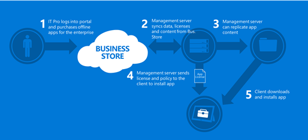
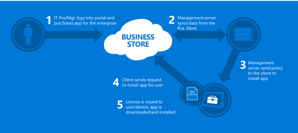

# Distribute apps with a management tool

**Applies to**

-   Windows 10
-   Windows 10 Mobile

You can configure a mobile device management (MDM) tool to synchronize your Store for Business inventory. Store for Business management tool services work with MDM tools to manage content.

Your MDM tool needs to be installed and configured in Azure AD, in the same Azure AD directory used with Windows Store for Business.

In Azure AD management portal, find the MDM application, and then add it to your directory. Once the MDM has been configured in Azure AD, you can authorize the tool to work with the Store for Business. This allows the MDM tool to call Store for Business management tool services. For more information, see [Configure MDM provider](configure-mdm-provider-windows-store-for-business.md).

Store for Business services provide:

-   Services for third-party MDM tools.

-   Synchronize app purchases and updates.

-   Synchronize metadata. For offline-licensed apps, also synchronize offline app package and offline licenses.

-   The ability to download offline-licensed apps from Store for Business.

MDM tool requirements:

-   Must be an Azure Active Directory (AD) application to authenticate against the Store for Business services.

-   Must be configured in Azure AD, and Store for Business.

-   Azure AD identity is required to authorize Store for Business services.

## Distribute offline-licensed apps

If your vendor doesn’t support the ability to synchronize applications from the management tool services or cannot connect to the management tool services, your vendor may support the ability to deploy offline licensed applications by downloading the application and license from the store and then deploying the app through your MDM. For more information on online and offline licensing with Store for Business, see [Apps in the Windows Store for Business.](apps-in-windows-store-for-business.md#licensing-model)

This diagram shows how you can use a management tool to distribute offline-licensed app to employees in your organization. Once synchronized from Store for Business, management tools can use the Windows Management framework to distribute applications to devices.

## Distribute online-licensed apps

This diagram shows how you can use a management tool to distribute an online-licensed app to employees in your organization. Once synchronized from Store for Business, management tools use the Windows Management framework to distribute applications to devices. For Online licensed applications, the management tool calls back in to Store for Business management services to assign an application prior to issuing the policy to install the application.

## Related topics

[Configure MDM Provider](../manage/configure-mdm-provider-windows-store-for-business.md)

[Manage apps you purchased from the Windows Store for Business with Micosoft InTune](https://technet.microsoft.com/library/mt676514.aspx)

 

 

