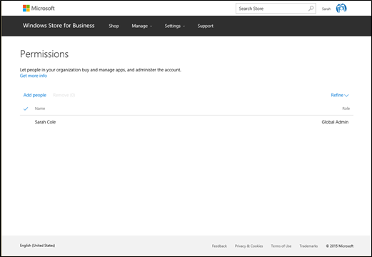
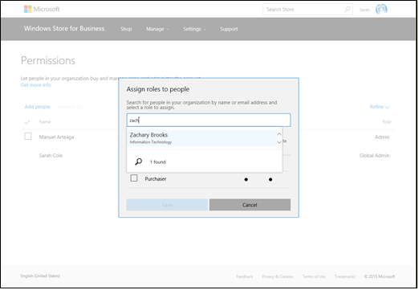

# Roles and permissions in Windows Store for Business

**Applies to**

-   Windows 10
-   Windows 10 Mobile

The first person to sign in to Windows Store for Business must be a Global Admin of the Azure Active Directory (AD) tenant. Once the Global Admin has signed in, they can give permissions to others employees.

Store for Business has a set of roles that help admins and employees manage access to apps and tasks for the Store for Business. Employees with these roles will need to use their Azure AD account to access the Store for Business. Global Administrators and global user accounts that are used with other Microsoft services, such as Azure, or Office 365 can sign in to Store for Business. Global user accounts have some permissions in the Store for Business. Store for Business has a set of roles that help IT admins and employees manage access to apps and tasks for the Store for Business.

### Global user account permissions in Store for Business

This table lists the global user accounts and the permissions they have in the Store for Business.

<table>
<colgroup>
<col width="25%" />
<col width="25%" />
<col width="25%" />
<col width="25%" />
</colgroup>
<thead>
<tr class="header">
<th align="left"></th>
<th align="left">Global Administrator</th>
<th align="left">User Administrator</th>
<th align="left">Billing Administrator</th>
</tr>
</thead>
<tbody>
<tr class="odd">
<td align="left">
Sign up for Store for Business
</td>
<td align="left">
X
</td>
<td align="left"></td>
<td align="left"></td>
</tr>
<tr class="even">
<td align="left">
Assign roles
</td>
<td align="left">
X
</td>
<td align="left">
X
</td>
<td align="left"></td>
</tr>
<tr class="odd">
<td align="left">
Modify company profile settings
</td>
<td align="left">
X
</td>
<td align="left"></td>
<td align="left"></td>
</tr>
<tr class="even">
<td align="left">
Manage Store for Business settings
</td>
<td align="left">
X
</td>
<td align="left"></td>
<td align="left"></td>
</tr>
<tr class="odd">
<td align="left">
Acquire apps
</td>
<td align="left">
X
</td>
<td align="left"></td>
<td align="left">
X
</td>
</tr>
<tr class="even">
<td align="left">
Distribute apps
</td>
<td align="left">
X
</td>
<td align="left"></td>
<td align="left">
X
</td>
</tr>
<tr class="odd">
<td align="left">
Sign policies and catalogs
</td>
<td align="left">
X
</td>
<td align="left"></td>
<td align="left"></td>
</tr>
</tbody>
</table>

 

-   **Global Administrator** - IT Pros with this account have full access to Store for Business. They can do everything allowed in the Store for Business Admin role, plus they can sign up for the Store for Business, and assign Store for Business roles to other employees.

-   **User Administrator** - IT Pros with this account can assign Store for Business roles to other employees, as long as the User Administrator also has the Store for Business Admin role.

-   **Billing Administrator** - IT Pros with this account have the same permissions as the Store for Business Purchaser role.

### Store for Business roles and permissions

Store for Business has a set of roles that help IT admins and employees manage access to apps and tasks for the Store for Business. Employees with these roles will need to use their Azure AD account to access the Store for Business.

This table lists the roles and their permissions.

<table>
<colgroup>
<col width="25%" />
<col width="25%" />
<col width="25%" />
<col width="25%" />
</colgroup>
<thead>
<tr class="header">
<th align="left"></th>
<th align="left">Admin</th>
<th align="left">Purchaser</th>
<th align="left">Device Guard signer</th>
</tr>
</thead>
<tbody>
<tr class="odd">
<td align="left">
Sign up for Store for Business
</td>
<td align="left"></td>
<td align="left"></td>
<td align="left"></td>
</tr>
<tr class="even">
<td align="left">
Assign roles
</td>
<td align="left"></td>
<td align="left"></td>
<td align="left"></td>
</tr>
<tr class="odd">
<td align="left">
Modify company profile settings
</td>
<td align="left"></td>
<td align="left"></td>
<td align="left"></td>
</tr>
<tr class="even">
<td align="left">
Manage Store for Business settings
</td>
<td align="left">
X
</td>
<td align="left"></td>
<td align="left"></td>
</tr>
<tr class="odd">
<td align="left">
Acquire apps
</td>
<td align="left">
X
</td>
<td align="left">
X
</td>
<td align="left"></td>
</tr>
<tr class="even">
<td align="left">
Distribute apps
</td>
<td align="left">
X
</td>
<td align="left">
X
</td>
<td align="left"></td>
</tr>
<tr class="odd">
<td align="left">
Sign policies and catalogs
</td>
<td align="left">
X
</td>
<td align="left"></td>
<td align="left"></td>
</tr>
<tr class="even">
<td align="left">
Sign Device Guard changes
</td>
<td align="left"></td>
<td align="left"></td>
<td align="left">
X
</td>
</tr>
</tbody>
</table>

 

These permissions allow people to:

-   **Manage Store for Business settings** - Manage Store for Business settings:

    -   Account information (view only)

    -   Device Guard signing

    -   LOB publishers

    -   Management tools

    -   Offline licensing

    -   Permissions (view only)

    -   Private store

-   **Acquire apps** - Acquire apps from Store for Business and add them to your inventory.

-   **Distribute apps** - Distribute apps that are in your inventory. You can distribute from inventory, private store, or management tool.

**To assign roles to people**

1.  Sign in to Store for Business.

    **Note**  
    You need to be a Global Administrator, or have the Store for Business Admin role to access the **Permissions** page.

    To assign roles, you need to be a Global Administrator or a Store Administrator that is also a User Administrator.

     

2.  Click **Settings**, and then choose **Permissions**.

    

3.  Click **Add people**, type a name, choose the role you want to assign, and click **Save** .

    

4.  

    If you are not finding the name you want, you might need to add people to your Azure AD directory. For more information, see [Manage user accounts in the Windows Store for Business.](manage-users-and-groups-windows-store-for-business.md)

 

 

