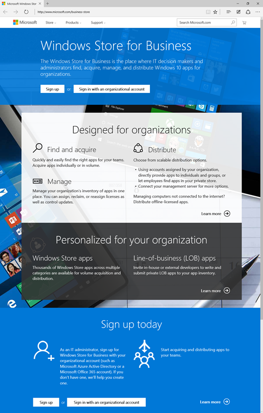
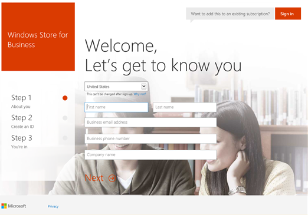
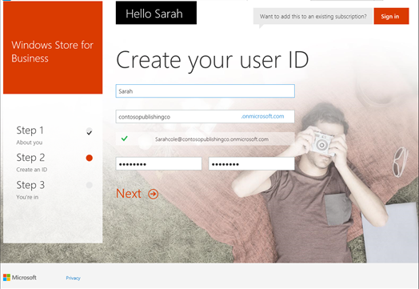
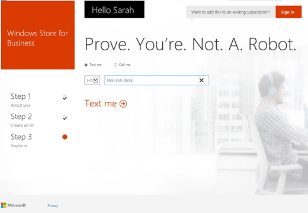
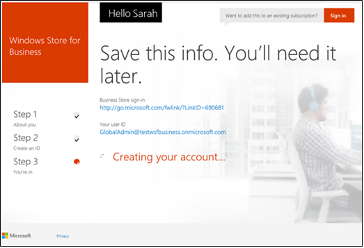
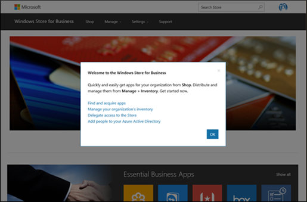

# Sign up for Windows Store for Business

**Applies to**

-   Windows 10
-   Windows 10 Mobile

Before you sign up for Windows Store for Business, at a minimum, you'll need an Azure Active Directory (AD) account for your organization, and you'll need to be the global administrator for your organization. If your organization is already using Azure AD, you can go ahead and sign up for Store for Business. If not, we'll help you create an Azure AD account and directory as part of the sign up process.

## Sign up for Store for Business

Before signing up for the Store for Business, make sure you're the global administrator for your organization.

**To sign up for the Store for Business**

1.  Go to [https://www.microsoft.com/business-store](http://go.microsoft.com/fwlink/p/?LinkId=691845), and click **Sign up**.

    -   If you start the Store for Business sign up process, and don't have an Azure AD directory for your organization, we'll help you create one. For more info, see [Sign up for Azure AD accounts](#o365-welcome).

    <!-- -->

    -   If you already have an Azure AD directory, you'll [sign in to Store for Business](#sign-in), and then accept Store for Business terms.

    

    **To sign up for Azure AD accounts through Office 365 for Business**

    -   Signing up for Store for Business will create an Azure AD directory and global administrator account for you. There are just a few steps.

        Step 1: About you.

        Type the required info and click **Next.**

        

    -   Step 2: Create an ID.

        We'll use info you provided on the previous page to build your user ID. Check the info and click **Next**.

        

    -   Step 3: You're in.

        Let us know how you'd like to receive a verification code, and click either **Text me**, or **Call me**. We'll send you a verification code

        

    -   Verification.

        Type your verification code and click **Create my account**.

        

    -   Save this info.

        Be sure to save the portal sign-in page and your user ID info. Click **You're ready to go**.

        

    -   At this point, you'll have an Azure AD directory created with one user account. That user account is the global administrator. You can use that account to sign in to Store for Business.

2.  Sign in with your Azure AD account.

    

3.  Read through and accept Store for Business terms.

4.  Welcome to the Store for Business. Click **Next** to continue.

    

### Next steps

After signing up for Store for Business, you can:

-   **Add users to your Azure AD directory**. If you created your Azure AD directory during Store for Business sign up, additional user accounts are required for employees to install apps you assign to them, or to browse the private store. For more information, see [Manage user accounts in Store for Business](manage-users-and-groups-windows-store-for-business.md)).

-   **Assign roles to employees**. For more information, see [Roles and permissions in the Windows Store for Business](roles-and-permissions-windows-store-for-business.md).

 

 

