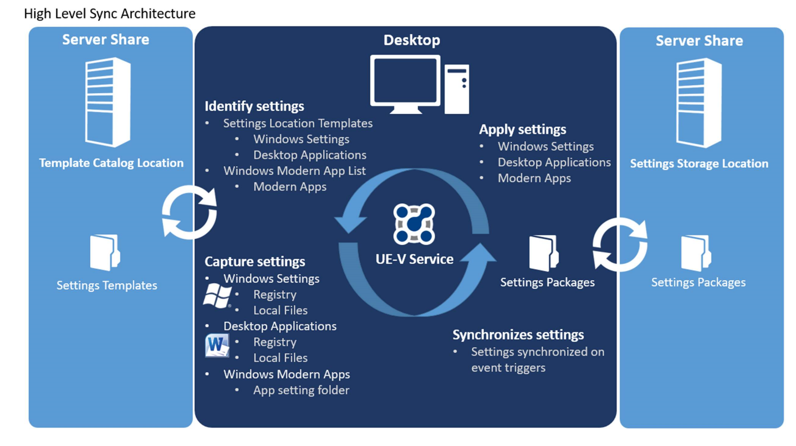

# User Experience Virtualization for Windows 10, version 1607

Many users customize their settings for Windows and for specific applications. Customizable Windows settings include Windows Store appearance, language, background picture, font size, and accent colors. Customizable application settings include language, appearance, behavior, and user interface options. With User Experience Virtualization (UE-V), you can capture user-customized Windows and application settings and store them on a centrally managed network file share. When users log on, their personalized settings are applied to their work session, regardless of which device or virtual desktop infrastructure (VDI) sessions they log on to.

**With UE-V you can…**

-   Specify which application and Windows settings synchronize across user devices

-   Deliver the settings anytime and anywhere users work throughout the enterprise

-   Create custom templates for your third-party or line-of-business applications

-   Recover settings after hardware replacement or upgrade, or after re-imaging a virtual machine to its initial state

## Components of UE-V

The diagram below illustrates how UE-V components work together to synchronize user settings.

<!--  SIMPLER METHOD FOR CODING IMAGE

-->

| **Component**            | **Function**     |
|--------------------------|------------------|
| **UE-V service**    | Enabled on every device that needs to synchronize settings, the **UE-V service** monitors registered applications and Windows for any settings changes, then synchronizes those settings between devices. |
| **Settings packages**                   | Application settings and Windows settings are stored in **settings packages** created by the UE-V service. Settings packages are built, locally stored, and copied to the settings storage location. The setting values for **desktop applications** are stored when the user closes the application. Values for **Windows settings** are stored when the user logs off, when the computer is locked, or when the user disconnects remotely from a computer. The sync provider determines when the application or operating system settings are read from the **Settings Packages** and synchronized. |
| **Settings storage location**           | This is a standard network share that your users can access. The UE-V service verifies the location and creates a hidden system folder in which to store and retrieve user settings.    |
| **Settings location templates**         | UE-V uses XML files as settings location templates to monitor and synchronize desktop application settings and Windows desktop settings between user computers. By default, some settings location templates are included in UE-V. You can also create, edit, or validate custom settings location templates by [managing settings synchronization for custom applications](#manage-settings-synchronization-for-custom-applications). **Note**&nbsp;&nbsp;Settings location templates are not required for Windows applications.   |
| **Universal Windows applications list** | Settings for Windows applications are captured and applied dynamically. The app developer specifies the settings that are synchronized for each app. UE-V determines which Windows applications are enabled for settings synchronization using a managed list of applications. By default, this list includes most Windows applications. You can add or remove applications in the Windows app list by following the procedures in [Managing UE-V Settings Location Templates Using Windows PowerShell and WMI](uev-managing-settings-location-templates-using-windows-powershell-and-wmi.md).  |

## Manage settings synchronization for custom applications

Use these UE-V components to create and manage custom templates for your third-party or line-of-business applications.

| Component                     | Description   |
|-------------------------------|---------------|
| **UE-V template generator**            | Use the **UE-V template generator** to create custom settings location templates that you can then distribute to user computers. The UE-V template generator also lets you edit an existing template or validate a template that was created with a different XML editor.  With the Windows 10, version 1607 release, the UE-V template generator is installed with the [Windows 10 Assessment and Deployment kit](https://developer.microsoft.com/en-us/windows/hardware/windows-assessment-deployment-kit) (Windows ADK).  If you are upgrading from an existing UE-V installation, you’ll need to use the new generator to create new settings location templates. Application templates created with previous versions of the UE-V template generator are still supported, however. |
| **Settings template catalog** | The **settings template catalog** is a folder path on UE-V computers or a Server Message Block (SMB) network share that stores the custom settings location templates. The UE-V service checks this location once a day, retrieves new or updated templates, and updates its synchronization behavior. If you use only the UE-V default settings location templates, then a settings template catalog is unnecessary. For more information about settings deployment catalogs, see [Deploy a UE-V settings template catalog](uev-deploy-uev-for-custom-applications.md#deploycatalogue).  |

<!-- PRESERVING ORIGINAL IMAGE CODING JUST IN CASE - NOTE THAT UPDATED IMAGE IS A PNG FILE

-->

## Settings synchronized by default

UE-V synchronizes settings for these applications by default. For a complete list and more detailed information, see [Settings that are automatically synchronized in a UE-V deployment](uev-prepare-for-deployment.md#autosyncsettings).

-   Microsoft Office 2016, 2013, and 2010

-   Internet Explorer 11, 10, and 9

-   Many Windows applications, such as Xbox

-   Many Windows desktop applications, such as Notepad

-   Many Windows settings, such as desktop background or wallpaper

**Note**
You can also [customize UE-V to synchronize settings](uev-deploy-uev-for-custom-applications.md) for applications other than those synchronized by default.

## Other resources for this feature

-   [Get Started with UE-V](uev-getting-started.md)

-   [UE-V Release Notes](uev-release-notes-1607.md)

-   [Prepare a UE-V Deployment](uev-prepare-for-deployment.md)

-   [Administer UE-V](uev-administering-uev.md)

<!-- Are we keeping the troubleshooting topic? 
-   [Troubleshoot UE-V](uev-troubleshooting.md) 
-->

-   [Technical Reference for UE-V](uev-technical-reference.md)

## Have a suggestion for UE-V?

Add or vote on suggestions [here](http://uev.uservoice.com/forums/280428-microsoft-user-experience-virtualization). For UE-V issues, use the [UE-V TechNet Forum](https://social.technet.microsoft.com/Forums/en-us/home?forum=mdopuev&filter=alltypes&sort=lastpostdesc).
