# Use Update Compliance to monitor Windows Updates

This section describes how to use Update Compliance to monitor Windows Updates and troubleshoot update failures on your network.

Update Compliance: 
- Uses telemetry gathered from user devices to form an all-up view of Windows 10 devices in your organization. 
- Enables you to maintain a high-level perspective on the progress and status of updates across all devices.
- Provides a workflow that can be used to quickly identify which devices require attention. 
- Enables you to track deployment compliance targets for updates.

>Information is refreshed daily so that update progress can be monitored. Changes will be displayed about 24 hours after their occurrence, so you always have a recent snapshot of your devices.

In OMS, the aspects of a solution's dashboard are usually divided into <I>blades</I>. Blades are a slice of information, typically with a summarization tile and an enumeration of the items that makes up that data. All data is presented through <I>queries</I>. <I>Perspectives</I> are also possible, wherein a given query has a unique view designed to display custom data. The terminology of blades, tiles, and perspectives will be used in the sections that follow. 

Update Compliance has the following primary blades: 

1. [OS Update Overview](#os-update-overview)
2. [Overall Quality Update Status](#overall-quality-update-status)
3. [Latest and Previous Security Update Status](#latest-and-previous-security-update-status)
4. [Overall Feature Update Status](#overall-feature-update-status)
5. [CB, CBB, LTSB Deployment Status](#cb-cbb-ltsb-deployment-status)
6. [List of Queries](#list-of-queries)

## OS Update Overview

The first blade of OMS Update Compliance is the General **OS Update Overview** blade: 

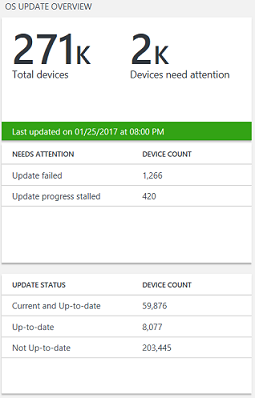

This blade is divided into three sections: 
- Device Summary: 
- Needs Attention Summary
- Update Status Summary

The **Device Summary** displays the total number of devices in your organization. These devices have the commercial ID configured, telemetry enabled, and have sent telemetry to Microsoft within the last 28 days. The tile also shows the devices that Need Attention. 

The **Needs Attention Summary** summarizes devices that require action on your part. There are multiple reasons why a device might need attention, and these reasons are categorized and summarized in the tile. You can view details about devices that are categorized as Needs Attention using a table view. The following **Needs Attention** states are defined:

<TABLE>
<TR><TD BGCOLOR="#cceeff">Needs Attention<TD BGCOLOR="#cceeff" ALIGN=left>Definition
<TR><TD>Out of Support<TD>Total number of devices that are no longer receiving servicing updates
<TR><TD>Update failed<TD>When a device has reported a failure at some stage in its update deployment process, it will report that the Update Failed. You can click on this to see the full set of devices with more details about the stage at which a failure was reported, when the device reported a failure, and other data.
<TR><TD>Missing 2+ Security Updates<TD>Total number of devices that are missing two or more security updates
<TR><TD>Update Progress Stalled<TD>Total number of devices where an update installation has been “in progress” for more than 7 days
</TABLE>

The **Update Status Summary** summarizes your organization's devices per the Windows 10 "Windows as a Service" (WaaS) model. For more information about WaaS, see [Overview of Windows as a service](waas-overview.md). Devices are categorized as: **Current**, **Up-to-date**, and **Not up-to-date**. See the following graphical representation of this model: 

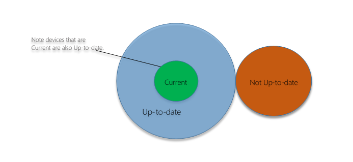

Update Status Summary definitions:

<TABLE>
<TR><TD BGCOLOR="#cceeff">Update Status<TD BGCOLOR="#cceeff" ALIGN=left>Definition
<TR><TD>Current and Up-to-date<TD>A device that is current is on the latest and greatest Microsoft offers. It is on the very newest feature update (ex. The Windows Anniversary Update, RS1), on the very latest quality update for its servicing branch.
<TR><TD>Up-to-date<TD>A device that is up-to-date is on the latest quality update for its servicing option (CB, CBB, LTSB), and the device is running an OS that is supported by Microsoft.
<TR><TD>Not up-to-date<TD>A device does not have the latest quality update for its servicing option.  
</TABLE>

## Overall Quality Update Status

**Overall Quality Update Status** is the second blade in Update Compliance. It has a donut data tile and lists the breakdown of the Up-to-date status of devices pivoted on OS version. See the following example: 

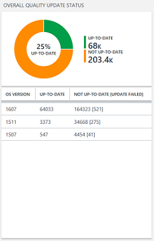

The donut tile offers a summary of all devices in your organization, divided into **Up-to-date** and **Not up-to-date**. Recall that devices that are current are also up-to-date.

The list view contains the breakdown of Up-to-date, Not up-to-date, and Update failed, all pivoted on OS version (e.g., 1507, 1511, 1607). Clicking on any of the rows of this list view will display the **OS Quality Update Summary Perspective** for that OS version. 
 
 
## Latest and Previous Security Update Status

Security updates are extremely important to your organization, so in addition to an overall view of Quality Updates, the deployment status for the latest two security updates are displayed for each supported OS build offered by Microsoft. 

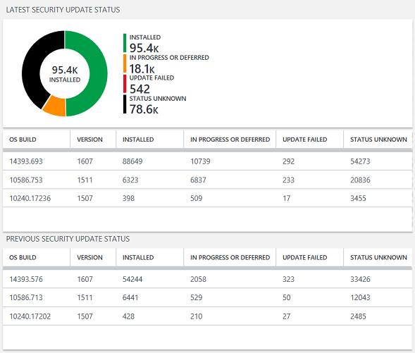

For the latest security update, a doughnut chart is displayed across all OS builds with a count of installed, in progress/deferred, update failed, and unknown status relative to that update. Two table views are provided below the doughnut displaying the same breakdown for each OS build supported by Microsoft. 

See the following definitions:

<TABLE>
<TR><TD BGCOLOR="#cceeff">Term<TD BGCOLOR="#cceeff" ALIGN=left>Definition
<TR><TD>OS Build<TD>The OS build + Revision for the OS Version. The build + revision is a one-to-one mapping of the given security update in this context.
<TR><TD>Version<TD>The OS Version corresponding to the OS build.
<TR><TD>Installed<TD>The count of devices that have the given security update installed. In the case that the latest security update is not latest quality update (that is, an update has since been released but it did not contain any security fixes), then devices that are on a newer update will also be counted.
  For the previous security update, a device will display as **Installed** until it has at least installed the latest security update.
<TR><TD>In Progress or Deferred<TD>The count of devices that are either currently in the process of installing the given security update, or are deferring the install as per their WUFB policy.
   All devices in this category for Previous Security Update Status are missing 2 or more security updates, and therefore qualify as needing attention.
<TR><TD>Update Failed<TD>The count of devices that were **In Progress** for the given security update, but failed at some point in the process. They will no longer be shown as **In Progress or deferred** in this case, and only be counted as **Update failed**.
<TR><TD>Status Unknown<TD>If a device should be, in some way, progressing toward this security update, but it’s status cannot be inferred, it will count as **Status Unknown**. Devices that are not using Windows Update are the most likely devices to fall into this category.
</TABLE>

## Overall Feature Update Status

Windows 10 has two main update types: Quality and Feature updates. The third blade in Update Compliance provides the most essential data about your organization’s devices for feature updates. 

Microsoft has developed terms to help specify the state of a given device for how it fits into the Windows as a Service (WaaS) model. There are three update states for a device: 
- Current 
- Up-to-date
- Not up-to-date

See the **Update Status Summary** description under [OS Update Overview](#os-update-overview) in this guide for definitions of these terms. 

The Overall Feature Update Status blade focuses around whether or not your devices are considered Current. See the following example:

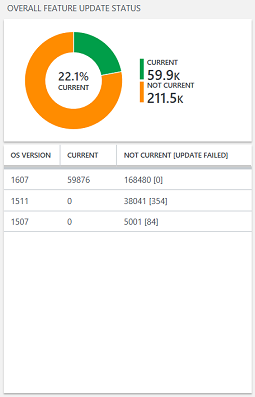

Devices are evaluated by OS Version (e.g., 1607) and the count of how many are Current, Not Current, and have Update Failures is displayed. Clicking on any of these counts will allow you to view all those devices, as well as select the **Update Deployment Status** perspective, described below. 

## CB, CBB, LTSB Deployment Status

Following the overview with respect to how current your organization’s devices are, there are three tables that show feature update deployment for all devices. The devices are split up by which branch they are on, as this directly impacts whether they are supported (for example, 1607 may be supported under CBB, but not under CB). This allows you a quick glance at how deployment is progressing across your organization with respect to feature updates. 

See the following example:

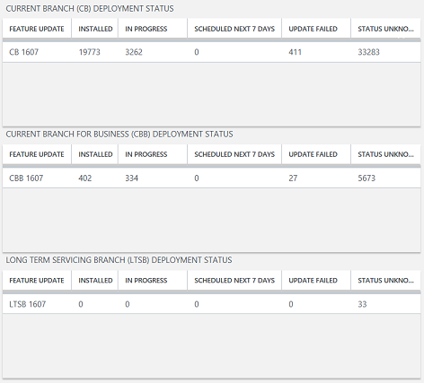

The three tables break down devices by feature update. For each OS version, the following columns provide counts of the possible device states:

<TABLE>
<TR><TD BGCOLOR="#cceeff">Deployment Status<TD BGCOLOR="#cceeff" ALIGN=left>Description
<TR><TD>Feature Update<TD>A concatenation of servicing branch (CB, CBB, LTSB) and OS Version (e.g., 1607)
<TR><TD>Installed<TD>The number of devices that have reported to be on the given servicing train and feature update.
<TR><TD>In progress<TD>The number of devices that have reported to be at some stage in the installation process for the given feature update.
  Example: Device X running CB 1507 could be installing CB 1607. In this example, X would count as both **Installed** for **CB 1507** and **In Progress** for **CB 1607**. 
<TR><TD>Scheduled next 7 days<TD>The total number of devices that are set to have a deferral period expire within 7 days, and after that deferral period expires are targeted to install the given update.
  Example: Device Y running CB 1507 could be scheduled to install CB 1607 in 5 days. In this example, X would count as both **Installed** for **CB 1507** and **Scheduled next 7 days** for **CB 1607**
<TR><TD>Update Failed<TD>The total number of devices that were **In progress** with the installation for the given feature update, but encountered a failure.
  Example: Device X running CB 1507 could be installing CB 1607. X then encounters an error during installation. In this example, X would count as both **Installed** for **CB 1507** and **Update failed** for **CB 1607**, but not as **In progress** for **CB 1607**.
<TR><TD>Status Unknown<TD>For devices not using Windows Update to get updates, some information on deployment progress cannot be known. It is possible to know the current installed Feature Update for a device, but not which devices are **In Progress**, **Scheduled next 7 days**, or devices with **Update Failed**.
  Devices that Update Compliance knows belongs to your organization, but it does not know update failures or installation progress, will be counted here. 
</TABLE>

## Quality Update Perspective

The Quality Update Deployment Status perspective is a breakdown of the most essential data the user should know about the status of their devices with respect to being Up-to-date. The perspective shows a summary of the organization’s devices for one specific OS version, or build. 
 
### Quality Update Build Summary

The build summary blade attempts to summarize the most important data points to the user for the given build. It is divided into two sections. The first section is a summary of devices for that build – the total number of devices, and the amount that need attention. Each row within the table below is a breakdown of why each device requires attention. The rows can be interacted with to be taken to a larger table view that shows detailed information about all the devices that meet the given criteria. See the following example:

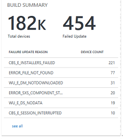

 
### Quality Update Deferral Configurations

The next blade is the Deferral configuration blade, which shows the WUFB Deferral configurations for all devices that are using WUFB and are reporting to Update Compliance. If no information can be gathered from a device or it is not configured to use WUFB, it will show up as **Not configured (-1)**. See the following example:

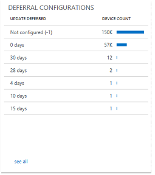

 
### Quality Update Deployment Status

Under the three top-level blades is the deployment status for the newest quality update for the given build. It provides information on the revision number as well as how many days it has been since that revision has been released. See the following example:

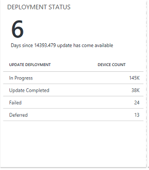

See the following table for a description of last reported states for devices deploying that quality update. 

<TABLE>
<TR><TD BGCOLOR="#cceeff">Deployment State<TD BGCOLOR="#cceeff" ALIGN=left>Description
<TR><TD>Update Completed<TD>When a device has finished the update process and is on the given update, it will display here as **Update completed**.
<TR><TD>In Progress<TD>Devices that are “in progress” installing an update will fall within this category. This category is detailed in the following blade: **Detailed Deployment Status**.
<TR><TD>Deferred<TD>If a device’s WUfB deferral policy dictates that it is not set to receive this update, the device will show as Update deferred.
<TR><TD>Cancelled<TD>A device will report that the update has been cancelled if the user, at some point, cancelled the update on the device.
<TR><TD>Blocked<TD>Devices that are blocked are prevented from proceeding further with the given update. This could be because another update is paused, or some other task on the device must be performed before the update process can proceed.
</TABLE>

### Quality Update Detailed Deployment Status

This blade provides more detail on the deployment process for the update in the Deployment Status blade. This blade is more of a deployment funnel for devices, enabling you to see at a more granular level how devices are progressing along in their deployment. See the following example:

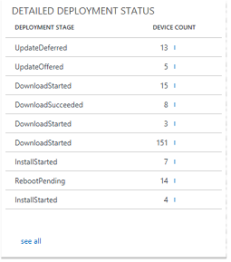

>Devices that are not managed using Windows Update (Windows Update for Business or otherwise) will not have detailed deployment information. 

The following table provides a list of the detailed deployment states a device can report:

<TABLE>
<TR><TD BGCOLOR="#cceeff">Detailed Deployment State<TD BGCOLOR="#cceeff" ALIGN=left>Description
<TR><TD>Update deferred<TD>The WUfB policy of the device dictates the update is deferred. 
<TR><TD>PreDownloadTasksPassed<TD>The device has finished all tasks necessary prior to downloading the update. 
<TR><TD>DownloadStarted<TD>The update has begun downloading on the device. 
<TR><TD>DownloadSucceeded<TD>The device has successfully downloaded the update. 
<TR><TD>PreInstallTasksPassed<TD>The device has downloaded the update successfully, and successfully passed all checks prior to beginning installation of the update. 
<TR><TD>InstallStarted<TD>The device has begun installing the update. 
<TR><TD>RebootRequired<TD>The device has finished installing the update, and a reboot is required before the update can be completed. 
<TR><TD>RebootPending<TD>The device is pending a scheduled reboot before the update can be completed. 
<TR><TD>RebootInitiated<TD>The device has reported to have initiated the reboot process for completing the update. 
<TR><TD>Update completed<TD>The device has completed installing, rebooting, and applying the update. 
</TABLE>

## Feature Update Perspective

Like Quality Updates, the Feature Update Deployment Status perspective is a breakdown of information most essential to an administrator. This information is viewed by clicking on a given build on the Feature Update Status blade and then navigating to the **Update Deployment Status** pane as displayed previously. In Update Compliance, a perspective is assigned to a query; the query used to generate the perspective can be altered to show other information, if desired.

Every piece of data shown in this view can be clicked; when clicked, it will alter the query to focus only on the data you need. If the perspective is not meaningful after the query is altered, you can use the other data views like the List and Table.

>After clicking on an OS version from the Feature Update Status blade, the query must fully load the results before you can select the Update Deployment Status perspective.

### Feature Update Build Summary

The Build Summary blade provides a summary for all devices on the given build. It gives a count of all devices, as well as a count of all devices that need attention. Below the counts, you can see why the devices need attention, with a count of devices that fall into each category. See the following example:

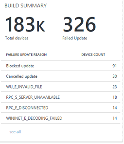

### Feature Update Deferral Configuration

This blade shows all deferral configurations for the devices on the given build. See the following example:

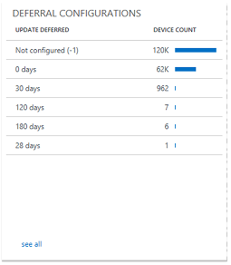

Deferral configurations are WUfB-specific, and are shown as days. Some useful information regarding how deferral configurations are shown:
- The devices are grouped based off what their deferral policy is set at. For feature updates, this can be up to 120 days. 
- A deferral of zero days means the device has WUfB configured, but is set to not defer the update. These devices will be under “0” for the Update Deferred field.
- Devices that are not configured to use WUfB deferral policies have a “-1” for their deferral days. In this table, the devices will show up as “Not Configured (-1)”.  

### Feature Update Deployment Status

As stated earlier in this section, the Feature Updates blade focuses on how Current your devices are. A device is only Current when it is on the latest feature update and quality update Microsoft offers. Thus, the Deployment Status blade displays the deployment status for devices regarding their deployment to the latest feature update. See the following example:

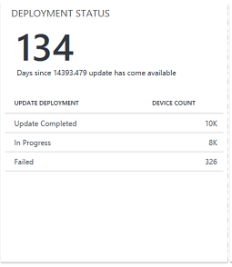

This blade breaks down the main states a device can be in through the deployment of a feature update. The possible states are as follows:

<TABLE>
<TR><TD BGCOLOR="#cceeff">Deployment State<TD BGCOLOR="#cceeff" ALIGN=left>Description
<TR><TD>Update completed<TD>When a device has completely finished the update process and is on the given update, it will show up here as **Update completed**. 
<TR><TD>Inprogress<TD>Devices “in progress” of installing the given update will fall within this category. This category is iterated on with further granularity in the proceeding blade, “Detailed Deployment Status”. 
<TR><TD>Update deferred<TD>If a device’s WUfB deferral policy dictates that it is not set to receive this update yet, the device will show as Update deferred.
<TR><TD>Cancelled<TD>A device will report that the update has been cancelled if the user, at some point, cancelled the update on the device. 
<TR><TD>Blocked<TD>Devices that are blocked are prevented from proceeding further with the given update. This could be because another update is paused, or some other task on the device must be performed before the update process can proceed. 
</TABLE>

### Feature Update Detailed Deployment Status

This blade provides more detail on the deployment process for the update in the Deployment Status blade. This blade is more of a deployment funnel for devices, enabling you to see at a more granular level how devices are progressing along in their deployment. See the following example:

The following table displays all states a device can report:

<TABLE>
<TR><TD BGCOLOR="#cceeff">Detailed Deployment State<TD BGCOLOR="#cceeff" ALIGN=left>Description
<TR><TD>Update deferred<TD>The WUfB policy of the device dictates the update is deferred.
<TR><TD>PreDownloadTasksPassed<TD>The device has finished all tasks necessary prior to downloading the update.
<TR><TD>DownloadStarted<TD>The update has begun downloading on the device.
<TR><TD>DownloadSucceeded<TD>The device has successfully downloaded the update.
<TR><TD>PreInstallTasksPassed<TD>The device has downloaded the update successfully, and successfully passed all checks prior to beginning installation of the update.
<TR><TD>InstallStarted<TD>The device has begun installing the update.
<TR><TD>RebootRequired<TD>The device has finished installing the update, and a reboot is required before the update can be completed.
<TR><TD>RebootPending<TD>The device is pending a scheduled reboot before the update can be completed.
<TR><TD>RebootInitiated<TD>The device has reported to have initiated the reboot process for completing the update.
<TR><TD>Update completed<TD>The device has completed installing, rebooting, and applying the update.
</TABLE>

## List of Queries

Operations Management Suite leverages its powerful Log Analytics querying to perform all data calculations. For this blade, we provide examples of queries that show useful data to the user about their organization’s devices. See the following example:

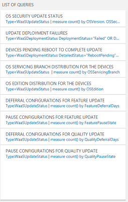

The following **Common queries** are available:

<TABLE>
<TR><TD BGCOLOR="#cceeff">Query Title<TD BGCOLOR="#cceeff" ALIGN=left>Description
<TR><TD>OS Security Update Status<TD>This query provides an all-up view with respect to how many devices are on the latest security update for their OS version. The table will detail an aggregated count of the number of devices, out of the total (so count, or percent) are on the latest security update for their OS build. 
<TR><TD>Update Deployment Failures<TD>This query provides a chart view, displaying an aggregation of all devices that have reported a deployment failure for either feature or quality updates. The aggregation of the data is on the given update for which a given device has reported a deployment failure. 
<TR><TD>Devices pending reboot to complete update<TD>This query will provide a table showing all devices that are at the stage of "Reboot Pending" In the update deployment process.  This query will show devices which are in this state for both feature and quality updates; the data will be organized on precisely which update the given device(s) are pending a reboot to install.
<TR><TD>Servicing Option Distribution for the devices<TD>This query provides a chart view that aggregates all devices seen by the solution on for each servicing option available for Windows 10 devices (CB, CBB, LTSB)
OS Distribution for the devices	This query provides a chart view displaying the distribution of the different editions of Windows 10 that devices seen by the solution are running (e.g., Enterprise, Professional, Education, etc.) 
<TR><TD>Deferral configurations for Feature Update<TD>This query provides a chart view which displays a breakdown of the different Feature Update deferral configurations through WUfB that the devices seen by the solution are using.  The configuration is in days. 0 days means the device has WUfB deferrals configured, but is not set to defer feature updates. -1 means the device has no feature update deferral policies configured. 
<TR><TD>Pause configurations for Feature Update<TD>The WUfB policy 
<TR><TD>Update deferred<TD>This query provides a chart view displaying the breakdown of devices that are either paused, or not paused for feature updates.  “Not configured” means the device is not paused. “Paused” means it is currently paused.
<TR><TD>Deferral configurations for Quality Update<TD>This query provides a chart view which displays a breakdown of the different Quality Update deferral configurations through WUfB that the devices seen by the solution are using.  The configuration is in days. 0 days means the device has WUfB deferrals configured, but is not set to defer quality updates. -1 means the device has no quality update deferral policies configured.
<TR><TD>Pause configurations for Quality Update<TD>This query provides to a chart view displaying the breakdown of devices that are either paused, or not paused for quality updates.  **Not configured** means the device is not paused. **Paused** means it is currently paused. 
</TABLE>