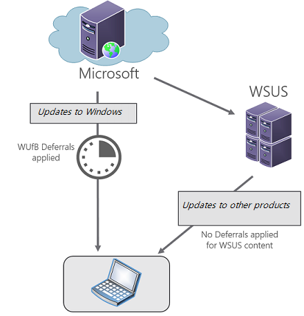
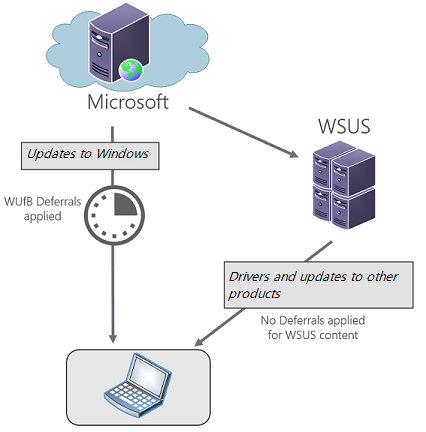
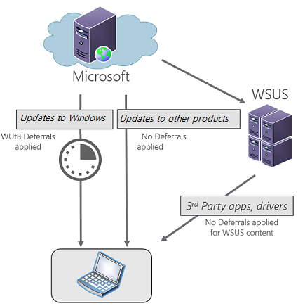

# Integrate Windows Update for Business with management solutions

**Applies to**

- Windows 10
- Windows 10 Mobile

You can integrate Windows Update for Business deployments with existing management tools such as Windows Server Update Services (WSUS) and System Center Configuration Manager.

## Integrate Windows Update for Business with Windows Server Update Services

For Windows 10, version 1607, devices can now be configured to receive updates from both Windows Update and Windows Server Update Services (WSUS).  In a joint WSUS and Windows Update for Business setup:

- Devices will receive their Windows content from Microsoft and defer these updates according to Windows Update for Business policy
- All other content synced from WSUS will be directly applied to the device; that is, non-Windows Updates content will not follow your Windows Update for Business deferral policies

### Configuration example \#1: Deferring Windows Update updates with other update content hosted on WSUS

**Configuration:**

- Device is configured to defer Windows Quality Updates using Windows Update for Business
- Device is also configured to be managed by WSUS
- Device is not configured to include Microsoft Updates from Windows Update (**Update/AllowMUUpdateService** = not enabled)
- Admin has opted to put Microsoft updates on WSUS
- Admin has also put 3rd party drivers on WSUS

<table><thead><th>Content</th><th>Metadata source</th><th>Payload source</th><th>Deferred?</th><th></th></thead>
<tbody><tr><td>Windows Update</td><td>Windows Update</td><td>Windows Update</td><td>Yes</td><td rowspan="3"></td></tr>
<tr><td>Microsoft Update (such as Office updates)</td><td>WSUS</td><td>WSUS</td><td>No</td></tr>
<tr><td>Third-party drivers</td><td>WSUS</td><td>WSUS</td><td>No</td></tr>
</table>

### Configuration example \#2: Excluding drivers from Windows Quality Updates using Windows Update for Business 

**Configuration:**

- Device is configured to defer Windows Quality Updates and to exclude drivers from Windows Update Quality Updates (**ExcludeWUDriversInQualityUpdate** = enabled)
- Device is also configured to be managed by WSUS
- Admin has opted to put Windows Update drivers on WSUS

<table><thead><th>Content</th><th>Metadata source</th><th>Payload source</th><th>Deferred?</th><th></th></thead>
<tbody><tr><td>Windows Update (exclude driver)</td><td>Windows Update</td><td>Windows Update</td><td>Yes</td><td rowspan="4"></td></tr>
<tr><td>Windows Update drivers</td><td>WSUS</td><td>WSUS</td><td>No</td></tr>
<tr><td>Microsoft Update (such as Office updates)</td><td>WSUS</td><td>WSUS</td><td>No</td></tr>
<tr><td>Windows drivers, third-party drivers</td><td>WSUS</td><td>WSUS</td><td>No</td></tr>

</table>

### Configuration example \#3: Device configured to receive Microsoft updates 

**Configuration:**

- Device is configured to defer Quality Updates using Windows Update for Business and to be managed by WSUS
- Device is configured to “receive updates for other Microsoft products” along with Windows Update updates (**Update/AllowMUUpdateService** = enabled)
- Admin has also placed Microsoft Update content on the WSUS server

In this example, the Microsoft Update deferral behavior is slightly different than if WSUS were not enabled. 
- In a non-WSUS case, the Microsoft Update updates would be deferred just as any Windows Update update would be.  
- However, with WSUS also configured, Microsoft Update content is sourced from Microsoft but deferral policies are not applied.  

<table><thead><th>Content</th><th>Metadata source</th><th>Payload source</th><th>Deferred?</th><th></th></thead>
<tbody><tr><td>Windows Update (exclude drivers)</td><td>Windows Update</td><td>Windows Update</td><td>Yes</td><td rowspan="3"></td></tr>
<tr><td>Microsoft Update (such as Office updates)</td><td>Microsoft Update</td><td>Microsoft Update</td><td>No</td></tr>
<tr><td>Drivers, third-party</td><td>WSUS</td><td>WSUS</td><td>No</td></tr>
</table>

>[!NOTE]
> Because the admin enabled **Update/AllowMUUpdateService**, placing the content on WSUS was not needed for the particular device, as the device will always receive Microsoft Update content from Microsoft when configured in this manner.

## Integrate Windows Update for Business with System Center Configuration Manager

For Windows 10, version 1607, organizations already managing their systems with a Configuration Manager solution can also have their devices configured for Windows Update for Business (i.e. setting deferral policies on those devices). Such devices will be visible in the Configuration Manager console, however they will appear with a detection state of **Unknown**.

## Related topics

- [Update Windows 10 in the enterprise](waas-update-windows-10.md)
- [Overview of Windows as a service](waas-overview.md)
- [Prepare servicing strategy for Windows 10 updates](waas-servicing-strategy-windows-10-updates.md)
- [Build deployment rings for Windows 10 updates](waas-deployment-rings-windows-10-updates.md)
- [Assign devices to servicing branches for Windows 10 updates](waas-servicing-branches-windows-10-updates.md)
- [Optimize update delivery for Windows 10 updates](waas-optimize-windows-10-updates.md)
- [Configure Delivery Optimization for Windows 10 updates](waas-delivery-optimization.md)
- [Configure BranchCache for Windows 10 updates](waas-branchcache.md)
- [Manage updates for Windows 10 Mobile Enterprise and Windows 10 IoT Mobile](waas-mobile-updates.md) 
- [Manage updates using Windows Update for Business](waas-manage-updates-wufb.md)
- [Configure Windows Update for Business](waas-configure-wufb.md)
- [Walkthrough: use Group Policy to configure Windows Update for Business](waas-wufb-group-policy.md)
- [Walkthrough: use Intune to configure Windows Update for Business](waas-wufb-intune.md)
- [Manage Windows 10 updates using Windows Server Update Services](waas-manage-updates-wsus.md)
- [Manage Windows 10 updates using System Center Configuration Manager](waas-manage-updates-configuration-manager.md)
- [Manage device restarts after updates](waas-restart.md)

