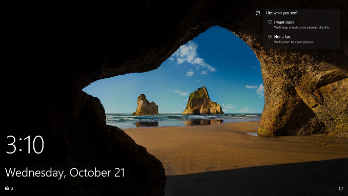

# Windows Spotlight on the lock screen

**Applies to**

-   Windows 10

Windows Spotlight is an option for the lock screen background that displays different background images and occasionally offers suggestions on the lock screen. Windows Spotlight is available in all desktop editions of Windows 10. 

For managed devices running Windows 10 Enterprise and Windows 10 Education, enterprise administrators can configure a mobile device management (MDM) or Group Policy setting to prevent users from using the Windows Spotlight background. For managed devices running Windows 10 Pro, version 1607, administrators can disable suggestions for third party apps.

>[!NOTE]
>In Windows 10, version 1607, the lock screen background does not display if you disable the **Animate windows when minimizing and mazimizing** setting in **This PC** > **Properties** > **Advanced system settings** > **Performance settings** > **Visual Effects**, or if you enable the Group Policy setting **Computer Configuration** > **Administrative Templates** > **Windows Components** > **Desktop Windows Manager** > **Do not allow windows animations**.

## What does Windows Spotlight include?

-   **Background image**

    The Windows Spotlight displays a new image on the lock screen each day. The initial background image is included during installation. Additional images are downloaded on ongoing basis.

    

-   **Feature suggestions, fun facts, tips**

    The lock screen background will occasionally suggest Windows 10 features that the user hasn't tried yet, such as **Snap assist**.

## How do you turn off Windows Spotlight locally?

To turn off Windows Spotlight locally, go to **Settings** &gt; **Personalization** &gt; **Lock screen** &gt; **Background** &gt; **Windows spotlight** &gt; select a different lock screen background

## How do you disable Windows Spotlight for managed devices?

Windows 10, version 1607, provides three new Group Policy settings to help you manage Windows Spotlight on enterprise computers.

**Windows 10 Pro, Enterprise, and Education**

- **User Configuration\Administrative Templates\Windows Components\Cloud Content\Do not suggest third-party content in Windows spotlight** enables enterprises to restrict suggestions to Microsoft apps and services.

**Windows 10 Enterprise and Education**

* **User Configuration\Administrative Templates\Windows Components\Cloud Content\Turn off all Windows Spotlight features** enables enterprises to completely disable all Windows Spotlight features in a single setting.
* **User Configuration\Administrative Templates\Windows Components\Cloud Content\Configure Spotlight on lock screen** specifically controls the use of the dynamic Windows Spotlight image on the lock screen, and can be enabled or disabled. (The Group Policy setting **Enterprise Spotlight** does not work in Windows 10, version 1607.)

Windows Spotlight is enabled by default. Administrators can replace Windows Spotlight with a selected image using the Group Policy setting **Computer Configuration** &gt; **Administrative Templates** &gt; **Control Panel** &gt; **Personalization** &gt; **Force a specific default lock screen image**.

>[!WARNING]
> In Windows 10, version 1607, the **Force a specific default lock screen image** policy setting will prevent users from changing the lock screen image. This behavior will be corrected in a future release.

Pay attention to the checkbox in **Options**. In addition to providing the path to the lock screen image, administrators can choose to allow or **Turn off fun facts, tips, tricks, and more on lock screen**. If the checkbox is not selected, users will see the lock screen image that is defined in the policy setting, and will also see occasional messages, such as the example in the following image.

## Related topics

[Manage Windows 10 Start layout options](../manage/windows-10-start-layout-options-and-policies.md)

 

 

