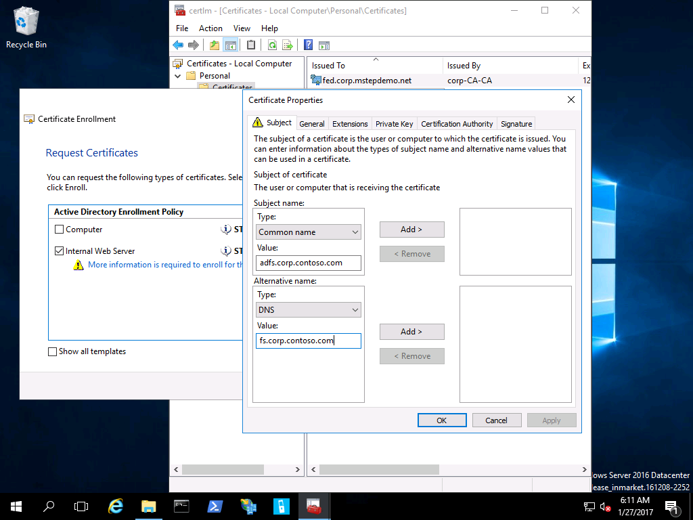
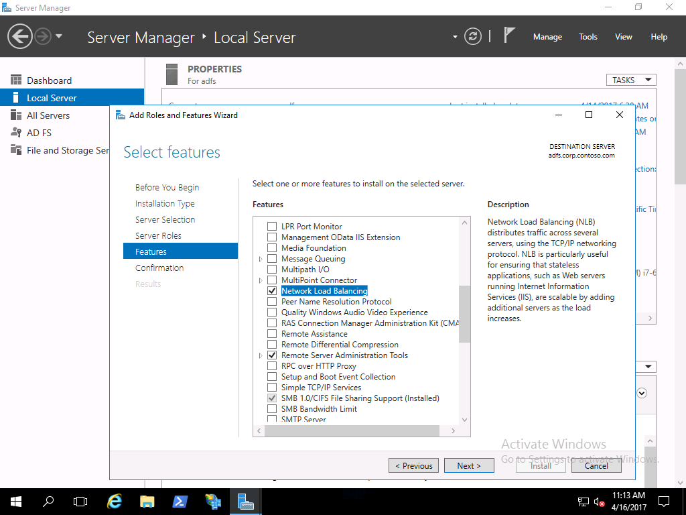
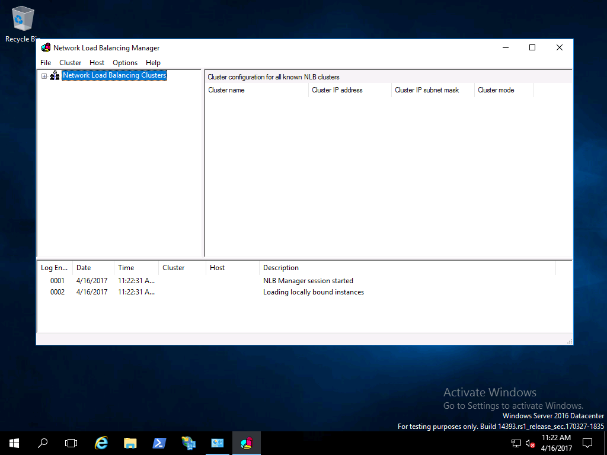
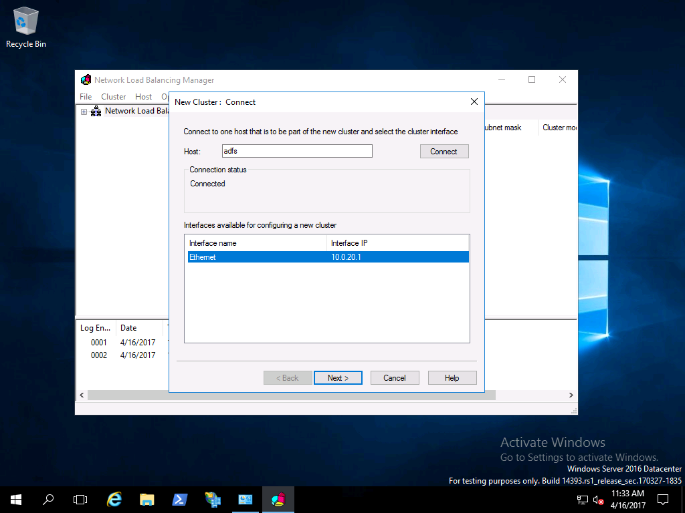
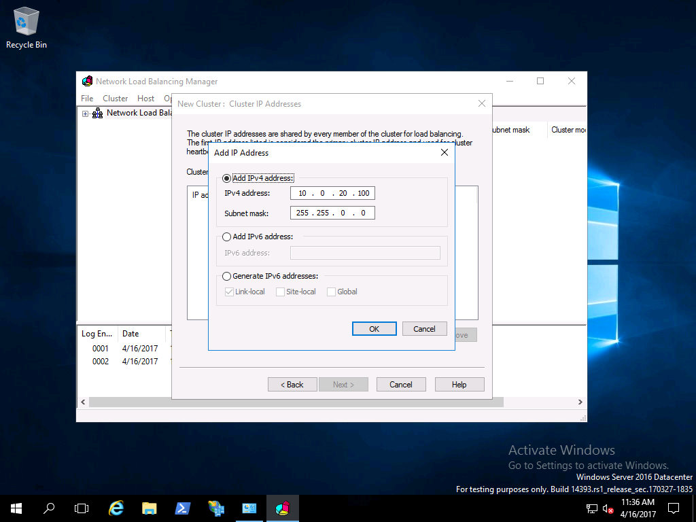
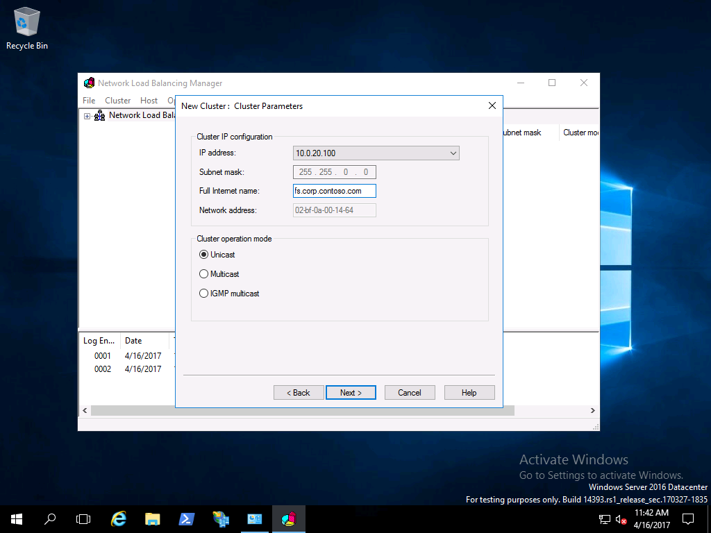
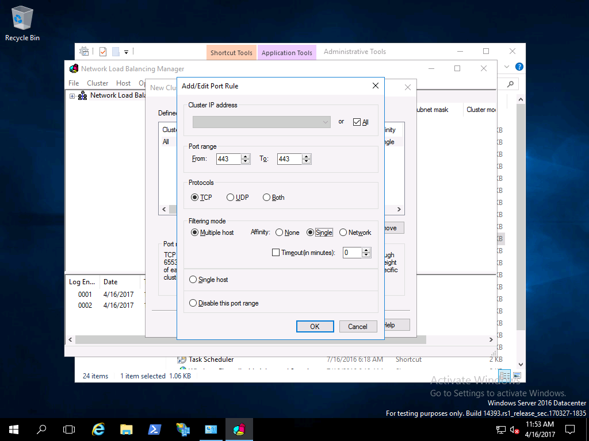
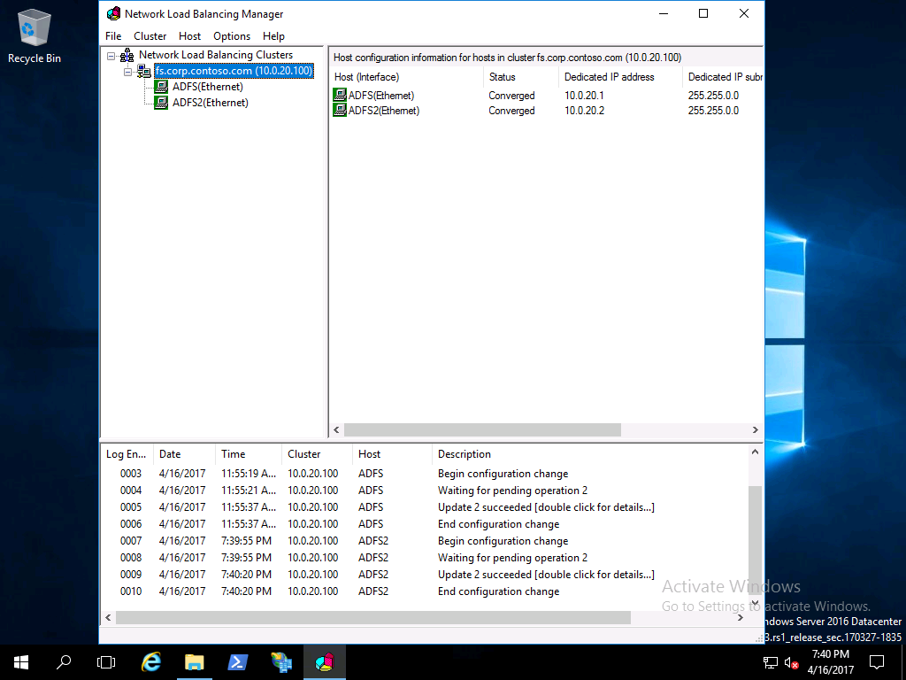

# Prepare and Deploy Windows Server 2016 Active Directory Federation Services

**Applies to**
-   Windows 10, version 1703 or later
-   On-premises deployment
-   Key trust

Windows Hello for Business works exclusively with the Active Directory Federation Service role included with Windows Server 2016 and requires an additional server update.  The on-premises key trust deployment uses Active Directory Federation Services roles for key registration and device registration.

The following guidance describes deploying a new instance of Active Directory Federation Services 2016 using the Windows Information Database as the configuration database, which is ideal for environments with no more than 30 federation servers and no more than 100 relying party trusts.

If your environment exceeds either of these factors or needs to provide SAML artifact resolution, token replay detection, or needs Active Directory Federation Services to operate in a federated provider role, then your deployment needs to use a SQL for your configuration database. To deploy the Active Directory Federation Services using SQL as its configuration database, please review the [Deploying a Federation Server Farm](https://docs.microsoft.com/windows-server/identity/ad-fs/deployment/deploying-a-federation-server-farm) checklist.

If your environment has an existing instance of Active Directory Federation Services, then you’ll need to upgrade all nodes in the farm to Windows Server 2016 along with the Windows Server 2016 update.  If your environment uses Windows Internal Database (WID) for the configuration database, please read [Upgrading to AD FS in Windows Server 2016 using a WID database](https://docs.microsoft.com/windows-server/identity/ad-fs/deployment/upgrading-to-ad-fs-in-windows-server-2016) to upgrade your environment.  If your environment uses SQL for the configuration database, please read [Upgrading to AD FS in Windows Server 2016 with SQL Server](https://docs.microsoft.com/en-us/windows-server/identity/ad-fs/deployment/upgrading-to-ad-fs-in-windows-server-2016-sql) to upgrade your environment.

Ensure you apply the Windows Server 2016 Update to all nodes in the farm after you have successfully completed the upgrade. 

A new Active Directory Federation Services farm should have a minimum of two federation servers for proper load balancing, which can be accomplished with an external networking peripherals, or with using the Network Load Balancing Role included in Windows Server.

Prepare the Active Directory Federation Services deployment by installing and updating two Windows Server 2016 Servers.  Ensure the update listed below is applied to each server before continuing.    

##  Update Windows Server 2016

Sign-in the federation server with _local admin_ equivalent credentials.
1.	Ensure Windows Server 2016 is current by running **Windows Update** from **Settings**. Continue this process until no further updates are needed. If you’re not using Windows Update for updates, please review the [Windows Server 2016 update history page](https://support.microsoft.com/help/4000825/windows-10-windows-server-2016-update-history) to make sure you have the latest updates available installed.
2.	Ensure the latest server updates to the federation server includes [KB4088889 (14393.2155)](https://support.microsoft.com/en-us/help/4088889).

>[!IMPORTANT]
>The above referenced updates are mandatory for Windows Hello for Business all on-premises deployment and hybrid certificate trust deployments for domain joined computers.

## Enroll for a TLS Server Authentication Certificate

Key trust Windows Hello for Business on-premises deployments need a federation server for device registration and key registration.  Typically, a federation service is an edge facing role.  However, the federation services and instance used with the on-premises deployment of Windows Hello for Business does not need Internet connectivity.  

The AD FS role needs a server authentication certificate for the federation services, but you can use a certificate issued by your enterprise (internal) certificate authority.  The server authentication certificate should have the following names included in the certificate if you are requesting an individual certificate for each node in the federation farm:
* Subject Name: The internal FQDN of the federation server (the name of the computer running AD FS)
* Subject Alternate Name: Your federation service name, such as *fs.corp.contoso.com* (or an appropriate wildcard entry such as *.corp.contoso.com)

You configure your federation service name when you configure the AD FS role. You can choose any name, but that name must be different than the name of the server or host. For example, you can name the host server **adfs** and the federation service **fs**.  The FQDN of the host is adfs.corp.contoso.com and the FQDN of the federation service is fs.corp.contoso.com.

You can, however, issue one certificate for all hosts in the farm.  If you chose this option, then leave the subject name blank, and include all the names in the subject alternate name when creating the certificate request.  All names should include the FQDN of each host in the farm and the federation service name.  

When creating a wildcard certificate, it is recommended that you mark the private key as exportable so that the same certificate can be deployed across each federation server and web application proxy within your AD FS farm. Note that the certificate must be trusted (chain to a trusted root CA). Once you have successfully requested and enrolled the server authentication certificate on one node, you can export the certificate and private key to a PFX file using the Certificate Manager console. You can then import the certificate on the remaining nodes in the AD FS farm. 

Be sure to enroll or import the certificate into the AD FS server’s computer certificate store.  Also, ensure all nodes in the farm have the proper TLS server authentication certificate.

### Internal Server Authentication Certificate Enrollment

Sign-in the federation server with domain administrator equivalent credentials.
1. Start the Local Computer **Certificate Manager** (certlm.msc).
2. Expand the **Personal** node in the navigation pane.
3. Right-click **Personal**. Select **All Tasks** and **Request New Certificate**.
4. Click **Next** on the **Before You Begin** page.
5. Click **Next** on the **Select Certificate Enrollment Policy** page.
6. On the **Request Certificates** page, Select the **Internal Web Server** check box.
7. Click the **More information is required to enroll for this certificate. Click here to configure settings** link   
    
8. Under **Subject name**, select **Common Name** from the **Type** list.  Type the FQDN of the computer hosting the Active Directory Federation Services role and then click **Add**.  Under **Alternative name**, select **DNS** from the **Type** list.  Type the FQDN of the name you will use for your federation services (fs.corp.contoso.com). The name you use here MUST match the name you use when configuring the Active Directory Federation Services server role.  Click **Add**. Click **OK** when finished.
9. Click **Enroll**.

A server authentication certificate should appear in the computer’s Personal certificate store.

## Deploy the Active Directory Federation Service Role

The Active Directory Federation Service (AD FS) role provides the following services to support Windows Hello for Business on-premises deployments.
* Device registration
* Key registration 

>[!IMPORTANT]
> Finish the entire AD FS configuration on the first server in the farm before adding the second server to the AD FS farm.  Once complete, the second server receives the configuration through the shared configuration database when it is added the AD FS farm. 

Windows Hello for Business depends on proper device registration.  For on-premises key trust deployments, Windows Server 2016 AD FS handles device and key registration.

Sign-in the federation server with _Enterprise Admin_ equivalent credentials.
1.	Start **Server Manager**.  Click **Local Server** in the navigation pane.
2.	Click **Manage** and then click **Add Roles and Features**.
3.	Click **Next** on the **Before you begin** page.
4.	On the **Select installation type** page, select **Role-based or feature-based installation** and click **Next**.
5.	On the **Select destination server** page, choose **Select a server from the server pool**.  Select the federation server from the **Server Pool** list.  Click **Next**.
6.	On the **Select server roles** page, select **Active Directory Federation Services**.  Click **Next**.
7.	Click **Next** on the **Select features** page.
8.	Click **Next** on the **Active Directory Federation Service** page.
9.	Click **Install** to start the role installation.

## Review

Before you continue with the deployment, validate your deployment progress by reviewing the following items:
* Confirm the AD FS farm uses the correct database configuration.
* Confirm the AD FS farm has an adequate number of nodes and is properly load balanced for the anticipated load.
* Confirm **all** AD FS servers in the farm have the latest updates.
* Confirm all AD FS servers have a valid server authentication certificate    
    * The subject of the certificate is the common name (FQDN) of the host or a wildcard name.
    * The alternate name of the certificate contains a wildcard or the FQDN of the federation service

## Device Registration Service Account Prerequisite

The service account used for the device registration server depends on the domain controllers in the environment.  

>[!NOTE]
>Follow the procedures below based on the domain controllers deployed in your environment.  If the domain controller is not listed below, then it is not supported for Windows Hello for Business.

### Windows Server 2012 or later Domain Controllers

Windows Server 2012 or later domain controllers support Group Managed Service Accounts—the preferred way to deploy service accounts for services that support them.  Group Managed Service Accounts, or GMSA have security advantages over normal user accounts because Windows handles password management.  This means the password is long, complex, and changes periodically.  The best part of GMSA is all this happens automatically.  AD FS supports GMSA and should be configured using them for additional defense in depth security.

GSMA uses the Microsoft Key Distribution Service that is located on Windows Server 2012 or later domain controllers.  Windows uses the Microsoft Key Distribution Service to protect secrets stored and used by the GSMA.  Before you can create a GSMA, you must first create a root key for the service.  You can skip this if your environment already uses GSMA.

#### Create KDS Root Key

Sign-in a domain controller with _Enterprise Admin_ equivalent credentials.
1. Start an elevated Windows PowerShell console.
2. Type `Add-KdsRootKey -EffectiveTime (Get-Date).AddHours(-10)`

### Windows Server 2008 or 2008 R2 Domain Controllers

Windows Server 2008 and 2008 R2 domain controllers do not host the Microsoft Key Distribution Service, nor do they support Group Managed Service Accounts.  Therefore, you must use create a normal user account as a service account where you are responsible for changing the password on a regular basis.

#### Create an AD FS Service Account

Sign-in a domain controller or management workstation with _Domain Admin_ equivalent credentials.
1.	Open **Active Directory Users and Computers**.
2.	Right-click the **Users** container, Click **New**. Click **User**.
3.	In the **New Object – User** window, type **adfssvc** in the **Full name** text box.  Type **adfssvc** in the **User logon name** text box.  Click **Next**.
4.	Enter and confirm a password for the **adfssvc** user. Clear the **User must change password at next logon** check box.
5.	Click **Next** and then click **Finish**.

## Configure the Active Directory Federation Service Role

>[!IMPORTANT]
>Follow the procedures below based on the domain controllers deployed in your environment. If the domain controller is not listed below, then it is not supported for Windows Hello for Business.

### Windows Server 2016, 2012 R2 or later Domain Controllers

Use the following procedures to configure AD FS when your environment uses **Windows Server 2012 or later Domain Controllers**.  If you are not using Windows Server 2012 or later Domain Controllers, follow the procedures under the [Configure the Active Directory Federation Service Role (Windows Server 2008 or 2008R2 Domain Controllers)](#windows-server-2008-or-2008R2-domain-controllers) section.

Sign-in the federation server with _Domain Admin_ equivalent credentials. These procedures assume you are configuring the first federation server in a federation server farm.
1. Start **Server Manager**.
2. Click the notification flag in the upper right corner. Click **Configure federation services on this server**.   
   

3. On the **Welcome** page, click **Create the first federation server farm** and click **Next**.
4. Click **Next** on the **Connect to Active Directory Domain Services** page.
5. On the **Specify Service Properties** page, select the recently enrolled or imported certificate from the **SSL Certificate** list.  The certificate is likely named after your federation service, such as *fs.corp.contoso.com* or *fs.contoso.com*.
6. Select the federation service name from the **Federation Service Name** list.
7. Type the Federation Service Display Name in the text box.  This is the name users see when signing in.  Click **Next**.
8. On the **Specify Service Account** page, select **Create a Group Managed Service Account**.  In the **Account Name** box, type **adfssvc**.
9. On the **Specify Configuration Database** page, select **Create a database on this server using Windows Internal Database** and click **Next**.
10. On the **Review Options** page, click **Next**.
11.	On the **Pre-requisite Checks** page, click **Configure**.
12.	When the process completes, click **Close**.

### Windows Server 2008 or 2008 R2 Domain Controllers

Use the following procedures to configure AD FS when your environment uses **Windows Server 2008 or 2008 R2 Domain Controllers**.  If you are not using Windows Server 2008 or 2008 R2 Domain Controllers, follow the procedures under the [Configure the Active Directory Federation Service Role (Windows Server 2012 or later Domain Controllers)](#windows-server-2012-or-later-domain-controllers) section.

Sign-in the federation server with _Domain Admin_ equivalent credentials.  These instructions assume you are configuring the first federation server in a federation server farm.
1. Start **Server Manager**.
2. Click the notification flag in the upper right corner.  Click **Configure federation services on this server**.   
    

3. On the **Welcome** page, click **Create the first federation server farm** and click **Next**.
4. Click **Next** on the **Connect to Active Directory Domain Services** page.
5. On the **Specify Service Properties** page, select the recently enrolled or imported certificate from the **SSL Certificate** list. The certificate is likely named after your federation service, such as fs.corp.mstepdemo.net or fs.mstepdemo.net.
6. Select the federation service name from the **Federation Service Name** list.
7. Type the Federation Service Display Name in the text box. This is the name users see when signing in. Click **Next**.
8. On the **Specify Service Account** page, Select **Use an existing domain user account or group Managed Service Account** and click **Select**.   
    * In the **Select User or Service Account** dialog box, type the name of the previously created AD FS service account (example adfssvc) and click **OK**. Type the password for the AD FS service account and click **Next**.
9.	On the **Specify Configuration Database** page, select **Create a database on this server using Windows Internal Database** and click **Next**.
10.	On the **Review Options** page, click **Next**.
11.	On the **Pre-requisite Checks** page, click **Configure**.
12.	When the process completes, click **Close**.
13.	Do not restart the AD FS server. You will do this later.

### Add the AD FS Service account to the KeyAdmins group

The KeyAdmins global group provides the AD FS service with the permissions needed to perform key registration.

Sign-in a domain controller or management workstation with _Domain Admin_ equivalent credentials.
1. Open **Active Directory Users and Computers**.
2. Click the **Users** container in the navigation pane.
3. Right-click **KeyAdmins** in the details pane and click **Properties**.
4. Click the **Members** tab and click **Add…**
5. In the **Enter the object names to select** text box, type **adfssvc**.  Click **OK**.
6. Click **OK** to return to **Active Directory Users and Computers**.
7.	Click **OK** to return to **Active Directory Users and Computers**.
8.	Change to server hosting the AD FS role and restart it.

## Configure the Device Registration Service

Sign-in the federation server with _Enterprise Admin_ equivalent credentials. These instructions assume you are configuring the first federation server in a federation server farm.
1. Open the **AD FS management** console.
2. In the navigation pane, expand **Service**. Click **Device Registration**.
3. In the details pane, click **Configure Device Registration**.
4. In the **Configure Device Registration** dialog, click **OK**.

## Review

Before you continue with the deployment, validate your deployment progress by reviewing the following items:
* Confirm you followed the correct procedures based on the domain controllers used in your deployment   
    * Windows Server 2016, 2012 R2 or Windows Server 2012 R2
    * Windows Server 2008 or Windows Server 2008 R2
* Confirm you have the correct service account based on your domain controller version.
* Confirm you properly installed the AD FS role on your Windows Server 2016 based on the proper sizing of your federation, the number of relying parties, and database needs.
* Confirm you used a certificate with the correct names as the server authentication certificate
    * Record the expiration date of the certificate and set a renewal reminder at least six weeks before it expires that includes the:
        * Certificate serial number
        * Certificate thumbprint
        * Common name of the certificate
        * Subject alternate name of the certificate
        * Name of the physical host server
        * The issued date
        * The expiration date
        * Issuing CA Vendor (if a third-party certificate) 
* Confirm you added the AD FS service account to the KeyAdmins group.
* Confirm you enabled the Device Registration service.

## Additional Federation Servers

Organizations should deploy more than one federation server in their federation farm for high-availability.  You should have a minimum of two federation services in your AD FS farm, however most organizations are likely to have more.  This largely depends on the number of devices and users using the services provided by the AD FS farm. 

### Server Authentication Certificate

Each server you add to the AD FS farm must have a proper server authentication certificate.  Refer to the [Enroll for a TLS Server Authentication Certificate](#enroll-for-a-tls-server-authentication-certificate) section of this document to determine the requirements for your server authentication certificate.  As previously stated, AD FS servers used exclusively for on-premises deployments of Windows Hello for Business can use enterprise server authentication certificates rather than server authentication certificates issued by public certificate authorities.

### Install Additional Servers

Adding federation servers to the existing AD FS farm begins with ensuring the server are fully patched, to include Windows Server 2016 Update needed to support Windows Hello for Business deployments (https://aka.ms/whfbadfs1703). Next, install the Active Directory Federation Service role on the additional servers and then configure the server as an additional server in an existing farm. 

## Load Balance AD FS Federation Servers

Many environments load balance using hardware devices.  Environments without hardware load-balancing capabilities can take advantage the network load-balancing feature included in Windows Server to load balance the AD FS servers in the federation farm.  Install the Windows Network Load Balancing feature on all nodes participating in the AD FS farm that should be load balanced.

### Install Network Load Balancing Feature on AD FS Servers

Sign-in the federation server with _Enterprise Admin_ equivalent credentials.
1. Start **Server Manager**.  Click **Local Server** in the navigation pane.
2. Click **Manage** and then click **Add Roles and Features**.
3. Click **Next** On the **Before you begin** page.
4. On the **Select installation type** page, select **Role-based or feature-based installation** and click **Next**.
5. On the **Select destination server** page, choose **Select a server from the server pool**.  Select the federation server from the **Server Pool** list.  Click **Next**.
6. On the **Select server roles** page, click **Next**.
7. Select **Network Load Balancing** on the **Select features** page.
8. Click **Install** to start the feature installation   
    

### Configure Network Load Balancing for AD FS

Before you can load balance all the nodes in the AD FS farm, you must first create a new load balance cluster.  Once you have created the cluster, then you can add new nodes to that cluster.

Sign-in a node of the federation farm with _Admin_ equivalent credentials.
1. Open **Network Load Balancing Manager** from **Administrative Tools**.   
    
2. Right-click **Network Load Balancing Clusters**, and then click **New Cluster**.
3. To connect to the host that is to be a part of the new cluster, in the **Host** text box, type the name of the host, and then click **Connect**.   
    
4. Select the interface that you want to use with the cluster, and then click **Next**. (The interface hosts the virtual IP address and receives the client traffic to load balance.)
5. In **Host Parameters**, select a value in **Priority (Unique host identifier)**. This parameter specifies a unique ID for each host. The host with the lowest numerical priority among the current members of the cluster handles all of the cluster's network traffic that is not covered by a port rule. Click **Next**.
6. In **Cluster IP Addresses**, click **Add** and type the cluster IP address that is shared by every host in the cluster. NLB adds this IP address to the TCP/IP stack on the selected interface of all hosts that are chosen to be part of the cluster. Click **Next**.   
    
7. In **Cluster Parameters**, select values in **IP Address** and **Subnet mask** (for IPv6 addresses, a subnet mask value is not needed). Type the full Internet name that users will use to access this NLB cluster.   
    
8. In **Cluster operation mode**, click **Unicast** to specify that a unicast media access control (MAC) address should be used for cluster operations. In unicast mode, the MAC address of the cluster is assigned to the network adapter of the computer, and the built-in MAC address of the network adapter is not used. We recommend that you accept the unicast default settings. Click **Next**.
9. In Port Rules, click Edit to modify the default port rules to use port 443.   
    

### Additional AD FS Servers

1. To add more hosts to the cluster, right-click the new cluster, and then click **Add Host to Cluster**.
2. Configure the host parameters (including host priority, dedicated IP addresses, and load weight) for the additional hosts by following the same instructions that you used to configure the initial host. Because you are adding hosts to an already configured cluster, all the cluster-wide parameters remain the same.   
    

## Configure DNS for Device Registration

Sign-in the domain controller or administrative workstation with domain administrator equivalent credentials.  You’ll need the Federation service name to complete this task.  You can view the federation service name by clicking **Edit Federation Service Properties** from the **Action** pan of the **AD FS** management console, or by using `(Get-AdfsProperties).Hostname.` (PowerShell) on the AD FS server.
1. Open the **DNS Management** console.
2. In the navigation pane, expand the domain controller name node and **Forward Lookup Zones**.
3. In the navigation pane, select the node that has the name of your internal Active Directory domain name.
4. In the navigation pane, right-click the domain name node and click **New Host (A or AAAA)**.
5. In the **name** box, type the name of the federation service. In the **IP address** box, type the IP address of your federation server. Click **Add Host**. 
6. Close the DNS Management console 

## Configure the Intranet Zone to include the federation service

The Windows Hello provisioning presents web pages from the federation service.  Configuring the intranet zone to include the federation service enables the user to authenticate to the federation service using integrated authentication.  Without this setting, the connection to the federation service during Windows Hello provisioning prompts the user for authentication. 

### Create an Intranet Zone Group Policy

Sign-in the domain controller or administrative workstation with _Domain Admin_ equivalent credentials
1. Start the **Group Policy Management Console** (gpmc.msc)
2. Expand the domain and select the **Group Policy Object** node in the navigation pane.
3. Right-click **Group Policy object** and select **New**
4. Type **Intranet Zone Settings** in the name box and click **OK**.
5. In the content pane, right-click the **Intranet Zone Settings** Group Policy object and click **Edit**.
6. In the navigation pane, expand **Policies** under **Computer Configuration**.
7. Expand **Administrative Templates > Windows Component > Internet Explorer > Internet Control Panel**, and select **Security Page**.
8. In the content pane, double-click **Site to Zone Assignment List**. Click **Enable**.
9. Click **Show**. In the **Value Name** column, type the url of the federation service beginning with https. In the **Value** column, type the number **1**.  Click OK twice, then close the Group Policy Management Editor.

### Deploy the Intranet Zone Group Policy object

1.	Start the **Group Policy Management Console** (gpmc.msc)
2.	In the navigation pane, expand the domain and right-click the node that has your Active Directory domain name and click **Link an existing GPO…**
3.	In the **Select GPO** dialog box, select **Intranet Zone Settings** or the name of the Windows Hello for Business Group Policy object you previously created and click **OK**.

## Review

Before you continue with the deployment, validate your deployment progress by reviewing the following items:
* Confirm all AD FS servers have a valid server authentication certificate    
    * The subject of the certificate is the common name (FQDN) of the host or a wildcard name.
    * The alternate name of the certificate contains a wildcard or the FQDN of the federation service
* Confirm the AD FS farm has an adequate number of nodes and is properly load balanced for the anticipated load.
* Confirm **all** AD FS servers in the farm have the latest updates.
* Confirm you restarted the AD FS service.
* Confirm you created a DNS A Record for the federation service and the IP address used is the load-balanced IP address
* Confirm you created and deployed the Intranet Zone settings to prevent double authentication to the federation server.

## Follow the Windows Hello for Business on premises certificate trust deployment guide
1. [Validate Active Directory prerequisites](hello-key-trust-validate-ad-prereq.md)
2. [Validate and Configure Public Key Infrastructure](hello-key-trust-validate-pki.md)
3. Prepare and Deploy Windows Server 2016 Active Directory Federation Services (*You are here*)
4. [Validate and Deploy Multifactor Authentication Services (MFA)](hello-key-trust-validate-deploy-mfa.md)
5. [Configure Windows Hello for Business Policy settings](hello-key-trust-policy-settings.md)

