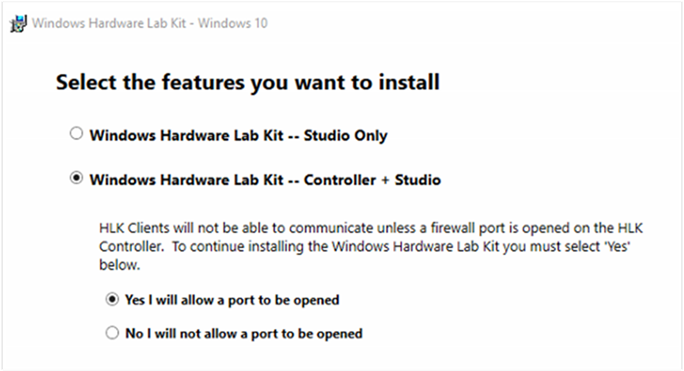
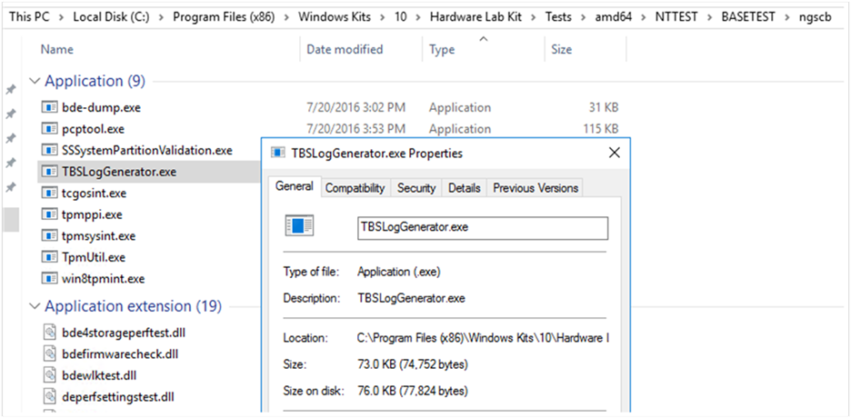
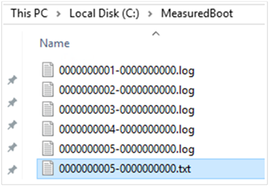
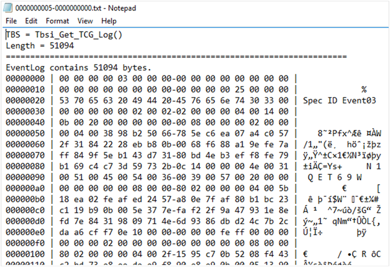

# Decode Measured Boot logs to track PCR changes

From [https://internal.support.services.microsoft.com/en-us/help/4345799](https://internal.support.services.microsoft.com/en-us/help/4345799)

[TPM fundamentals: Measured Boot with support for attestation](https://docs.microsoft.com/en-us/windows/security/information-protection/tpm/tpm-fundamentals#measured-boot-with-support-for-attestation)
[Understanding PCR banks on TPM 2.0 devices](https://docs.microsoft.com/en-us/windows/security/information-protection/tpm/switch-pcr-banks-on-tpm-2-0-devices)

Measured Boot logs are located under C:\\Windows\\Logs\\MeasuredBoot\\ directory.

These logs can be used to figure out which Platform Configuration Register (PCR) got changed resulting into Bitlocker recovery and also figure out what all events were measured into a particular PCR helping us to explain why that PCR changed in the first place.

## Install TBSLogGenerator

You can follow the same steps and thereby use the same tool (TBSLogGenerator.exe) so as to decode the Measured Boot logs collected from pre-Windows 10 machine(s) as well.

Install Hardware Lab Kit&mdash;Controller + Studio on a Windows Server 2016 machine which has TPM enabled and ready for use. You can also install HLK on a W2K16 Gen 2 Hyper-V VM as we could make use of the virtual TPM. You can also install HLK on a W2K16 Gen 2 Hyper-V VM as we could make use of the virtual TPM.

1. Download the Windows Hardware Lab Kit from one of the following locations:

   - [Windows Hardware Lab Kit](https://docs.microsoft.com/en-us/windows-hardware/test/hlk/)
   - Direct Download link for Windows Server 2016: [Windows HLK, version 1607](https://go.microsoft.com/fwlink/p/?LinkID=404112)

1. Accept the default installation path.

   

1. Under **Select the features you want to install**, select **Windows Hardware Lab Kit&mdash;Controller + Studio**.

   

1. Finish the installation.

## Use TBSLogGenerator to decode Measured Boot logs

1. Once installed, launch an elevated command prompt and navigate to the following directory: C:\\Program Files (x86)\\Windows Kits\\10\\Hardware Lab Kit\\Tests\\amd64\\NTTEST\\BASETEST\\ngscb

   This directory contains a tool named as TBSLogGenerator.exe, which is going to be used to decode the Measured Boot logs.

   

1. Run the following command:
   ```cmd
   TBSLogGenerator.exe -LF <directory which contains the Measuredboot log to be decoded>\<name of the log>.log > <Target directory where the decoded file should be placed>\<name of the file>.txt
   ```

   For example, in the following screenshot, the MeasuredBoot logs have been collected from a target Windows 10 machine and placed in the C:\\MeasuredBoot\\ directory. I have executed the command as follows so as to decode the **0000000005-0000000000.log** file:

    ```cmd
    TBSLogGenerator.exe -LF C:\MeasuredBoot\0000000005-0000000000.log > C:\MeasuredBoot\0000000005-0000000000.txt
    ```

   

   After the command finishes, you will get a text file with the name specified. As per the above screenshot it is **0000000005-0000000000.txt**  in the same directory where the original .log file is present.

   

1. Open this **0000000005-0000000000.txt** file and you should see something like below:

   

1. If you go to the end of the text file, you will see the PCR info.

   
