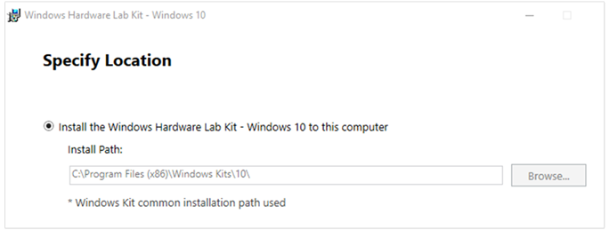
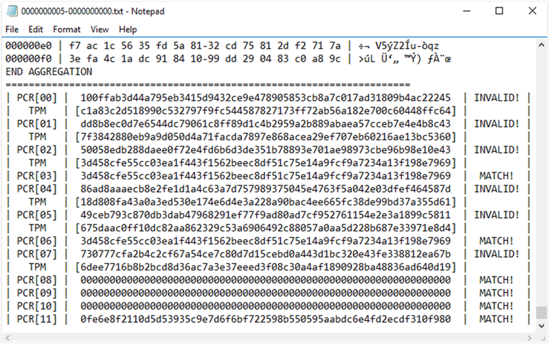

# Decode Measured Boot logs to track PCR changes

Platform Configuration Registers (PCRs) are a memory locations in the Trusted Protection Module (TPM). BitLocker and its related technologies depend on specific PCR configurations. In addition, specific change in PCRs can cause a device or computer to enter BitLocker Recovery. Tracking changes in the PCRs, and identifying when they changed, can provide insight into issues that may be occurring or explain why a device or computer entered BitLocker Recovery. The Measured Boot logs, located in the C:\\Windows\\Logs\\MeasuredBoot\\ folder, record PCR changes and other information.  

For more information about Measured Boot and PCRs, see the following articles:

- [TPM fundamentals: Measured Boot with support for attestation](https://docs.microsoft.com/windows/security/information-protection/tpm/tpm-fundamentals#measured-boot-with-support-for-attestation)  
- [Understanding PCR banks on TPM 2.0 devices](https://docs.microsoft.com/windows/security/information-protection/tpm/switch-pcr-banks-on-tpm-2-0-devices)

## Install TBSLogGenerator

Use TBSLogGenerator to decode Measured Boot logs that you have collected from Windows 10 and older versions. You can install this tool on the following systems:

- A computer running Windows Server 2016, that has a TPM enabled
- A Gen 2 virtual machine (running on Hyper-V) that is running Windows Server 2016 (you can use the virtual TPM)

To install the tool, follow these steps:

1. Download the Windows Hardware Lab Kit from one of the following locations:

   - [Windows Hardware Lab Kit](https://docs.microsoft.com/windows-hardware/test/hlk/)
   - Direct Download link for Windows Server 2016: [Windows HLK, version 1607](https://go.microsoft.com/fwlink/p/?LinkID=404112)

1. Accept the default installation path.

   

1. Under **Select the features you want to install**, select **Windows Hardware Lab Kit&mdash;Controller + Studio**.

   

1. Finish the installation.

## Use TBSLogGenerator to decode Measured Boot logs

1. After the installation has finished, open an elevated Command Prompt window and navigate to the following folder:  
   **C:\\Program Files (x86)\\Windows Kits\\10\\Hardware Lab Kit\\Tests\\amd64\\NTTEST\\BASETEST\\ngscb**

   The TBSLogGenerator.exe file resides in this folder.

   

1. Run the following command:
   ```cmd
   TBSLogGenerator.exe -LF <directory which contains the Measuredboot log to be decoded>\<name of the log>.log > <Target directory where the decoded file should be placed>\<name of the file>.txt
   ```

   For example, the following figure shows Measured Boot logs that were collected from a Windows 10 computer and placed in the C:\\MeasuredBoot\\ folder. The figure also shows a Command Prompt window and the command to decode the **0000000005-0000000000.log** file:

    ```cmd
    TBSLogGenerator.exe -LF C:\MeasuredBoot\0000000005-0000000000.log > C:\MeasuredBoot\0000000005-0000000000.txt
    ```

   

   The command produces a text file that uses the specified name. In the case of the example, the file is **0000000005-0000000000.txt**. The file resides in the same folder as the original .log file.

   

The content of this text file resembles the following:


To find the PCR information, go to the end of the file.

   
