# Create a Windows Information Protection (WIP) policy with MDM using the Azure portal for Microsoft Intune

**Applies to:**

-   Windows 10, version 1607 and later
-   Windows 10 Mobile, version 1607 and later (except Microsoft Azure Rights Management, which is only available on the desktop)

Microsoft Intune has an easy way to create and deploy a Windows Information Protection (WIP) policy. You can choose which apps to protect, the level of protection, and how to find enterprise data on the network. The devices can be fully managed by Mobile Device Management (MDM), or managed by Mobile Application Management (MAM), where Intune only manages the apps on a user's personal device.

>[!NOTE]
>If the same user and device are targeted for both MDM and MAM, the MDM policy will be applied to devices joined to Azure AD. For personal devices that are workplace-joined (that is, added by using **Settings** > **Email & accounts** > **Add a work or school account**). the MAM-only policy will be preferred but it's possible to upgrade the device management to MDM in **Settings**. Windows Home edition only supports WIP for MAM-only; upgrading to MDM policy on Home edition will revoke WIP-protected data access. MAM supports only one user per device.  

## Prerequisites

Before you can create a WIP policy using Intune, you need to configure an MDM or MAM provider in Azure Active Directory (Azure AD). MAM requires an [Azure Active Direcory (Azure AD) Premium license](https://docs.microsoft.com/azure/active-directory/fundamentals/active-directory-whatis#what-are-the-azure-ad-licenses). An Azure AD Premium license is also required for WIP auto-recovery, where a device can re-enroll and re-gain access to protected data. WIP auto-recovery depends on Azure AD registration to back up the encryption keys, which requires device auto-enrollment with MDM. 

## Configure the MDM or MAM provider

1. Sign in to the Azure portal. 
2. Click **Azure Active Directory** > **Mobility (MDM and MAM)** > **Microsoft Intune**.
3. Click **Restore Default URLs** or enter the settings for MDM or MAM user scope and click **Save**:

   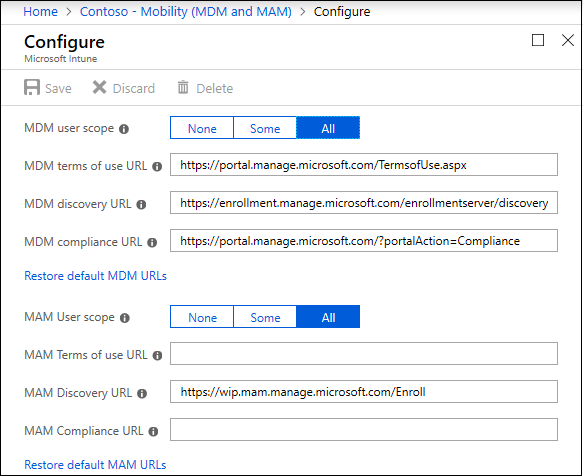

## Create a WIP policy

1. Sign in to the Azure portal.

2. Open Microsoft Intune and click **Client apps** > **App protection policies** > **Create policy**.

   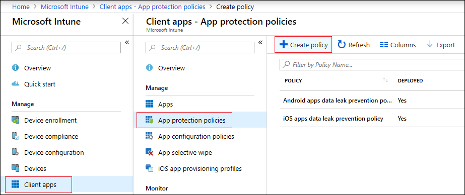

3. In the **App policy** screen, click **Add a policy**, and then fill out the fields:

   - **Name.** Type a name (required) for your new policy.

   - **Description.** Type an optional description.

   - **Platform.** Choose **Windows 10**.

   - **Enrollment state.** Choose **Without enrollment** for MAM or **With enrollment** for MDM.

   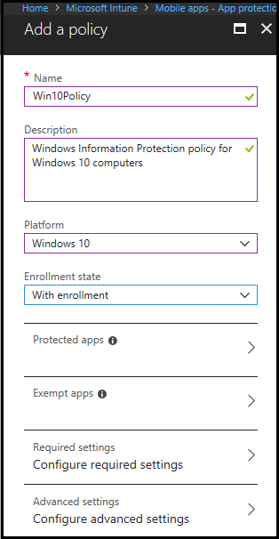

4. Click **Protected apps** and then click **Add apps**.

   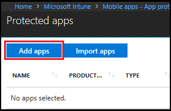

   You can add these types of apps:

   - [Recommended apps](#add-recommended-apps)
   - [Store apps](#add-store-apps)
   - [Desktop apps](#add-desktop-apps)
    
### Add recommended apps 

Select **Recommended apps** and select each app you want to access your enterprise data or select them all, and click **OK**.

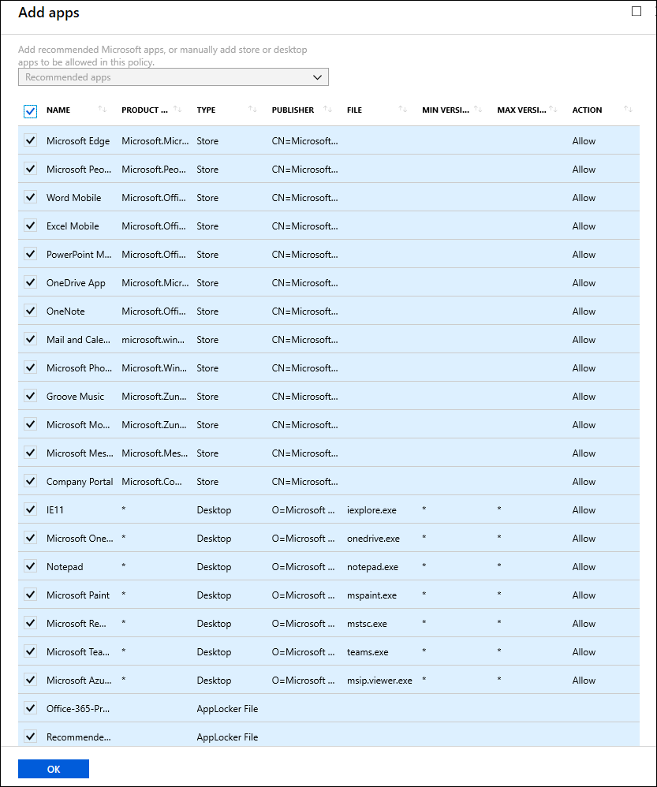    

### Add Store apps 

Select **Store apps**, type the app product name and publisher, and click **OK**. For example, to add the Power BI Mobile App from the Store, type the following: 

- **Name**: Microsoft Power BI
- **Publisher**: `CN=Microsoft Corporation, O=Microsoft Corporation, L=Redmond, S=Washington, C=US`
- **Product Name**: `Microsoft.MicrosoftPowerBIForWindows`


To add multiple Store apps, click the elipsis **…**. 

If you don't know the Store app publisher or product name, you can find them by following these steps.

1.	Go to the [Microsoft Store for Business](https://go.microsoft.com/fwlink/p/?LinkID=722910) website, and find your app. For example, *Power BI Mobile App*.

2.	Copy the ID value from the app URL. For example, the Power BI Mobile App ID URL is https://www.microsoft.com/store/p/microsoft-power-bi/9nblgggzlxn1, and you'd copy the ID value, `9nblgggzlxn1`.

3.	In a browser, run the Store for Business portal web API, to return a JavaScript Object Notation (JSON) file that includes the publisher and product name values. For example, run https://bspmts.mp.microsoft.com/v1/public/catalog/Retail/Products/9nblgggzlxn1/applockerdata, where `9nblgggzlxn1` is replaced with your ID value.
    
    The API runs and opens a text editor with the app details.

    ```json
        {
            "packageIdentityName": "Microsoft.MicrosoftPowerBIForWindows",
            "publisherCertificateName": "CN=Microsoft Corporation, O=Microsoft Corporation, L=Redmond, S=Washington, C=US"
        }
    ```

4.  Copy the `publisherCertificateName` value into the **Publisher** box and copy the `packageIdentityName` value into the **Name** box of Intune.

    >[!Important]
    >The JSON file might also return a `windowsPhoneLegacyId` value for both the **Publisher Name** and **Product Name** boxes. This means that you have an app that’s using a XAP package and that you must set the **Product Name** as `windowsPhoneLegacyId`, and set the **Publisher Name** as `CN=` followed by the `windowsPhoneLegacyId`.<br><br>For example:<br>
    <code>{<br>"windowsPhoneLegacyId": "ca05b3ab-f157-450c-8c49-a1f127f5e71d",<br>}</code>

If you need to add Windows 10 mobile apps that aren't distributed through the Store for Business, you must use the **Windows Device Portal** feature.

>**Note**<br>Your PC and phone must be on the same wireless network.

1.	On the Windows Phone, go to **Settings**, choose **Update & security**, and then choose **For developers**.

2.	In the **For developers** screen, turn on **Developer mode**, turn on **Device Discovery**, and then turn on **Device Portal**.

3.	Copy the URL in the **Device Portal** area into your device's browser, and then accept the SSL certificate.

4.	In the **Device discovery** area, press **Pair**, and then enter the PIN into the website from the previous step.

6.	On the **Apps** tab of the website, you can see details for the running apps, including the publisher and product names.

7.	Start the app for which you're looking for the publisher and product name values.

8.	Copy the `publisherCertificateName` value and paste it into the **Publisher Name** box and the `packageIdentityName` value into the **Product Name** box of Intune.

    >[!Important]
    >The JSON file might also return a `windowsPhoneLegacyId` value for both the **Publisher Name** and **Product Name** boxes. This means that you have an app that’s using a XAP package and that you must set the **Product Name** as `windowsPhoneLegacyId`, and set the **Publisher Name** as `CN=` followed by the `windowsPhoneLegacyId`.<br><br>For example:<br>
    <code>{<br>"windowsPhoneLegacyId": "ca05b3ab-f157-450c-8c49-a1f127f5e71d",<br>}</code>

### Add Desktop apps

To add **Desktop apps**, complete the following fields, based on what results you want returned.

<table>
    <tr>
        <th>Field</th>
        <th>Manages</th>
    </tr>
    <tr>
        <td>All fields marked as “*”</td>
        <td>All files signed by any publisher. (Not recommended)</td>
    </tr>
    <tr>
        <td>Publisher only</td>
        <td>If you only fill out this field, you’ll get all files signed by the named publisher.<br><br>This might be useful if your company is the publisher and signer of internal line-of-business apps.</td>
    </tr>
    <tr>
        <td>Publisher and Name only</td>
            <td>If you only fill out these fields, you’ll get all files for the specified product, signed by the named publisher.</td>
    </tr>
    <tr>
        <td>Publisher, Name, and File only</td>
        <td>If you only fill out these fields, you’ll get any version of the named file or package for the specified product, signed by the named publisher.</td>
    </tr>
    <tr>
        <td>Publisher, Name, File, and Min version only</td>
        <td>If you only fill out these fields, you’ll get the specified version or newer releases of the named file or package for the specified product, signed by the named publisher.<br><br>This option is recommended for enlightened apps that weren't previously enlightened.</td>
    </tr>
    <tr>
        <td>Publisher, Name, File, and Max version only</td>
        <td>If you only fill out these fields, you’ll get the specified version or older releases of the named file or package for the specified product, signed by the named publisher.</td>
    </tr>
    <tr>
        <td>All fields completed</td>
        <td>If you fill out all fields, you’ll get the specified version of the named file or package for the specified product, signed by the named publisher.</td>
    </tr>
</table>

To add another Desktop app, click the elipsis **…**. After you’ve entered the info into the fields, click **OK**.

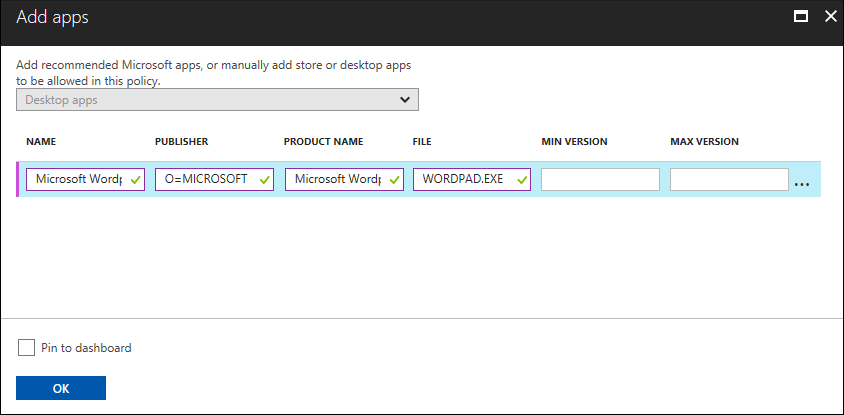
 
If you’re unsure about what to include for the publisher, you can run this PowerShell command:

```ps1
Get-AppLockerFileInformation -Path "<path_of_the_exe>"
```

Where `"<path_of_the_exe>"` goes to the location of the app on the device. For example:

```ps1
Get-AppLockerFileInformation -Path "C:\Program Files\Windows NT\Accessories\wordpad.exe"
```

In this example, you'd get the following info:

```
Path                   Publisher
----                   ---------
%PROGRAMFILES%\WINDOWS NT\ACCESSORIES\WORDPAD.EXE O=MICROSOFT CORPORATION, L=REDMOND, S=WASHINGTON, C=US
```

Where `O=MICROSOFT CORPORATION, L=REDMOND, S=WASHINGTON, C=US` is the **Publisher** name and `WORDPAD.EXE` is the **File** name.

### Import a list of apps 

This section covers two examples of using an AppLocker XML file to the **Protected apps** list. You’ll use this option if you want to add multiple apps at the same time. 

- [Create a Packaged App rule for Store apps](#create-a-packaged-app-rule-for-store-apps)
- [Create an Executable rule for unsigned apps](#create-an-executable-rule-for-unsigned-apps)

For more info about AppLocker, see the [AppLocker](https://technet.microsoft.com/itpro/windows/keep-secure/applocker-overview) content.

#### Create a Packaged App rule for Store apps

1.	Open the Local Security Policy snap-in (SecPol.msc).
    
2.	In the left blade, expand **Application Control Policies**, expand **AppLocker**, and then click **Packaged App Rules**.

    

3.	Right-click in the right-hand blade, and then click **Create New Rule**.

    The **Create Packaged app Rules** wizard appears.

4.  On the **Before You Begin** page, click **Next**.

    

5.  On the **Permissions** page, make sure the **Action** is set to **Allow** and the **User or group** is set to **Everyone**, and then click **Next**.

    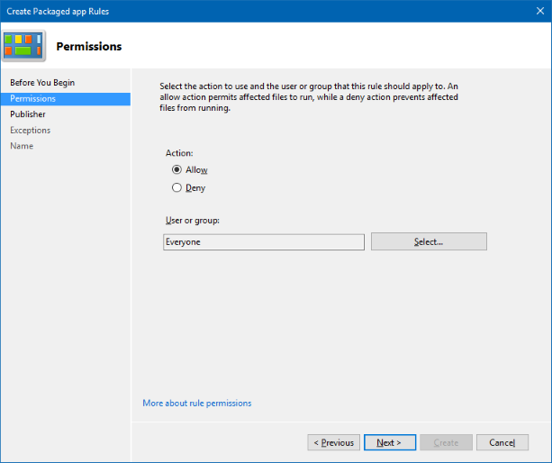

6.	On the **Publisher** page, click **Select** from the **Use an installed packaged app as a reference** area.

    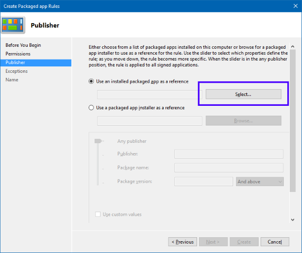

7.  In the **Select applications** box, pick the app that you want to use as the reference for your rule, and then click **OK**. For this example, we’re using Microsoft Dynamics 365.

    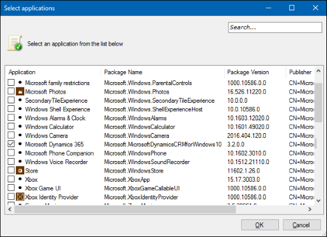

8.  On the updated **Publisher** page, click **Create**.

    

9.  Click **No** in the dialog box that appears, asking if you want to create the default rules. You must not create default rules for your WIP policy.

    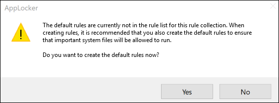

9.  Review the Local Security Policy snap-in to make sure your rule is correct.

    

10.	In the left blade, right-click on **AppLocker**, and then click **Export policy**.

    The **Export policy** box opens, letting you export and save your new policy as XML.

    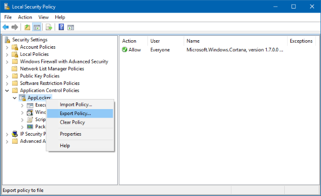

11.	In the **Export policy** box, browse to where the policy should be stored, give the policy a name, and then click **Save**.

    The policy is saved and you’ll see a message that says 1 rule was exported from the policy.

    **Example XML file**<br>
    This is the XML file that AppLocker creates for Microsoft Dynamics 365.

    ```xml
        <?xml version="1.0"?>
        <AppLockerPolicy Version="1">
            <RuleCollection EnforcementMode="NotConfigured" Type="Appx">
                <FilePublisherRule Action="Allow" UserOrGroupSid="S-1-1-0" Description="" Name="Microsoft.MicrosoftDynamicsCRMforWindows10, version 3.2.0.0 and above, from Microsoft Corporation" Id="3da34ed9-aec6-4239-88ba-0afdce252ab4">
                    <Conditions>
                        <FilePublisherCondition BinaryName="*" ProductName="Microsoft.MicrosoftDynamicsCRMforWindows10" PublisherName="CN=Microsoft Corporation, O=Microsoft Corporation, L=Redmond, S=Washington, C=US">
                            <BinaryVersionRange HighSection="*" LowSection="3.2.0.0"/>
                        </FilePublisherCondition>
                    </Conditions>
                </FilePublisherRule>
            </RuleCollection>
            <RuleCollection EnforcementMode="NotConfigured" Type="Dll"/>
            <RuleCollection EnforcementMode="NotConfigured" Type="Exe"/>
            <RuleCollection EnforcementMode="NotConfigured" Type="Msi"/>
            <RuleCollection EnforcementMode="NotConfigured" Type="Script"/>
        </AppLockerPolicy>
    ```

12.	After you’ve created your XML file, you need to import it by using Microsoft Intune.

## Create an Executable rule for unsigned apps

1. Open the Local Security Policy snap-in (SecPol.msc).
    
2. In the left pane, click **Application Control Policies** > **AppLocker** > **Executable Rules**.

3. Right-click **Executable Rules** > **Create New Rule**.

   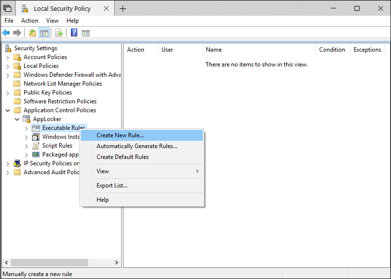

4. On the **Before You Begin** page, click **Next**.

5. On the **Permissions** page, make sure the **Action** is set to **Allow** and the **User or group** is set to **Everyone**, and then click **Next**.

6. On the **Conditions** page, click **Path** and then click **Next**.

    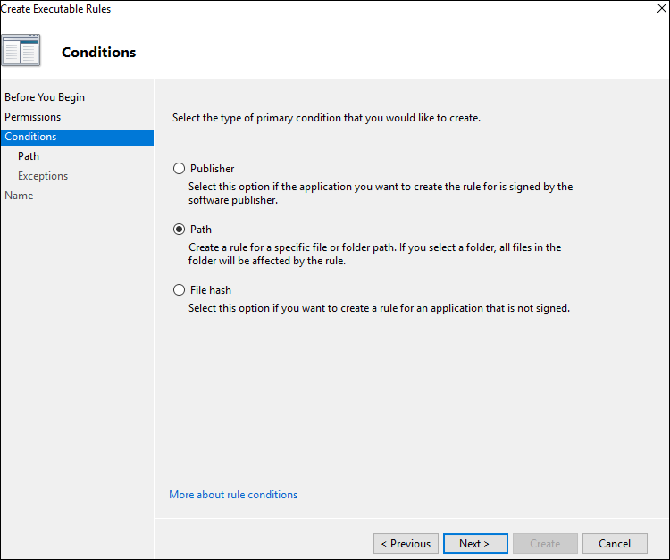

7. Click **Browse Folders...** and select the path for the unsigned apps. For this example, we’re using "C:\Program Files".

    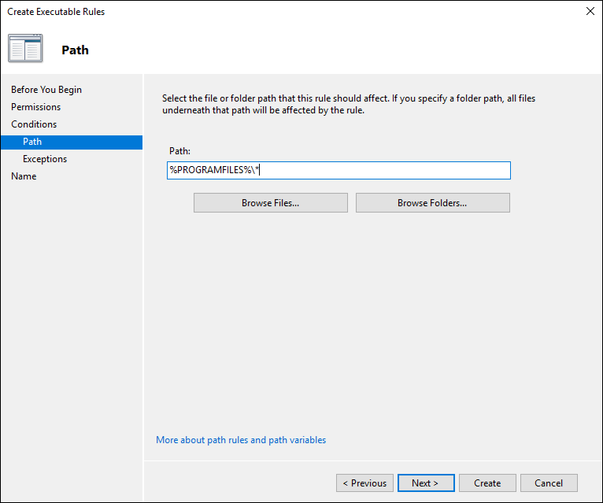

8. On the **Exceptions** page, add any exceptions and then click **Next**.

9. On the **Name** page, type a name and description for the rule and then click **Create**.

10.	In the left pane, right-click **AppLocker** > **Export policy**.

11.	In the **Export policy** box, browse to where the policy should be stored, give the policy a name, and then click **Save**.

    The policy is saved and you’ll see a message that says 1 rule was exported from the policy.

12.	After you’ve created your XML file, you need to import it by using Microsoft Intune.

**To import a list of protected apps using Microsoft Intune**

1.	In **Protected apps**, click **Import apps**.

    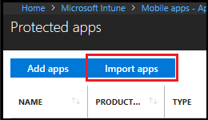
    
    Then import your file.
    
    

2.	Browse to your exported AppLocker policy file, and then click **Open**.

    The file imports and the apps are added to your **Protected apps** list.

### Exempt apps from a WIP policy
If your app is incompatible with WIP, but still needs to be used with enterprise data, you can exempt the app from the WIP restrictions. This means that your apps won't include auto-encryption or tagging and won't honor your network restrictions. It also means that your exempted apps might leak.

1.	In **Client apps - App protection policies**, click **Exempt apps**.
    
    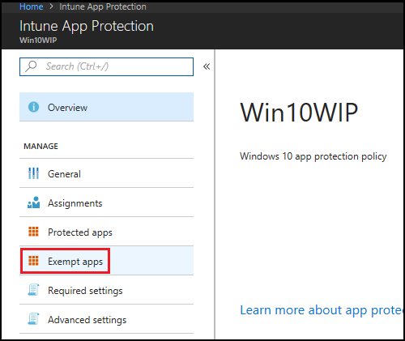

2.	In **Exempt apps**, click **Add apps**.

    Be aware that when you exempt apps, they’re allowed to bypass the WIP restrictions and access your corporate data. 
    
3.	Fill out the rest of the app info, based on the type of app you’re adding:

    - [Add Recommended apps](#add-recommended-apps)

    - [Add Store apps](#add-store-apps)

    - [Add Desktop apps](#add-desktop-apps)

    - [Import apps](#import-a-list-of-apps)

4.  Click **OK**.

## Manage the WIP protection mode for your enterprise data
After you've added the apps you want to protect with WIP, you'll need to apply a management and protection mode.

We recommend that you start with **Silent** or **Allow Overrides** while verifying with a small group that you have the right apps on your protected apps list. After you're done, you can change to your final enforcement policy, **Block**.

>[!NOTE]
>For info about how to collect your audit log files, see [How to collect Windows Information Protection (WIP) audit event logs](collect-wip-audit-event-logs.md).

1.	From the **App protection policy** blade, click the name of your policy, and then click **Required settings**.

    

    |Mode |Description |
    |-----|------------|
    |Block |WIP looks for inappropriate data sharing practices and stops the employee from completing the action. This can include sharing info across non-enterprise-protected apps in addition to sharing enterprise data between other people and devices outside of your enterprise.|
    |Allow Overrides |WIP looks for inappropriate data sharing, warning employees if they do something deemed potentially unsafe. However, this management mode lets the employee override the policy and share the data, logging the action to your audit log. For info about how to collect your audit log files, see [How to collect Windows Information Protection (WIP) audit event logs](collect-wip-audit-event-logs.md).|
    |Silent |WIP runs silently, logging inappropriate data sharing, without blocking anything that would’ve been prompted for employee interaction while in Allow Override mode. Unallowed actions, like apps inappropriately trying to access a network resource or WIP-protected data, are still stopped.|
    |Off (not recommended) |WIP is turned off and doesn't help to protect or audit your data.<br><br>After you turn off WIP, an attempt is made to decrypt any WIP-tagged files on the locally attached drives. Be aware that your previous decryption and policy info isn’t automatically reapplied if you turn WIP protection back on.|

2.	Click **Save**.

## Define your enterprise-managed corporate identity
Corporate identity, usually expressed as your primary Internet domain (for example, contoso.com), helps to identify and tag your corporate data from apps you’ve marked as protected by WIP. For example, emails using contoso.com are identified as being corporate and are restricted by your Windows Information Protection policies.

Starting with Windows 10, version 1703, Intune automatically determines your corporate identity and adds it to the **Corporate identity** field.

**To change your corporate identity**

1.	From the **App policy** blade, click the name of your policy, and then click **Required settings**.

2.  If the auto-defined identity isn’t correct, you can change the info in the **Corporate identity** field. If you need to add domains, for example your email domains, you can do it in the **Advanced settings** area.

    

## Choose where apps can access enterprise data
After you've added a protection mode to your apps, you'll need to decide where those apps can access enterprise data on your network.

There are no default locations included with WIP, you must add each of your network locations. This area applies to any network endpoint device that gets an IP address in your enterprise’s range and is also bound to one of your enterprise domains, including SMB shares. Local file system locations should just maintain encryption (for example, on local NTFS, FAT, ExFAT).

>[!Important]
>Every WIP policy should include policy that defines your enterprise network locations.<br>Classless Inter-Domain Routing (CIDR) notation isn’t supported for WIP configurations.

**To define where your protected apps can find and send enterprise data on you network**

1.	From the **App policy** blade, click the name of your policy, and then click **Advanced settings**.

2.	Click **Add network boundary** from the Network perimeter area.

    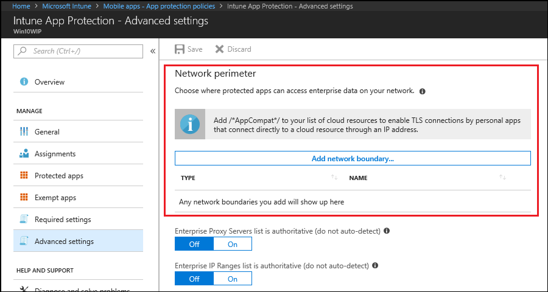

3.	Select the type of network boundary to add from the **Boundary type** box.

4.	Type a name for your boundary into the **Name** box, add your values to the **Value** box, based on the following options, and then click **OK**.

    <table>
        <tr>
            <th>Boundary type</th>
            <th>Value format</th>
            <th>Description</th>
        </tr>
        <tr>
            <td>Cloud Resources</td>
            <td><strong>With proxy:</strong> contoso.sharepoint.com,contoso.internalproxy1.com|<br>contoso.visualstudio.com,contoso.internalproxy2.com<br><br><strong>Without proxy:</strong> contoso.sharepoint.com|contoso.visualstudio.com</td>
            <td>Specify the cloud resources to be treated as corporate and protected by WIP.<br><br>For each cloud resource, you may also optionally specify a proxy server from your Internal proxy servers list to route traffic for this cloud resource. Be aware that all traffic routed through your Internal proxy servers is considered enterprise.<br><br>If you have multiple resources, you must separate them using the "|" delimiter. If you don’t use proxy servers, you must also include the "," delimiter just before the "|". For example: <code>URL &lt;,proxy&gt;|URL &lt;,proxy&gt;</code>.<br><br><strong>Important</strong><br>In some cases, such as when an app connects directly to a cloud resource through an IP address, Windows can’t tell whether it’s attempting to connect to an enterprise cloud resource or to a personal site. In this case, Windows blocks the connection by default. To stop Windows from automatically blocking these connections, you can add the <code>/&#42;AppCompat&#42;/</code> string to the setting. For example: <code>URL &lt;,proxy&gt;|URL &lt;,proxy&gt;|/&#42;AppCompat&#42;/</code>.<br><br>When using this string, we recommend that you also turn on [Azure Active Directory Conditional Access](https://docs.microsoft.com/azure/active-directory/active-directory-conditional-access), using the <strong>Domain joined or marked as compliant</strong> option, which blocks apps from accessing any enterprise cloud resources that are protected by conditional access.</td>
        </tr>
        <tr>
            <td>Protected domains</td>
            <td>exchange.contoso.com,contoso.com,region.contoso.com</td>
            <td>Specify the domains used for identities in your environment. All traffic to the fully-qualified domains appearing in this list will be protected.<br><br>If you have multiple domains, you must separate them using the "," delimiter.</td>
        </tr>
        <tr>
            <td>Network domains</td>
            <td>corp.contoso.com,region.contoso.com</td>
            <td>Specify the DNS suffixes used in your environment. All traffic to the fully-qualified domains appearing in this list will be protected.<br><br>If you have multiple resources, you must separate them using the "," delimiter.</td>
        </tr>
        <tr>
            <td>Proxy servers</td>
            <td>proxy.contoso.com:80;proxy2.contoso.com:443</td>
            <td>Specify the proxy servers your devices will go through to reach your cloud resources. Using this server type indicates that the cloud resources you’re connecting to are enterprise resources.<br><br>This list shouldn’t include any servers listed in your Internal proxy servers list. Internal proxy servers must be used only for WIP-protected (enterprise) traffic.<br><br>If you have multiple resources, you must separate them using the ";" delimiter.</td>
        </tr>
        <tr>
            <td>Internal proxy servers</td>
            <td>contoso.internalproxy1.com;contoso.internalproxy2.com</td>
            <td>Specify the internal proxy servers your devices will go through to reach your cloud resources. Using this server type indicates that the cloud resources you’re connecting to are enterprise resources.<br><br>This list shouldn’t include any servers listed in your Proxy servers list. Proxy servers must be used only for non-WIP-protected (non-enterprise) traffic.<br><br>If you have multiple resources, you must separate them using the ";" delimiter.</td>
        </tr>
        <tr>
            <td>IPv4 ranges</td>
            <td>**Starting IPv4 Address:** 3.4.0.1<br>**Ending IPv4 Address:** 3.4.255.254<br>**Custom URI:** 3.4.0.1-3.4.255.254,<br>10.0.0.1-10.255.255.254</td>
            <td>Starting with Windows 10, version 1703, this field is optional.<br><br>Specify the addresses for a valid IPv4 value range within your intranet. These addresses, used with your Network domain names, define your corporate network boundaries.<br><br>If you have multiple ranges, you must separate them using the "," delimiter.</td>
        </tr>
        <tr>
            <td>IPv6 ranges</td>
            <td>**Starting IPv6 Address:** 2a01:110::<br>**Ending IPv6 Address:** 2a01:110:7fff:ffff:ffff:ffff:ffff:ffff<br>**Custom URI:** 2a01:110:7fff:ffff:ffff:ffff:ffff:ffff,<br>fd00::-fdff:ffff:ffff:ffff:ffff:ffff:ffff:ffff</td>
            <td>Starting with Windows 10, version 1703, this field is optional.<br><br>Specify the addresses for a valid IPv6 value range within your intranet. These addresses, used with your Network domain names, define your corporate network boundaries.<br><br>If you have multiple ranges, you must separate them using the "," delimiter.</td>
        </tr>
        <tr>
            <td>Neutral resources</td>
            <td>sts.contoso.com,sts.contoso2.com</td>
            <td>Specify your authentication redirection endpoints for your company.<br><br>These locations are considered enterprise or personal, based on the context of the connection before the redirection.<br><br>If you have multiple resources, you must separate them using the "," delimiter.</td>
        </tr>
    </table>

5.	Repeat steps 1-4 to add any additional network boundaries.

6.	Decide if you want to Windows to look for additional network settings:

    

    - **Enterprise Proxy Servers list is authoritative (do not auto-detect).** Click this box if you want Windows to treat the proxy servers you specified in the network boundary definition as the complete list of proxy servers available on your network. If you clear this box, Windows will search for additional proxy servers in your immediate network.

	- **Enterprise IP Ranges list is authoritative (do not auto-detect).** Click this box if you want Windows to treat the IP ranges you specified in the network boundary definition as the complete list of IP ranges available on your network. If you clear this box, Windows will search for additional IP ranges on any domain-joined devices connected to your network.

## Upload your Data Recovery Agent (DRA) certificate
After you create and deploy your WIP policy to your employees, Windows begins to encrypt your corporate data on the employees’ local device drive. If somehow the employees’ local encryption keys get lost or revoked, the encrypted data can become unrecoverable. To help avoid this possibility, the Data Recovery Agent (DRA) certificate lets Windows use an included public key to encrypt the local data while you maintain the private key that can unencrypt the data.

>[!Important]
>Using a DRA certificate isn’t mandatory. However, we strongly recommend it. For more info about how to find and export your data recovery certificate, see the [Data Recovery and Encrypting File System (EFS)](https://go.microsoft.com/fwlink/p/?LinkId=761462) topic. For more info about creating and verifying your EFS DRA certificate, see the [Create and verify an Encrypting File System (EFS) Data Recovery Agent (DRA) certificate](https://docs.microsoft.com/windows/threat-protection/windows-information-protection/create-and-verify-an-efs-dra-certificate) topic.

**To upload your DRA certificate**
1.	From the **App policy** blade, click the name of your policy, and then click **Advanced settings** from the menu that appears.

    The **Advanced settings** blade appears.

2.  In the **Upload a Data Recovery Agent (DRA) certificate to allow recovery of encrypted data** box, click **Browse** to add a data recovery certificate for your policy.

    

## Choose your optional WIP-related settings
After you've decided where your protected apps can access enterprise data on your network, you’ll be asked to decide if you want to add any optional WIP settings.

**To set your optional settings**

1.	Choose to set any or all optional settings:

    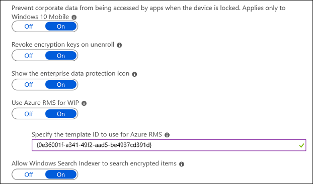
    
    - **Prevent corporate data from being accessed by apps when the device is locked. Applies only to Windows 10 Mobile.** Determines whether to encrypt enterprise data using a key that's protected by an employee's PIN code on a locked device. Apps won't be able to read corporate data when the device is locked. The options are:
        
        - **On.** Turns on the feature and provides the additional protection.
        
        - **Off, or not configured.** Doesn't enable this feature.
    
    - **Revoke encryption keys on unenroll.** Determines whether to revoke a user’s local encryption keys from a device when it’s unenrolled from Windows Information Protection. If the encryption keys are revoked, a user no longer has access to encrypted corporate data. The options are:
    
        - **On, or not configured (recommended).** Revokes local encryption keys from a device during unenrollment.
        
        - **Off.** Stop local encryption keys from being revoked from a device during unenrollment. For example if you’re migrating between Mobile Device Management (MDM) solutions.
        
    - **Show the enterprise data protection icon.** Determines whether the Windows Information Protection icon overlay appears on corporate files in the Save As and File Explorer views. The options are:
    
        - **On.** Allows the Windows Information Protection icon overlay to appear on corporate files in the Save As and File Explorer views. Additionally, for unenlightened but protected apps, the icon overlay also appears on the app tile and with Managed text on the app name in the **Start** menu.
        
        - **Off, or not configured (recommended).** Stops the Windows Information Protection icon overlay from appearing on corporate files or unenlightened, but protected apps. Not configured is the default option.
        
    - **Use Azure RMS for WIP.** Determines whether to use Azure Rights Management encryption with Windows Information Protection.
    
        - **On.** Starts using Azure Rights Management encryption with WIP. By turning this option on, you can also add a TemplateID GUID to specify who can access the Azure Rights Management protected files, and for how long. For more info about setting up Azure Rights management and using a template ID with WIP, see the [Choose to set up Azure Rights Management with WIP](#choose-to-set-up-azure-rights-management-with-wip) section of this topic.
        
        - **Off, or not configured.** Stops using Azure Rights Management encryption with WIP.

    - **Allow Windows Search Indexer to search encrypted files.** Determines whether to allow the Windows Search Indexer to index items that are encrypted, such as WIP protected files.
    
        - **On.** Starts Windows Search Indexer to index encrypted files.
    
        - **Off, or not configured.** Stops Windows Search Indexer from indexing encrypted files.

## Choose to set up Azure Rights Management with WIP
WIP can integrate with Microsoft Azure Rights Management to enable secure sharing of files by using removable drives such as USB drives. For more info about Azure Rights Management, see [Microsoft Azure Rights Management](https://products.office.com/business/microsoft-azure-rights-management). To integrate Azure Rights Management with WIP, you must already have Azure Rights Management set up.

To configure WIP to use Azure Rights Management, you must set the **AllowAzureRMSForEDP** MDM setting to **1** in Microsoft Intune. This setting tells WIP to encrypt files copied to removable drives with Azure Rights Management, so they can be shared amongst your employees on computers running at least Windows 10, version 1703.

Optionally, if you don’t want everyone in your organization to be able to share your enterprise data, you can set the **RMSTemplateIDForEDP** MDM setting to the **TemplateID** of the Azure Rights Management template used to encrypt the data. You must make sure to mark the template with the **EditRightsData** option. 

>[!IMPORTANT]
>Curly braces -- {} -- are required around the RMS Template ID.

>[!NOTE]
>For more info about setting the **AllowAzureRMSForEDP** and the **RMSTemplateIDForEDP** MDM settings, see the [EnterpriseDataProtection CSP](https://msdn.microsoft.com/windows/hardware/commercialize/customize/mdm/enterprisedataprotection-csp) topic. For more info about setting up and using a custom template, see [Configuring custom templates for the Azure Rights Management service](https://docs.microsoft.com/information-protection/deploy-use/configure-custom-templates) topic.

## Related topics
- [How to collect Windows Information Protection (WIP) audit event logs](collect-wip-audit-event-logs.md)
 
- [Deploy your Windows Information Protection (WIP) policy](deploy-wip-policy-using-intune.md)

- [Associate and deploy your Windows Information Protection (WIP) and VPN policies by using Microsoft Intune](create-vpn-and-wip-policy-using-intune.md)

- [General guidance and best practices for Windows Information Protection (WIP)](guidance-and-best-practices-wip.md)

- [What is Azure Rights Management?]( https://docs.microsoft.com/information-protection/understand-explore/what-is-azure-rms)

- [Create and deploy Windows Information Protection (WIP) app protection policy with Intune and MAM](https://docs.microsoft.com/intune/deploy-use/create-windows-information-protection-policy-with-intune)

- [Intune MAM Without Enrollment](https://blogs.technet.microsoft.com/configmgrdogs/2016/02/04/intune-mam-without-enrollment/)

- [Azure RMS Documentation Update for May 2016](https://blogs.technet.microsoft.com/enterprisemobility/2016/05/31/azure-rms-documentation-update-for-may-2016/)

>[!NOTE]
>Help to make this topic better by providing us with edits, additions, and feedback. For info about how to contribute to this topic, see [Editing Windows IT professional documentation](https://github.com/Microsoft/windows-itpro-docs/blob/master/CONTRIBUTING.md).
