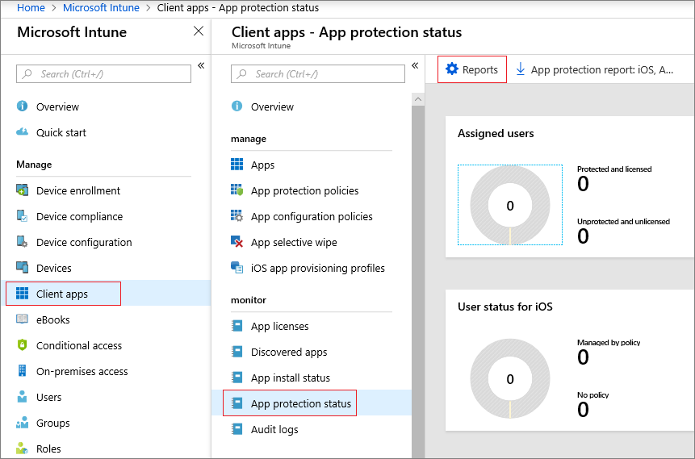
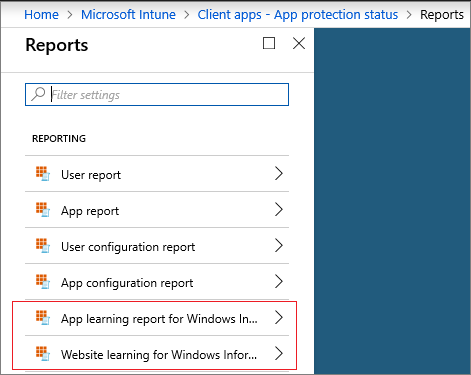
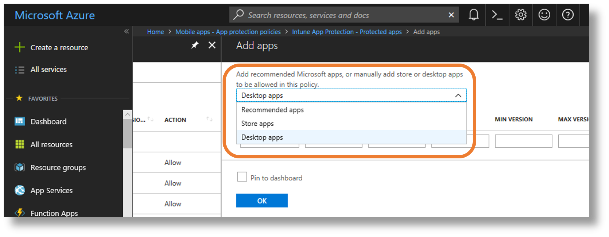

# Fine-tune Windows Information Protection (WIP) with WIP Learning
**Applies to:**

- Windows 10, version 1703 and later
- Windows 10 Mobile, version 1703 and later

With WIP Learning, you can intelligently tune which apps and websites are included in your WIP policy to help reduce disruptive prompts and keep it accurate and relevant. WIP Learning generates two reports: The **App learning report** and the **Website learning report**. Both reports can be accessed from Microsoft Azure Intune.

The **App learning report** monitors your apps, not in policy, that attempt to access work data. You can identify these apps using the report and add them to your WIP policies to avoid productivity disruption before fully enforcing WIP with [“Block”](protect-enterprise-data-using-wip.md#bkmk-modes) mode. Frequent monitoring of the report will help you continuously identify access attempts so you can update your policy accordingly.

In the **Website learning report**, you can view a summary of the devices that have shared work data with websites. You can use this information to determine which websites should be added to group and user WIP policies. The summary shows which website URLs are accessed by WIP-enabled apps so you can decide which ones are cloud or personal, and add them to the resource list.

## Access the WIP Learning reports

1. Open the [Azure portal](http://portal.azure.com/). 

1. Click **All services**, type **Intune** in the text box filter, and click the star to add it to **Favorites**.

1. Click **Intune** > **Client apps** > **App protection status** > **Reports**.

    

1. Select either **App learning report for Windows Information Protection** or **Website learning report for Windows Information Protection**. 

    

Once you have the apps and websites showing up in the WIP Learning logging reports, you can decide whether to add them to your app protection policies. 

## Use the WIP section of Device Health

You can use Device Health to adjust your WIP protection policy. See [Using Device Health](https://docs.microsoft.com/windows/deployment/update/device-health-using#windows-information-protection) to learn more.

If you want to configure your environment for Windows Analytics: Device Health, see [Get Started with Device Health](https://docs.microsoft.com/windows/deployment/update/device-health-get-started) for more information.

Once you have WIP policies in place, by using the WIP section of Device Health, you can:

- Reduce disruptive prompts by adding rules to allow data sharing from approved apps.
- Tune WIP rules by confirming that certain apps are allowed or denied by current policy.

## Use Device Health and Intune to adjust WIP protection policy

The information needed for the following steps can be found using Device Health, which you will first have to set up. Learn more about how you can  [Monitor the health of devices with Device Health](https://docs.microsoft.com/windows/deployment/update/device-health-monitor).

1. In **Device Health** click the app you want to add to your policy and copy the publisher information.

2. In Intune, click **App protection policies** and then choose the app policy you want to add an application to.

3. Click **Protected apps**, and then click **Add Apps**.

4. In the **Recommended apps** drop down menu, choose either **Store apps** or **Desktop apps**, depending on the app you've chosen (for example, an executable (EXE) is a desktop app). 

    

5. In **NAME** (optional), type the name of the app, and then in **PUBLISHER** (required), paste the publisher information that you copied in step 1 above.

    

6. Type the name of the product in **PRODUCT NAME** (required)  (this will probably be the same as what you typed for **NAME**).

7. Copy the name of the executable (for example, snippingtool.exe) and paste it in **FILE** (required).

8. Type the version number of the app into **MIN VERSION** in Intune (alternately, you can specify the max version, but one or the other is required), and then select the **ACTION**: **Allow** or **Deny**

When working with WIP-enabled apps and WIP-unknown apps, it is recommended that you start with **Silent** or **Allow overrides** while verifying with a small group that you have the right apps on your allowed apps list. After you're done, you can change to your final enforcement policy, **Block**. For more information about WIP modes, see: [Protect enterprise data using WIP: WIP-modes](protect-enterprise-data-using-wip.md#bkmk-modes)

>[!NOTE]
>Help to make this topic better by providing us with edits, additions, and feedback. For info about how to contribute to this topic, see [Editing Windows IT professional documentation](https://github.com/Microsoft/windows-itpro-docs/blob/master/CONTRIBUTING.md).
