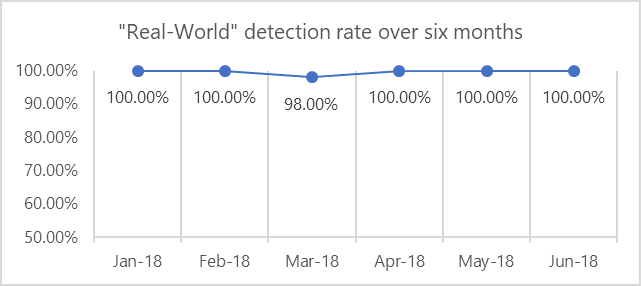
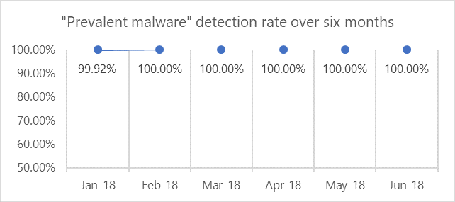

# Top scoring in industry antivirus tests

Antivirus capabilities in Windows Defender Advanced Threat Protection (Windows Defender ATP) **consistently receive high scores** from independent tests, making Windows Defender ATP a top choice in the antivirus market. Windows 10 has technological advances in AV as well as other built-in security solutions, raising the bar for exploits, malware, and other threats.

Windows Defender ATP [next generation protection](https://www.youtube.com/watch?v=Xy3MOxkX_o4) detects and stops malware at first sight by using a model that leverages predictive technologies, [machine learning](https://cloudblogs.microsoft.com/microsoftsecure/2018/06/07/machine-learning-vs-social-engineering/), [artificial intelligence](https://cloudblogs.microsoft.com/microsoftsecure/2018/02/14/how-artificial-intelligence-stopped-an-emotet-outbreak/), behavioral analysis, and other advanced technologies.

Millions of devices are protected from malware outbreaks and cyberattacks every day, sometimes [milliseconds after a campaign starts](https://cloudblogs.microsoft.com/microsoftsecure/2018/03/07/behavior-monitoring-combined-with-machine-learning-spoils-a-massive-dofoil-coin-mining-campaign/). In many cases, customers might not even know they were protected.

Test scores, real-world performance, and tight integration with the platform as well as other security technologies are the main reasons why Windows Defender ATP antivirus capabilities is [gaining a foothold in the enterprise market](https://docs.microsoft.com/windows/threat-protection/windows-defender-antivirus/windows-defender-antivirus-in-windows-10). 

## AV-TEST

The AV-TEST Product Review and Certification Report tests on three categories: protection, performance, and usability. The scores listed below are for the protection category against malware infections which has two scores, the AV-Test reference set (known as just "prevalent malware") and the real world testing.

**Real-world testing** refers to protection against zero-day malware attacks, inclusive of web and email threats.

**Prevalent malware** refers to detection of widespread and prevalent malware discovered in the last 4 weeks.

The below scores are the results of AV-TEST tests on **Windows Defender ATP antivirus capabilities**.

|Month (2018)|Real World test score| Prevalent malware test score | AV-Test report| Microsoft analysis|
|---|---|---|---|---|
|January| 100.00%| 99.92%| [Report (Jan-Feb)](https://www.av-test.org/en/antivirus/home-windows/windows-7/february-2018/kaspersky-lab-internet-security-18.0-180557/)| [Analysis (Jan-Feb)](https://query.prod.cms.rt.microsoft.com/cms/api/am/binary/RE27O5A?ocid=cx-blog-mmpc)|
|February| 100.00% | 100.00%|[Report (Jan-Feb)](https://www.av-test.org/en/antivirus/home-windows/windows-7/february-2018/kaspersky-lab-internet-security-18.0-180557/)| [Analysis (Jan-Feb)](https://query.prod.cms.rt.microsoft.com/cms/api/am/binary/RE27O5A?ocid=cx-blog-mmpc)|
March |98.00%| 100.00%|[Report (Mar-Apr)](https://www.av-test.org/en/antivirus/business-windows-client/windows-10/april-2018/microsoft-windows-defender-antivirus-4.12-181574/)|[Analysis (Mar-Apr)](https://query.prod.cms.rt.microsoft.com/cms/api/am/binary/RE2ouJA)|
April|100.00%| 100.00%|[Report (Mar-Apr)](https://www.av-test.org/en/antivirus/business-windows-client/windows-10/april-2018/microsoft-windows-defender-antivirus-4.12-181574/)|[Analysis (Mar-Apr)](https://query.prod.cms.rt.microsoft.com/cms/api/am/binary/RE2ouJA)|
May|100.00%| 100.00%| [Report (May-Jun)](https://www.av-test.org/en/antivirus/business-windows-client/windows-10/june-2018/microsoft-windows-defender-antivirus-4.12-182374/)|Analysis pending|
June|100.00%| 100.00%| [Report (May-Jun)](https://www.av-test.org/en/antivirus/business-windows-client/windows-10/june-2018/microsoft-windows-defender-antivirus-4.12-182374/)|Analysis pending|

### Graphs

## AV Comparatives

AV-Comparatives is an independent organization offering systematic testing for security software such as PC/Mac-based antivirus products and mobile security solutions.

The **blocked** category tests whether malware was successfully blocked by AV.

The  **Real-World Protection Test (Enterprise)** evaluates the “real-world” protection capabilities with default settings. The goal is to find out whether the security software protects the computer by either hindering the malware from changing any systems or remediating all changes if any were made.

The **Malware Protection Test Enterprise** assesses a security program’s ability to protect a system against infection by malicious files before, during or after execution. It is only tested every *six months*.

The below scores are the results of AV Comparatives tests on **Windows Defender ATP antivirus capabilities**.

|Month (2018)| Real World (blocked) test score| Malware (blocked) test score|
|---|---|---|
|January| No test| No test|
|February| 100.00%| No test|
|March| 94.40%| 99.90%|
|April| 96.40%%| No test|
|May| 100.00%| No test|
|June| 99.50%%| No test|

* [Real-World Protection Test (Enterprise) February - June 2018](https://www.av-comparatives.org/tests/real-world-protection-test-february-june-2018/)

* [Malware Protection Test Enterprise March 2018](https://www.av-comparatives.org/tests/malware-protection-test-enterprise-march-2018-testresult/)

## Protection capabilities not represented in the tests

It is important to remember that the capabilities within [Windows Defender ATP](https://www.microsoft.com/en-us/WindowsForBusiness/windows-atp?ocid=cx-blog-mmpc) provide [additional layers of protection](https://cloudblogs.microsoft.com/microsoftsecure/2017/12/11/detonating-a-bad-rabbit-windows-defender-antivirus-and-layered-machine-learning-defenses/) that are not factored into tests. The capabilities such as attack surface reduction and next generation protection help prevent malware from getting onto devices in the first place.

 To see these capabilities for yourself sign up for a [90-day trial of Windows Defender ATP](https://www.microsoft.com/windowsforbusiness/windows-atp?ocid=cx-blog-mmpc) today, or [enable Preview features on existing tenants](https://docs.microsoft.com/windows/security/threat-protection/windows-defender-atp/preview-settings-windows-defender-advanced-threat-protection).

