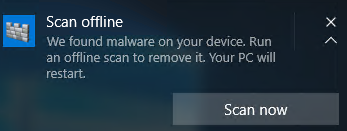
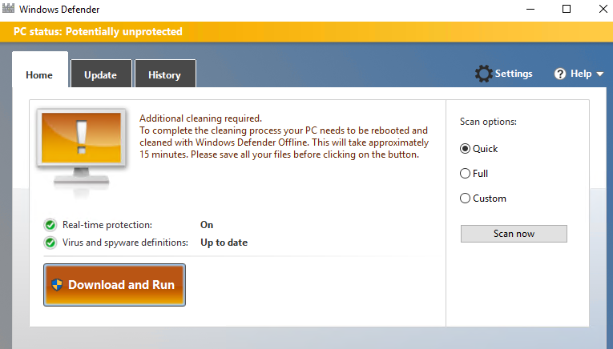
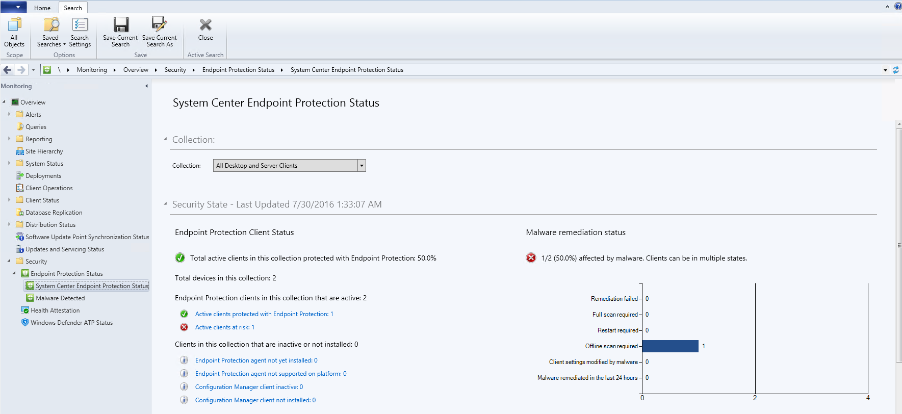

# Run and review the results of a Windows Defender Offline scan


**Applies to:**

- Windows 10, version 1607

**Audience**

- Enterprise security administrators

**Manageability available with**

- Group Policy
- PowerShell cmdlets
- Windows Management Instruction (WMI)

Windows Defender Offline is an antimalware scanning tool that lets you boot and run a scan from a trusted environment. The scan runs from outside the normal Windows kernel so it can target malware that attempts to bypass the Windows shell, such as viruses and rootkits that infect or overwrite the master boot record (MBR).

You can use Windows Defender Offline if you suspect a malware infection, or you want to confirm a thorough clean of the endpoint after a malware outbreak.

In Windows 10, Windows Defender Offline can be run with one click directly from the [Windows Defender Security Center app](windows-defender-security-center-antivirus.md). In previous versions of Windows, a user had to install Windows Defender Offline to bootable media, restart the endpoint, and load the bootable media.

## Pre-requisites and requirements

Windows Defender Offline in Windows 10 has the same hardware requirements as Windows 10. 

For more information about Windows 10 requirements, see the following topics:

- [Minimum hardware requirements](https://msdn.microsoft.com/library/windows/hardware/dn915086(v=vs.85).aspx)

- [Hardware component guidelines](https://msdn.microsoft.com/library/windows/hardware/dn915049(v=vs.85).aspx)

> [!NOTE]
> Windows Defender Offline is not supported on machines with ARM processors, or on Windows Server Stock Keeping Units.

To run Windows Defender Offline from the endpoint, the user must be logged in with administrator privileges.
 
## Windows Defender Offline updates

Windows Defender Offline uses the most recent protection updates available on the endpoint; it's updated whenever Windows Defender Antivirus is updated. 

> [!NOTE]
> Before running an offline scan, you should attempt to update Windows Defender AV protection. You can either force an update with Group Policy or however you normally deploy updates to endpoints, or you can manually download and install the latest protection updates from the [Microsoft Malware Protection Center](https://www.microsoft.com/security/portal/definitions/adl.aspx).

See the [Manage Windows Defender Antivirus protection and definition updates](manage-protection-updates-windows-defender-antivirus.md) topic for more information.

## Usage scenarios

In Windows 10, version 1607, you can manually force an offline scan. Alternatively, if Windows Defender determines that Windows Defender Offline needs to run, it will prompt the user on the endpoint. 

The need to perform an offline scan will also be revealed in System Center Configuration Manager if you're using it to manage your endpoints.

The prompt can occur via a notification, similar to the following:



The user will also be notified within the Windows Defender client:



In Configuration Manager, you can identify the status of endpoints by navigating to **Monitoring > Overview > Security > Endpoint Protection Status > System Center Endpoint Protection Status**. 

Windows Defender Offline scans are indicated under **Malware remediation status** as **Offline scan required**.



## Configure notifications
<a name="manage-notifications"></a>

Windows Defender Offline notifications are configured in the same policy setting as other Windows Defender AV notifications.

For more information about notifications in Windows Defender, see the [Configure the notifications that appear on endpoints](configure-notifications-windows-defender-antivirus.md) topic.

## Run a scan 

> [!IMPORTANT]
> Before you use Windows Defender Offline, make sure you save any files and shut down running programs. The Windows Defender Offline scan takes about 15 minutes to run. It will restart the endpoint when the scan is complete. The scan is performed outside of the usual Windows operating environment. The user interface will appear different to a normal scan performed by Windows Defender. After the scan is completed, the endpoint will be restarted and Windows will load normally.

You can run a Windows Defender Offline scan with the following:

- PowerShell
- Windows Management Instrumentation (WMI)
- The Windows Defender Security Center app


**Use PowerShell cmdlets to run an offline scan:**

Use the following cmdlets:

```PowerShell
Start-MpWDOScan
```

See [Use PowerShell cmdlets to configure and run Windows Defender Antivirus](use-powershell-cmdlets-windows-defender-antivirus.md) and [Defender cmdlets](https://technet.microsoft.com/en-us/library/dn433280.aspx) for more information on how to use PowerShell with Windows Defender Antivirus.

**Use Windows Management Instruction (WMI) to run an offline scan:**

Use the [**MSFT_MpWDOScan**](https://msdn.microsoft.com/en-us/library/dn455323(v=vs.85).aspx) class to run an offline scan.

The following WMI script snippet will immediately run a Windows Defender Offline scan, which will cause the endpoint to restart, run the offline scan, and then restart and boot into Windows.

```WMI
wmic /namespace:\\root\Microsoft\Windows\Defender path MSFT_MpWDOScan call Start 
```

See the following for more information:
- [Windows Defender WMIv2 APIs](https://msdn.microsoft.com/en-us/library/dn439477(v=vs.85).aspx)


**Use the Windows Defender Security app to run an offline scan:**

1. Open the Windows Defender Security Center by clicking the shield icon in the task bar or searching the start menu for **Defender**.

2. Click the **Virus & threat protection** tile (or the shield icon on the left menu bar) and then the **Advanced scan** label:

    
3.	Select **Windows Defender Offline scan** and click **Scan now**.


> [!NOTE]
> In Windows 10, version 1607, the offline scan could be run from under **Windows Settings** > **Update & security** > **Windows Defender** or from the Windows Defender client.


## Review scan results

Windows Defender Offline scan results will be listed in the [Scan history section of the Windows Defender Security Center app](windows-defender-security-center-antivirus.md#detection-history). 


## Related topics

- [Customize, initiate, and review the results of scans and remediation](customize-run-review-remediate-scans-windows-defender-antivirus.md)
- [Windows Defender Antivirus](windows-defender-antivirus-in-windows-10.md)