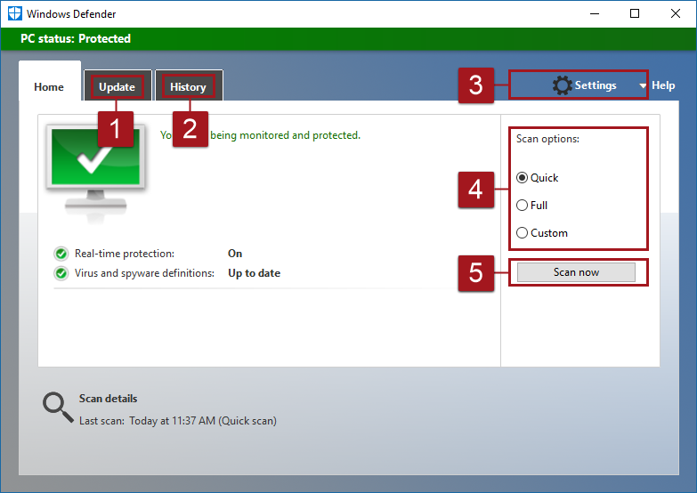
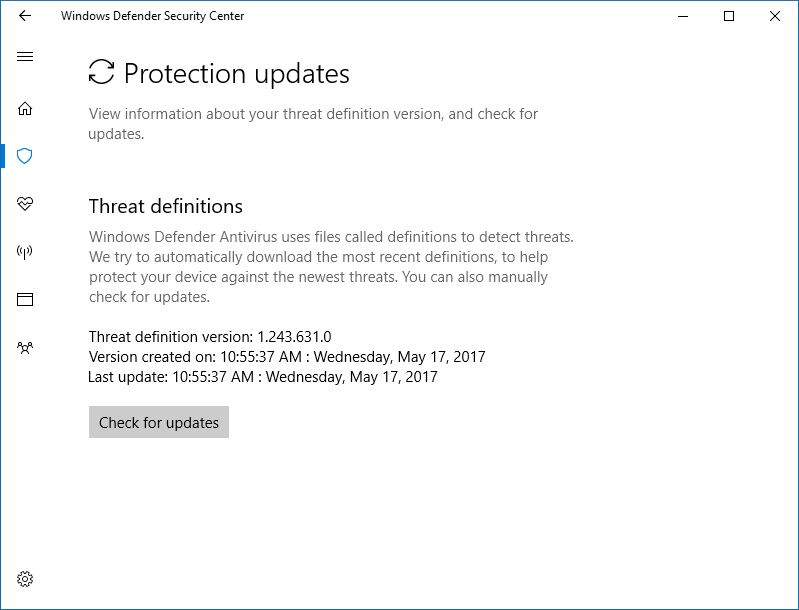

# Windows Defender Antivirus in the Windows Defender Security Center app

**Applies to**

- Windows 10, version 1703

**Audience**

- End-users

**Manageability available with**

- Windows Defender Security Center app  

In Windows 10, version 1703 (also known as the Creators Update), the Windows Defender app is now part of the Windows Defender Security Center.

Settings that were previously part of the Windows Defender client and main Windows Settings have been combined and moved to the new app, which is installed by default as part of Windows 10, version 1703.

> [!IMPORTANT] 
> Disabling the Windows Security Center service will not disable Windows Defender AV or [Windows Firewall](https://docs.microsoft.com/en-us/windows/access-protection/windows-firewall/windows-firewall-with-advanced-security). These will be disabled automatically when a third-party antivirus or firewall product is installed and kept up to date.

> [!WARNING] 
> If you do disable the Windows Security Center service, or configure its associated Group Policy settings to prevent it from starting or running, the Windows Defender Security Center may display stale or inaccurate information about any antivirus or firewall products you have installed on the device. 
>It may also prevent Windows Defender AV from enabling itself if you have an old or outdated third-party antivirus, or if you uninstall any third-party antivirus products you may have previously installed. 
>This will significantly lower the protection of your device and could lead to malware infection.

See the [Windows Defender Security Center topic](/windows/threat-protection/windows-defender-security-center/windows-defender-security-center) for more information on other Windows security features that can be monitored in the app.

>[!NOTE]
>The Windows Defender Security Center app is a client interface on Windows 10, version 1703. It is not the Windows Defender Security Center web portal that is used to review and manage [Windows Defender Advanced Threat Protection](../windows-defender-atp/windows-defender-advanced-threat-protection.md).

**Review virus and threat protection settings in the Windows Defender Security Center app:**

1. Open the Windows Defender Security Center app by clicking the shield icon in the task bar or searching the start menu for **Defender**.

2. Click the **Virus & threat protection** tile (or the shield icon on the left menu bar).

    
## Comparison of settings and functions of the old app and the new app

All of the previous functions and settings from the Windows Defender app (in versions of Windows 10 before version 1703) are now found in the new Windows Defender Security Center app. Settings that were previously located in Windows Settings under **Update & security** > **Windows Defender** are also now in the new app. 

The following diagrams compare the location of settings and functions between the old and new apps:

Item | Windows 10, before version 1703 | Windows 10, version 1703 | Description
---|---|---|---
1 | **Update** tab | **Protection updates** | Update the protection ("definition updates")
2 | **History** tab | **Scan history** | Review threats that were quarantined, removed, or allowed
3 | **Settings** (links to **Windows Settings**) | **Virus & threat protection settings** | Enable various features, including Real-time protection, Cloud-delivered protection, Advanced notifications, and Automatic ample submission
4 | **Scan options** | **Advanced scan** | Run a full scan, custom scan, or a Windows Defender Offline scan
5 | Run a scan (based on the option chosen under **Scan options** | **Quick scan** | In Windows 10, version 1703 you can run custom and full scans under the **Advanced scan** option

## Common tasks

This section describes how to perform some of the most common tasks when reviewing or interacting with the threat protection provided by Windows Defender Antivirus in the new Windows Defender Security Center app.

> [!NOTE]
> If these settings are configured and deployed using Group Policy, the settings described in this section will be greyed-out and unavailable for use on individual endpoints. Changes made through a Group Policy Object must first be deployed to individual endpoints before the setting will be updated in Windows Settings. The [Configure end-user interaction with Windows Defender Antivirus](configure-end-user-interaction-windows-defender-antivirus.md) topic describes how local policy override settings can be configured.

**Run a scan with the Windows Defender Security Center app**
1. Open the Windows Defender Security Center app by clicking the shield icon in the task bar or searching the start menu for **Defender**.

2. Click the **Virus & threat protection** tile (or the shield icon on the left menu bar).

3. Click **Quick scan**.

4. Click **Advanced scan** to specify different types of scans, such as a full scan.

**Review the definition update version and download the latest updates in the Windows Defender Security Center app**
1. Open the Windows Defender Security Center app by clicking the shield icon in the task bar or searching the start menu for **Defender**.

2. Click the **Virus & threat protection** tile (or the shield icon on the left menu bar).

3. Click **Protection updates**. The currently installed version is displayed along with some information about when it was downloaded. You can check this against the latest version available for manual download, or review the change log for that version.

4. Click **Check for updates** to download new protection updates (if there are any).

**Ensure Windows Defender Antivirus is enabled in the Windows Defender Security Center app**

1. Open the Windows Defender Security Center app by clicking the shield icon in the task bar or searching the start menu for **Defender**.

2. Click the **Virus & threat protection** tile (or the shield icon on the left menu bar).

3. Click **Virus & threat protection settings**.

4. Toggle the **Real-time protection** switch to **On**.

>[!NOTE]
>If you switch **Real-time protection** off, it will automatically turn back on after a short delay. This is to ensure you are protected from malware and threats.  
>If you install another antivirus product, Windows Defender AV will automatically disable itself and will indicate this in the Windows Defender Security Center app. A setting will appear that will allow you to enable limited periodic scanning.

**Add exclusions for Windows Defender Antivirus in the Windows Defender Security Center app**
1. Open the Windows Defender Security Center app by clicking the shield icon in the task bar or searching the start menu for **Defender**.

2. Click the **Virus & threat protection** tile (or the shield icon on the left menu bar).

3. Click **Virus & threat protection settings**.

4. Under the **Exclusions** setting, click **Add or remove exclusions**. 

5. Click the plus icon to choose the type and set the options for each exclusion. 

**Review threat detection history in the Windows Defender Security Center app**
1. Open the Windows Defender Security Center app by clicking the shield icon in the task bar or searching the start menu for **Defender**.
 
2. Click the **Virus & threat protection** tile (or the shield icon on the left menu bar).
 
3. Click **Scan history**.
 
4. Click **See full history** under each of the categories (**Current threats**, **Quarantined threats**, **Allowed threats**).
 
 

## Related topics

- [Windows Defender Antivirus](windows-defender-antivirus-in-windows-10.md)

