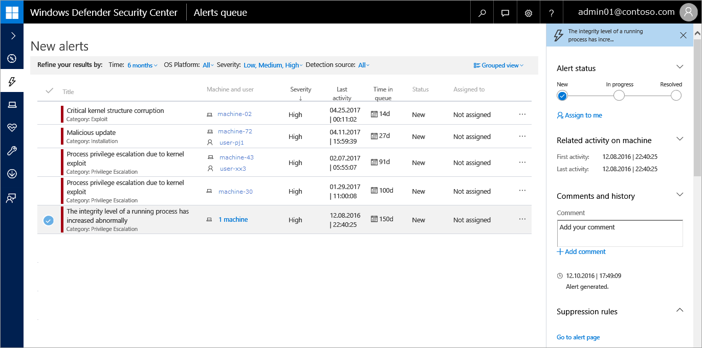

# View and organize the Windows Defender Advanced Threat Protection Alerts queue

**Applies to:**

- Windows 10 Enterprise
- Windows 10 Education
- Windows 10 Pro
- Windows 10 Pro Education
- Windows Defender Advanced Threat Protection (Windows Defender ATP)

The **Alerts queue** shows a list of alerts that were flagged from endpoints in your network. Alerts are displayed in queues according to their current status. In each queue, you'll see details such as the severity of alerts and the number of machines the alerts were raised on.

Alerts are organized in queues by their workflow status or assignment:

- **New**
- **In progress**
- **Resolved**
- **Assigned to me**

To see a list of alerts, click any of the queues under the **Alerts queue** option in the navigation pane.

> [!NOTE]
> By default, alerts in the queues are sorted from newest to oldest.

##  Sort, filter, and group the alerts list
You can sort and filter the alerts using the available filters or clicking on a column's header that will sort the view in ascending or descending order.

**Time period** 
- 1 day
- 3 days
- 7 days
- 30 days
- 6 months

**OS Platform** 
  - Windows 10
  - Windows Server 2012 R2
  - Windows Server 2016
  - Other

**Severity** 

Alert severity | Description
:---|:---
High  (Red) | Threats often associated with advanced persistent threats (APT). These alerts indicate a high risk due to the severity of damage they can inflict on endpoints.
Medium  (Orange) | Threats rarely observed in the organization, such as anomalous registry change, execution of suspicious files, and observed behaviors typical of attack stages.
Low  (Yellow) | Threats associated with prevalent malware and hack-tools that do not necessarily indicate an advanced threat targeting the organization.
Informational  (Grey) | Informational alerts are those that might not be considered harmful to the network but might be good to keep track of.

Reviewing the various alerts and their severity can help you decide on the appropriate action to protect your organization's endpoints.

**Detection source** 
- Windows Defender AV
- Windows Defender ATP

>[!NOTE]
>The Windows Defender Antivirus filter will only appear if your endpoints are using Windows Defender as the default real-time protection antimalware product.

**View** 
- **Flat view** - Lists alerts individually with alerts having the latest activity displayed at the top.
- **Grouped view** - Groups alerts by alert ID, file hash, malware family, or other attribute to enable more efficient alert triage and management. Alert grouping reduces the number of rows in the queue by aggregating similar alerts together.

The grouped view allows for efficient alert triage and management.

### Use the Alert management pane
Selecting an alert brings up the **Alert management** pane where you can manage and see details about the alert.

You can take immediate action on an alert and see details about an alert in the **Alert management** pane:

- Change the status of an alert from new, to in progress, or resolved.
- Specify the alert classification from true alert or false alert.
  Selecting true alert displays the **Determination** drop-down list to provide additional information about the true alert:
    - APT
    - Malware
    - Security personnel
    - Security testing
    - Unwanted software
    - Other
- Assign the alert to yourself if the alert is not yet assigned.
- View related activity on the machine.
- Add and view comments about the alert.

>[!NOTE]
>You can also access the **Alert management** pane from the machine details view by selecting an alert in the **Alerts related to this machine** section.

### Use the User details pane
Selecting a user brings up the **User details** pane where you can see information such as machine details, related alerts, last IP address, when the machine was first and last seen reporting to the service, and information on the logged on users.

### Bulk edit alerts
Select multiple alerts (Ctrl or Shift select) and manage or edit alerts together, which allows resolving multiple similar alerts in one action.

## Related topics
- [View the Windows Defender Advanced Threat Protection Dashboard](dashboard-windows-defender-advanced-threat-protection.md)
- [Investigate Windows Defender Advanced Threat Protection alerts](investigate-alerts-windows-defender-advanced-threat-protection.md)
- [Investigate a file associated with a Windows Defender ATP alert](investigate-files-windows-defender-advanced-threat-protection.md)
- [Investigate an IP address associated with a Windows Defender ATP alert](investigate-ip-windows-defender-advanced-threat-protection.md)
- [Investigate a domain associated with a Windows Defender ATP alert](investigate-domain-windows-defender-advanced-threat-protection.md)
- [View and organize the Windows Defender ATP Machines view](machines-view-overview-windows-defender-advanced-threat-protection.md)
- [Investigate machines in the Windows Defender ATP Machines view](investigate-machines-windows-defender-advanced-threat-protection.md)
- [Investigate a user account in Windows Defender ATP](investigate-user-windows-defender-advanced-threat-protection.md)
- [Manage Windows Defender Advanced Threat Protection alerts](manage-alerts-windows-defender-advanced-threat-protection.md)
- [Take response actions in Windows Defender ATP](response-actions-windows-defender-advanced-threat-protection.md)
