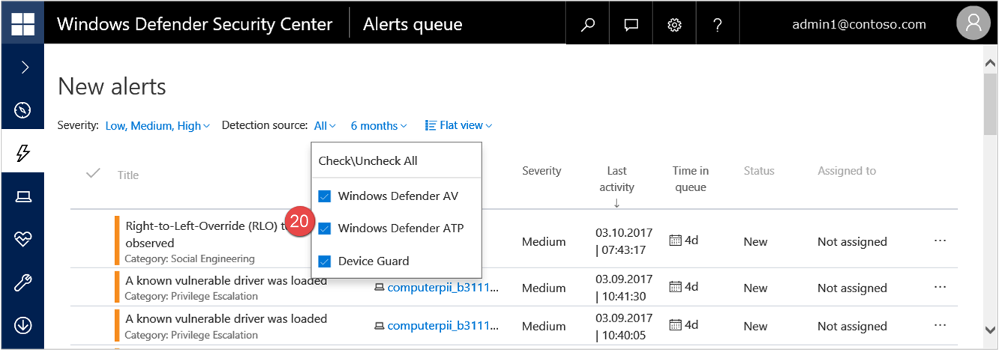
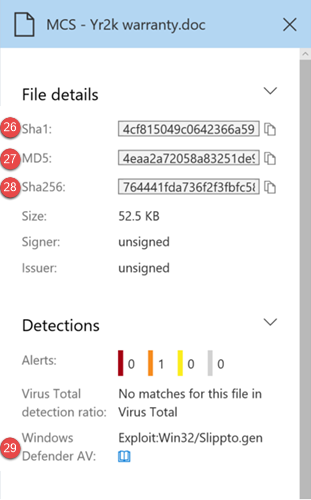

# Windows Defender ATP alert API fields

**Applies to:**

- Windows 10 Enterprise
- Windows 10 Education
- Windows 10 Pro
- Windows 10 Pro Education
- Windows Defender Advanced Threat Protection (Windows Defender ATP)

Understand what data fields are exposed as part of the alerts API and how they map to the Windows Defender ATP portal.

##	Alert API fields and portal mapping
Field numbers match the numbers in the images below.

Portal label  | SIEM field name | Description
:---|:---|:---
1	| LinkToWDATP |	Link back to the alert page in Windows Defender ATP
2	|	Alert ID	| Alert ID visible in the link: `https://securitycenter.windows.com/alert/<alert id>`
3	| AlertTitle | Alert	title
4	| Actor |	Actor name
5	| AlertTime |	Last time the alert was observed
6 | Severity |	Alert severity
7	| Category |	Alert category
8 | Status in queue | Alert status in queue
9	| ComputerDnsName|	Computer DNS name and machine name
10| IoaDefinitionId	| (Internal only)      ID for the IOA (Indication of attack) that this alert belongs to. It usually correlates with the title.    **Note**: This is an internal ID of the rule which triggers the alert. It's provided here as it can be used for aggregations in the SIEM.
11 | UserName	| The user context relevant to the activity on the machine which triggered the alert. NOTE: Not yet populated.
12 | FileName	| File name
13 | FileHash	| Sha1 of file observed
14 | FilePath	| File path
15 | IpAddress |	IP of the IOC (when relevant)
16 | URL	| URL of the IOC (when relevant)  
17 | FullId	| (Internal only)     Unique ID for each combination of IOC and Alert ID. Provides the ability to apply dedup logic in the SIEM.
18 | AlertPart	| (Internal only)     Alerts which contain multiple IOCs will be split into several messages, each message contains one IOC and a running counter. The counter provides the ability to reconstruct the alerts in the SIEM.
19 | LastProccesedTimeUtc | (Internal only)    	Time the alert was last processed in Windows Defender ATP.
20 | Source| Alert detection source (Windows Defender AV, Windows Defender ATP, and Device Guard)
21 | ThreatCategory| Windows Defender AV threat category
22 | ThreatFamily |	Windows Defender AV family name
23 | RemediationAction |	Windows Defender AV threat category	 |
24 | WasExecutingWhileDetected	| Indicates if a file was running while being detected.
25|	RemediationIsSuccess	| Indicates if an alert was successfully remediated.
26 | Sha1	| Sha1 of file observed	in alert timeline and in file side pane (when available)
27 | Md5 | Md5 of file observed	(when available)
28 | Sha256 |	Sha256 of file observed	(when available)
29	|	ThreatName	| Windows Defender AV threat name

>[!NOTE]
> Fields #21-29 are related to Windows Defender Antivirus alerts.

## Related topics
- [Enable SIEM integration in Windows Defender ATP](enable-siem-integration-windows-defender-advanced-threat-protection.md)
- [Configure Splunk to pull Windows Defender ATP alerts](configure-splunk-windows-defender-advanced-threat-protection.md)
- [Configure ArcSight to pull Windows Defender ATP alerts](configure-arcsight-windows-defender-advanced-threat-protection.md)
- [Pull Windows Defender ATP alerts using REST API](pull-alerts-using-rest-api-windows-defender-advanced-threat-protection.md)
- [Troubleshoot SIEM tool integration issues](troubleshoot-siem-windows-defender-advanced-threat-protection.md)
