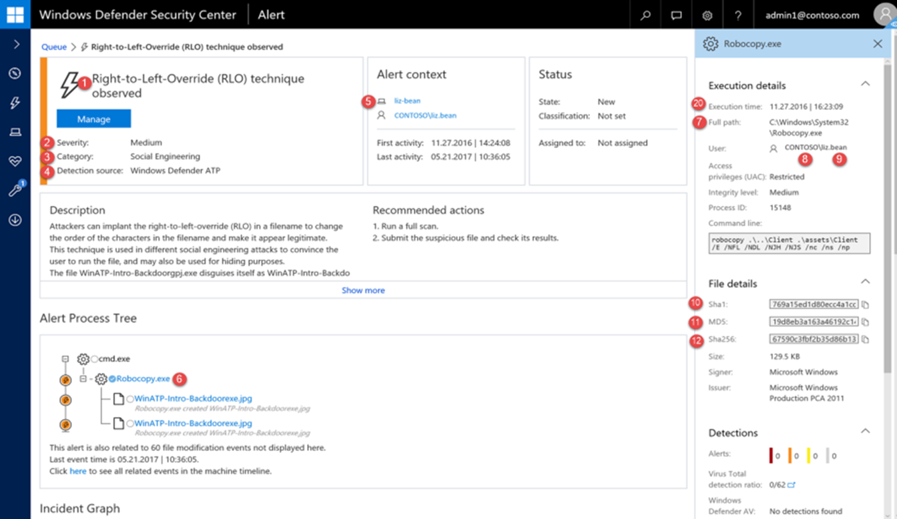
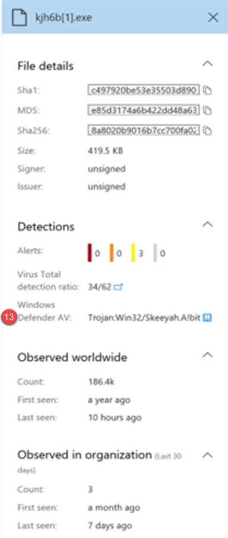

# Windows Defender ATP alert API fields

**Applies to:**

- Windows 10 Enterprise
- Windows 10 Education
- Windows 10 Pro
- Windows 10 Pro Education
- Windows Defender Advanced Threat Protection (Windows Defender ATP)

Understand what data fields are exposed as part of the alerts API and how they map to the Windows Defender ATP portal.

##	Alert API fields and portal mapping
Field numbers match the numbers in the images below.

<table style="table-layout:fixed;width:100%" >
  <tr>
    <th class="tg-yw4l">Portal label</th>
    <th class="tg-yw4l">SIEM field name</th>
    <th class="tg-yw4l">ArcSight field</th>
    <th class="tg-yw4l">Example value</th>
    <th class="tg-yw4l">Description</th>
    <th class="tg-yw4l"></th>
  </tr>
  <tr>
    <td class="tg-yw4l">1</td>
    <td class="tg-yw4l">AlertTitle</td>
    <td class="tg-yw4l">name</td>
    <td class="tg-yw4l">A dll was unexpectedly loaded into a high integrity process without a UAC prompt</td>
    <td class="tg-yw4l">Value available for every alert.</td>
    <td class="tg-yw4l"></td>
  </tr>
  <tr>
    <td class="tg-yw4l">2</td>
    <td class="tg-yw4l">Severity</td>
    <td class="tg-yw4l">deviceSeverity</td>
    <td class="tg-yw4l">Medium</td>
    <td class="tg-yw4l">Value available for every alert.</td>
    <td class="tg-yw4l"></td>
  </tr>
  <tr>
    <td class="tg-yw4l">3</td>
    <td class="tg-yw4l">Category</td>
    <td class="tg-yw4l">deviceEventCategory</td>
    <td class="tg-yw4l">Privilege Escalation</td>
    <td class="tg-yw4l">Value available for every alert.</td>
    <td class="tg-yw4l"></td>
  </tr>
  <tr>
    <td class="tg-yw4l">4</td>
    <td class="tg-yw4l">Source</td>
    <td class="tg-yw4l">sourceServiceName</td>
    <td class="tg-yw4l">WindowsDefenderATP</td>
    <td class="tg-yw4l">Windows Defender Antivirus or Windows Defender ATP. Value available for every alert.</td>
    <td class="tg-yw4l"></td>
  </tr>
  <tr>
    <td class="tg-yw4l">5</td>
    <td class="tg-yw4l">MachineName</td>
    <td class="tg-yw4l">sourceHostName</td>
    <td class="tg-yw4l">liz-bean</td>
    <td class="tg-yw4l">Value available for every alert.</td>
    <td class="tg-yw4l"></td>
  </tr>
  <tr>
    <td class="tg-yw4l">6</td>
    <td class="tg-yw4l">FileName</td>
    <td class="tg-yw4l">fileName</td>
    <td class="tg-yw4l">Robocopy.exe</td>
    <td class="tg-yw4l">Available for alerts associated with a file or process.</td>
    <td class="tg-yw4l"></td>
  </tr>
  <tr>
    <td class="tg-yw4l">7</td>
    <td class="tg-yw4l">FilePath</td>
    <td class="tg-yw4l">filePath</td>
    <td class="tg-yw4l">C:\Windows\System32\Robocopy.exe</td>
    <td class="tg-yw4l">Available for alerts associated with a file or process. \</td>
    <td class="tg-yw4l"></td>
  </tr>
  <tr>
    <td class="tg-yw4l">8</td>
    <td class="tg-yw4l">UserDomain</td>
    <td class="tg-yw4l">sourceNtDomain</td>
    <td class="tg-yw4l">contoso</td>
    <td class="tg-yw4l">The domain of the user context running the activity, available for Windows Defender ATP behavioral based alerts.</td>
    <td class="tg-yw4l"></td>
  </tr>
  <tr>
    <td class="tg-yw4l">9</td>
    <td class="tg-yw4l">UserName</td>
    <td class="tg-yw4l">sourceUserName</td>
    <td class="tg-yw4l">liz-bean</td>
    <td class="tg-yw4l">The user context running the activity, available for Windows Defender ATP behavioral based alerts.</td>
    <td class="tg-yw4l"></td>
  </tr>
  <tr>
    <td class="tg-yw4l">10</td>
    <td class="tg-yw4l">Sha1</td>
    <td class="tg-yw4l">fileHash</td>
    <td class="tg-yw4l">5b4b3985339529be3151d331395f667e1d5b7f35</td>
    <td class="tg-yw4l">Available for alerts associated with a file or process.</td>
    <td class="tg-yw4l"></td>
  </tr>
  <tr>
    <td class="tg-yw4l">11</td>
    <td class="tg-yw4l">Md5</td>
    <td class="tg-yw4l">deviceCustomString5</td>
    <td class="tg-yw4l">55394b85cb5edddff551f6f3faa9d8eb</td>
    <td class="tg-yw4l">Available for Windows Defender AV alerts.</td>
    <td class="tg-yw4l"></td>
  </tr>
  <tr>
    <td class="tg-yw4l">12</td>
    <td class="tg-yw4l">Sha256</td>
    <td class="tg-yw4l">deviceCustomString6</td>
    <td class="tg-yw4l">9987474deb9f457ece2a9533a08ec173a0986fa3aa6ac355eeba5b622e4a43f5</td>
    <td class="tg-yw4l">Available for Windows Defender AV alerts.</td>
    <td class="tg-yw4l"></td>
  </tr>
  <tr>
    <td class="tg-yw4l">13</td>
    <td class="tg-yw4l">ThreatName</td>
    <td class="tg-yw4l">eviceCustomString1</td>
    <td class="tg-yw4l">Trojan:Win32/Skeeyah.A!bit</td>
    <td class="tg-yw4l">Available for Windows Defender AV alerts.</td>
    <td class="tg-yw4l"></td>
  </tr>
  <tr>
    <td class="tg-yw4l">14</td>
    <td class="tg-yw4l">IpAddress</td>
    <td class="tg-yw4l">sourceAddress</td>
    <td class="tg-yw4l">218.90.204.141</td>
    <td class="tg-yw4l">Available for alerts associated to network events. For example, 'Communication to a malicious network destination'.</td>
    <td class="tg-yw4l"></td>
  </tr>
  <tr>
    <td class="tg-yw4l">15</td>
    <td class="tg-yw4l">Url</td>
    <td class="tg-yw4l">requestUrl</td>
    <td class="tg-yw4l">down.esales360.cn</td>
    <td class="tg-yw4l">Availabe for alerts associated to network events. For example, 'Communication to a malicious network destination'.</td>
    <td class="tg-yw4l"></td>
  </tr>
  <tr>
    <td class="tg-yw4l">16</td>
    <td class="tg-yw4l">RemediationIsSuccess</td>
    <td class="tg-yw4l">deviceCustomNumber2</td>
    <td class="tg-yw4l">TRUE</td>
    <td class="tg-yw4l">Available for Windows Defender AV alerts. ArcSight value is 1 when TRUE and 0 when FALSE.</td>
    <td class="tg-yw4l"></td>
  </tr>
  <tr>
    <td class="tg-yw4l">17</td>
    <td class="tg-yw4l">WasExecutingWhileDetected</td>
    <td class="tg-yw4l">deviceCustomNumber1</td>
    <td class="tg-yw4l">FALSE</td>
    <td class="tg-yw4l">Available for Windows Defender AV alerts. ArcSight value is 1 when TRUE and 0 when FALSE.</td>
    <td class="tg-yw4l"></td>
  </tr>
  <tr>
    <td class="tg-yw4l">18</td>
    <td class="tg-yw4l">AlertId</td>
    <td class="tg-yw4l">externalId</td>
    <td class="tg-yw4l">636210704265059241_673569822</td>
    <td class="tg-yw4l">Value available for every alert.</td>
    <td class="tg-yw4l"></td>
  </tr>
  <tr>
    <td class="tg-yw4l">19</td>
    <td class="tg-yw4l">LinkToWDATP</td>
    <td class="tg-yw4l">flexString1</td>
    <td class="tg-yw4l">https://securitycenter.windows.com/alert/636210704265059241_673569822</td>
    <td class="tg-yw4l">Value available for every alert.</td>
    <td class="tg-yw4l"></td>
  </tr>
  <tr>
    <td class="tg-yw4l">20</td>
    <td class="tg-yw4l">AlertTime</td>
    <td class="tg-yw4l">deviceReceiptTime</td>
    <td class="tg-yw4l">2017-05-07T01:56:59.3191352Z</td>
    <td class="tg-yw4l">The time the activity relevant to the alert occurred. Value available for every alert.</td>
    <td class="tg-yw4l"></td>
  </tr>
  <tr>
    <td class="tg-yw4l">21</td>
    <td class="tg-yw4l">MachineDomain</td>
    <td class="tg-yw4l">sourceDnsDomain</td>
    <td class="tg-yw4l">contoso.com</td>
    <td class="tg-yw4l">Domain name not relevant for AAD joined machines. Value available for every alert.</td>
    <td class="tg-yw4l"></td>
  </tr>
  <tr>
    <td class="tg-yw4l">22</td>
    <td class="tg-yw4l">Actor</td>
    <td class="tg-yw4l">deviceCustomString4</td>
    <td class="tg-yw4l"></td>
    <td class="tg-yw4l">Available for alerts related to a known actor group.</td>
    <td class="tg-yw4l"></td>
  </tr>
  <tr>
    <td class="tg-yw4l">21+5</td>
    <td class="tg-yw4l">ComputerDnsName</td>
    <td class="tg-yw4l">No mapping</td>
    <td class="tg-yw4l">liz-bean.contoso.com</td>
    <td class="tg-yw4l">The machine fully qualified domain name. Value available for every alert.</td>
    <td class="tg-yw4l"></td>
  </tr>
  <tr>
    <td class="tg-yw4l"></td>
    <td class="tg-yw4l">LogOnUsers</td>
    <td class="tg-yw4l">sourceUserId</td>
    <td class="tg-yw4l">contoso\liz-bean; contoso\jay-hardee</td>
    <td class="tg-yw4l">The domain and user of the interactive logon user/s at the time of the event. Note: For machines on Windows 10 version 1607, the domain information will not be available.</td>
    <td class="tg-yw4l"></td>
  </tr>
  <tr>
    <td class="tg-yw4l">Internal field</td>
    <td class="tg-yw4l">LastProcessedTimeUtc</td>
    <td class="tg-yw4l">No mapping</td>
    <td class="tg-yw4l">2017-05-07T01:56:58.9936648Z</td>
    <td class="tg-yw4l">Time when event arrived at the backend. This field can be used when setting the request parameter for the range of time that alerts are retrieved.</td>
    <td class="tg-yw4l"></td>
  </tr>
  <tr>
    <td class="tg-yw4l"></td>
    <td class="tg-yw4l">Not part of the schema</td>
    <td class="tg-yw4l">deviceVendor</td>
    <td class="tg-yw4l"></td>
    <td class="tg-yw4l">Static value in the ArcSight mapping - 'Microsoft'.</td>
    <td class="tg-yw4l"></td>
  </tr>
  <tr>
    <td class="tg-yw4l"></td>
    <td class="tg-yw4l">Not part of the schema</td>
    <td class="tg-yw4l">deviceProduct</td>
    <td class="tg-yw4l"></td>
    <td class="tg-yw4l">Static value in the ArcSight mapping - 'Windows Defender ATP'.</td>
    <td class="tg-yw4l"></td>
  </tr>
  <tr>
    <td class="tg-yw4l"></td>
    <td class="tg-yw4l">Not part of the schema</td>
    <td class="tg-yw4l">deviceVersion</td>
    <td class="tg-yw4l"></td>
    <td class="tg-yw4l">Static value in the ArcSight mapping - '2.0', used to identify the mapping versions.</td>
    <td class="tg-yw4l"></td>
  </tr>
</table>

Portal label | SIEM field name  | ArcSight field| Example value | Description
:---|:---|:---|:---|:---
1 | AlertTitle  | name   | A dll was unexpectedly loaded into a high integrity  process without a UAC prompt |   Value available for every alert.                                  
2 | Severity  | deviceSeverity  | Medium | Value available for every alert.  
3 | Category  | deviceEventCategory | Privilege Escalation  | Value available for every alert.                                            
4 | Source  | sourceServiceName   | WindowsDefenderATP   | Windows Defender Antivirus or Windows Defender ATP.   Value available for every alert.        
5 | MachineName  | sourceHostName  | liz-bean  | Value available for every alert.  
6 | FileName | fileName | Robocopy.exe | Available for alerts associated with a file or process.                                                                                
7 | FilePath | filePath | C:\Windows\System32\Robocopy.exe  | Available for alerts associated with a file or process. \                                                           
8 | UserDomain  | sourceNtDomain | contoso | The domain of the user context running the activity, available for Windows Defender ATP behavioral based alerts.           |               
9 | UserName | sourceUserName  | liz-bean | The user context running the activity, available for Windows Defender ATP behavioral based alerts.                                     
10 | Sha1 | fileHash| 5b4b3985339529be3151d331395f667e1d5b7f35     | Available for alerts associated with a file or process.                          
11 | Md5 | deviceCustomString5 | 55394b85cb5edddff551f6f3faa9d8eb | Available for Windows Defender AV alerts.
12 | Sha256 | deviceCustomString6 | 9987474deb9f457ece2a9533a08ec173a0986fa3aa6ac355eeba5b622e4a43f5 | Available for Windows Defender AV alerts.
13 | ThreatName | eviceCustomString1  | Trojan:Win32/Skeeyah.A!bit | Available for Windows Defender AV alerts.
14 | IpAddress | sourceAddress | 218.90.204.141                                                                     | Available for alerts associated to network events.   For example, 'Communication to a malicious network destination'.
15 | Url | requestUrl | down.esales360.cn                                                                  | Availabe for alerts associated to network events.   For example, 'Communication to a malicious network destination'.  
16 | RemediationIsSuccess | deviceCustomNumber2 | TRUE                                                                               | Available for Windows Defender AV   alerts. ArcSight value is 1 when TRUE and 0 when FALSE.
17 | WasExecutingWhileDetected | deviceCustomNumber1 | FALSE                                                                              | Available for Windows Defender AV alerts. ArcSight   value is 1 when TRUE and 0 when FALSE.
18 | AlertId | externalId          | 636210704265059241_673569822                                                       |   Value available for every alert.
19| LinkToWDATP | flexString1 | `https://securitycenter.windows.com/alert/636210704265059241_673569822`             |  Value available for every alert.
20 | AlertTime | deviceReceiptTime   | 2017-05-07T01:56:59.3191352Z  | The time the activity relevant to the alert occurred.   Value available for every alert.
21 | MachineDomain | sourceDnsDomain | contoso.com | Domain name not relevant for AAD joined machines. Value available for every alert.
22 | Actor | deviceCustomString4 || Available for alerts related to a known actor group.
21+5 | ComputerDnsName | No mapping | liz-bean.contoso.com | The machine fully qualified domain   name.   Value available for every alert.
             | LogOnUsers                | sourceUserId        | contoso\liz-bean; contoso\jay-hardee | The domain and user of the interactive logon user/s at   the time of the event. Note: For machines on Windows 10 version 1607, the domain information will not be available.
 Internal field | LastProcessedTimeUtc   | No mapping    | 2017-05-07T01:56:58.9936648Z | Time when event arrived at the  backend. This field can be used when setting the request parameter for the range of time that alerts are retrieved.
                | Not part of the schema | deviceVendor  |                              | Static value in the ArcSight mapping -   'Microsoft'.              
                | Not part of the schema | deviceProduct |                              | Static value in the ArcSight mapping - 'Windows   Defender ATP'.  
                | Not part of the schema | deviceVersion |                              | Static value in the ArcSight mapping - '2.0', used to   identify the mapping versions.                                                                   

## Related topics
- [Enable SIEM integration in Windows Defender ATP](enable-siem-integration-windows-defender-advanced-threat-protection.md)
- [Configure Splunk to pull Windows Defender ATP alerts](configure-splunk-windows-defender-advanced-threat-protection.md)
- [Configure ArcSight to pull Windows Defender ATP alerts](configure-arcsight-windows-defender-advanced-threat-protection.md)
- [Pull Windows Defender ATP alerts using REST API](pull-alerts-using-rest-api-windows-defender-advanced-threat-protection.md)
- [Troubleshoot SIEM tool integration issues](troubleshoot-siem-windows-defender-advanced-threat-protection.md)
