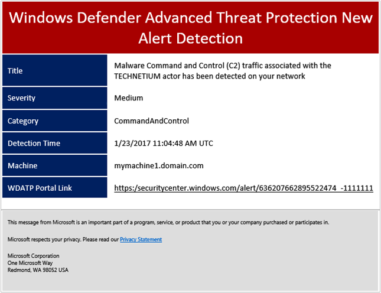

# Configure email notifications in Windows Defender ATP

**Applies to:**

- Windows 10 Enterprise
- Windows 10 Education
- Windows 10 Pro
- Windows 10 Pro Education
- Windows Defender Advanced Threat Protection (Windows Defender ATP)

[! include[Prerelease information](prerelease.md)]

You can configure Windows Defender ATP to send email notifications to specified recipients for new alerts. This feature enables you to identify a group of individuals who will immediately be informed and can act on alerts based on their severity.

> [!NOTE]
> Only users with full access can configure email notifications.

You can set the alert severity levels that trigger notifications. When you turn enable the email notifications feature, it’s set to high and medium alerts by default.

You can also add or remove recipients of the email notification. New recipients get notified about alerts encountered after they are added. For more information about alerts, see [View and organize the Alerts queue](alerts-queue-windows-defender-advanced-threat-protection.md).

The email notification includes basic information about the alert and a link to the portal where you can do further investigation.

## Set up email notifications for alerts
The email notifications feature is turned off by default. Turn it on to start receiving email notifications.

1. On the navigation pane, select **Preferences setup** > **Email Notifications**.
2. Toggle the setting between **On** and **Off**.
3.	Select the alert severity level that you’d like your recipients to receive:
  - **High** – Select this level to send notifications for high-severity alerts.
  - **Medium** – Select this level to send notifications for medium-severity alerts.
  - **Low** - Select this level to send notifications for low-severity alerts.
  - **Informational** - Select this level to send notification for alerts that might not be considered harmful but good to keep track of.
4.	In **Email recipients to notify on new alerts**, type the email address then select the + sign.
5.	Click **Save preferences** when you’ve completed adding all the recipients.

Check that email recipients are able to receive the email notifications by selecting **Send test email**. All recipients in the list will receive the test email.

Here's an example email notification:

## Remove email recipients

1. Select the trash bin icon beside the email address you’d like to remove.
2. Click **Save preferences**.

## Troubleshoot email notifications for alerts
This section lists various issues that you may encounter when using email notifications for alerts.

**Problem:** Intended recipients report they are not getting the notifications.

**Solution:** Make sure that the notifications are not blocked by email filters:

1.	Check that the Windows Defender ATP email notifications are not sent to the Junk Email folder. Mark them as Not junk.
2.	Check that your email security product is not blocking the email notifications from Windows Defender ATP.
3.	Check your email application rules that might be catching and moving your Windows Defender ATP email notifications.

## Related topics
- [Update general settings in Windows Defender ATP](general-settings-windows-defender-advanced-threat-protection.md)
- [Turn on advanced features in Windows Defender ATP](advanced-features-windows-defender-advanced-threat-protection.md)
- [Turn on the preview experience in Windows Defender ATP](preview-settings-windows-defender-advanced-threat-protection.md)
- [Enable SIEM integration in Windows Defender ATP](enable-siem-integration-windows-defender-advanced-threat-protection.md)
- [Enable the custom threat intelligence API in Windows Defender ATP](enable-custom-ti-windows-defender-advanced-threat-protection.md)
- [Create and build Power BI reports](powerbi-reports-windows-defender-advanced-threat-protection.md)