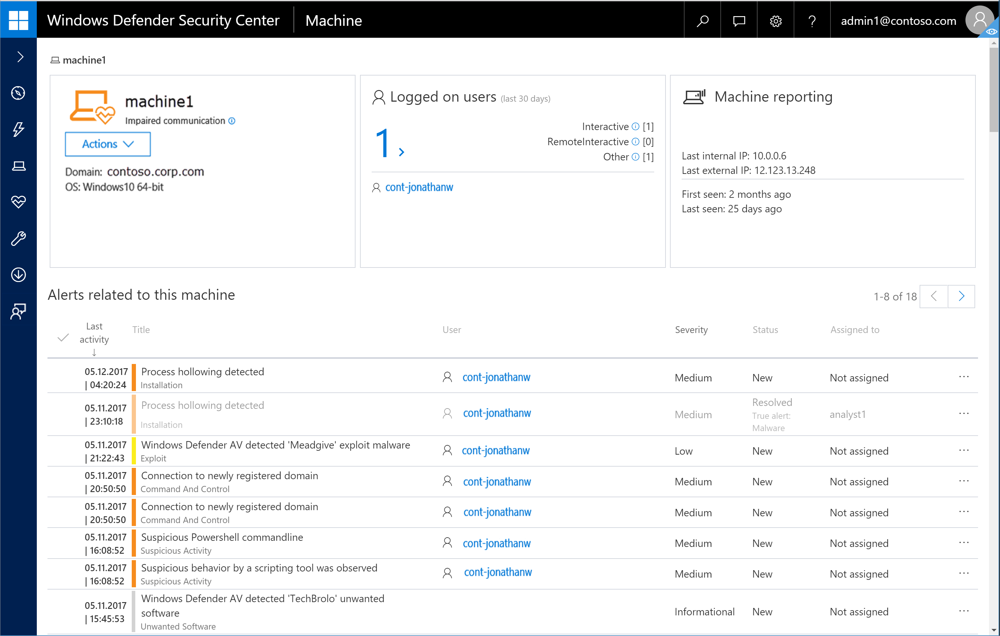
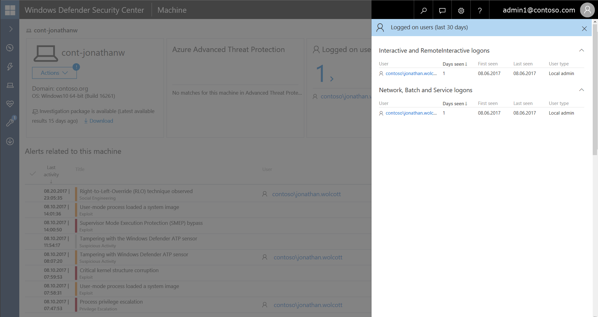
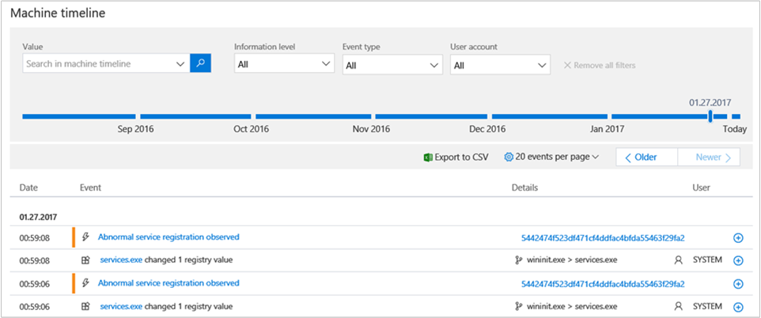
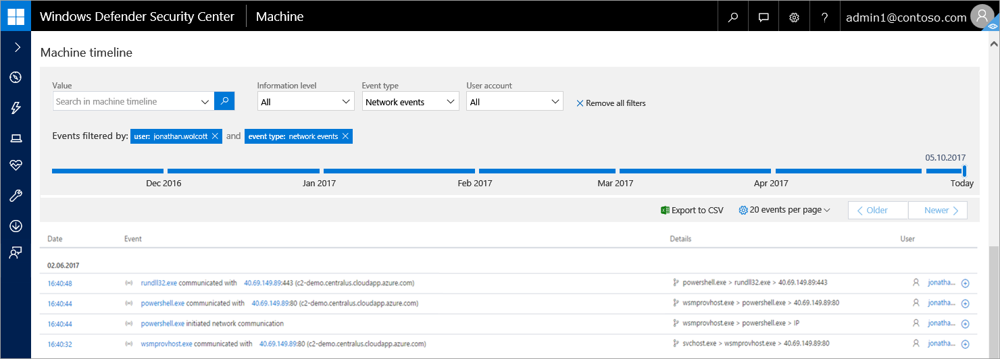
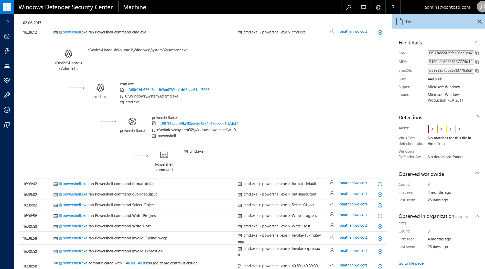

# Investigate machines in the Windows Defender ATP Machines view

**Applies to:**

- Windows 10 Enterprise
- Windows 10 Education
- Windows 10 Pro
- Windows 10 Pro Education
- Windows Defender Advanced Threat Protection (Windows Defender ATP)

## Investigate machines
Investigate the details of an alert raised on a specific machine to identify other behaviors or events that might be related to the alert or the potential scope of breach.

You can click on affected machines whenever you see them in the portal to open a detailed report about that machine. Affected machines are identified in the following areas:

- The [Machines view](investigate-machines-windows-defender-advanced-threat-protection.md)
- The [Alerts queue](alerts-queue-windows-defender-advanced-threat-protection.md)
- The [Dashboard](dashboard-windows-defender-advanced-threat-protection.md)
- Any individual alert
- Any individual file details view
- Any IP address or domain details view

When you investigate a specific machine, you'll see:
-	Machine details, Logged on users, and Machine Reporting
- Alerts related to this machine
- Machine timeline

The machine details, total logged on users and machine reporting sections display various attributes about the machine. You’ll see details such as machine name, health state, actions you can take on the machine, and others. For more information on how to take action on a machine, see [Take response action on a machine](respond-machine-alerts-windows-defender-advanced-threat-protection.md).

You'll also see other information such as domain, operating system (OS) and build, total logged on users and who frequently and less frequently logged on, IP address, and how long it's been reporting sensor data to the Windows Defender ATP service.

Clicking on the number of total logged on users in the Logged on users tile opens the Users Details pane that displays the following information for logged on users in the past 30 days:

-	Interactive and remote interactive logins
-	Network, batch, and system logins

You'll also see details such as logon types for each user account, the user group, and when the account logged occurred.

 For more information, see [Investigate user entities](investigate-user-windows-defender-advanced-threat-protection.md).

The **Alerts related to this machine** section provides a list of alerts that are associated with the machine. This list is a filtered version of the [Alerts queue](alerts-queue-windows-defender-advanced-threat-protection.md), and shows the date when the alert's last activity was detected, a short description of the alert, the user account associated with the alert, the alert's severity, the alert's status in the queue, and who is addressing the alert.

You can also choose to highlight an alert from the **Alerts related to this machine** or from the  **Machine timeline** section to see the correlation between the alert and its related events on the machine by right-clicking on the alert and selecting **Select and mark events**. This highlights the alert and its related events and helps distinguish them from other alerts and events appearing in the timeline. Highlighted events are displayed in all information levels whether you choose to view the timeline by **Detections**, **Behaviors**, or **Verbose**.

The **Machine timeline** section provides a chronological view of the events and associated alerts that have been observed on the machine.

This feature also enables you to selectively drill down into events that occurred within a given time period. You can view the temporal sequence of events that occurred on a machine over a selected time period.  

Windows Defender ATP monitors and captures suspicious or anomalous behavior on Windows 10 machines and displays the process tree flow in the **Machine timeline**. This gives you better context of the behavior which can contribute to understanding the correlation between events, files, and IP addresses in relation to the machine.

### Search for specific alerts
Use the search bar to look for specific alerts or files associated with the machine. Harness the power of using the following defined search queries based on type:value pairs and event filter types to sift through the search results:

-	**Value** - Type in any search keyword to filter the timeline with the attribute you’re searching for. This search supports defined search queries based on type:value pairs. 
  You can use any of the following values: 
  - Hash: Sha1 or MD5
  - File name
  - File extension
  - Path
  - Command line
  - User
  - IP
  - URL
-	**Informational level** – Click the drop-down button to filter by the following levels:
  - Detections mode: displays Windows ATP Alerts and detections
  -	Behaviors mode: displays "detections" and selected events of interest
  -	Verbose mode: displays all raw events without aggregation or filtering

- **Event type** - Click the drop-down button to filter by the following levels:
  - Windows Defender ATP alerts
  - Windows Defender AV alerts
  - Response actions
  - AppGuard related events
  - Windows Defender Device Guard events
  - Process events
  - Network events
  - File events
  - Registry events
  - Load DLL events
  - Other events   
  Filtering by event type allows you to define precise queries so that you see events with a specific focus. For example, you can search for a file name, then filter the results to only see Process events matching the search criteria or to only view file events, or even better: to view only network events over a period of time to make sure no suspicious outbound communications go unnoticed.

-	**User account** – Click the drop-down button to filter the machine timeline by the following user associated events:
  -	Logon users
  -	System
  -	Network
  -	Local service

The following example illustrates the use of type:value pair. The events were filtered by searching for the user jonathan.wolcott and network events as the event type:

The results in the timeline only show network communication events run in the defined user context.

### Filter events from a specific date
Use the time-based slider to filter events from a specific date. By default, the machine timeline is set to display the events of the current day.

Using the slider updates the listed alerts to the date that you select. Displayed events are filtered from that date and older.

The slider is helpful when you're investigating a particular alert on a machine. You can navigate from the **Alerts view** and click on the machine associated with the alert to jump to the specific date when the alert was observed, enabling you to investigate the events that took place around the alert.

### Export machine timeline events
You can also export detailed event data from the machine timeline to conduct offline analysis. You can choose to export the machine timeline for the current date or specify a date range. You can export up to seven days of data and specify the specific time between the two dates.

### Navigate between pages
Use the events per page drop-down to choose the number of alerts you’d like to see on the page. You can choose to display 20, 50, or 100 events per page. You can also move between pages by clicking **Older** or **Newer**.

From the **Machines view**, you can also navigate to the file, IP, or URL view and the timeline associated with an alert is retained, helping you view the investigation from different angles and retain the context of the event time line.

From the list of events that are displayed in the timeline, you can examine the behaviors or events in to help identify indicators of interests such as files and IP addresses to help determine the scope of a breach. You can then use the information to respond to events and keep your system secure.

You can also use the [Alerts spotlight](investigate-alerts-windows-defender-advanced-threat-protection.md#alert-timeline) feature to see the correlation between alerts and events on a specific machine.

Expand an event to view associated processes related to the event. Click on the circle next to any process or IP address in the process tree to investigate additional details of the identified processes. This action brings up the **Details pane** which includes execution context of processes, network communications and a summary of metadata on the file or IP address.

The details pane enriches the ‘in-context’ information across investigation and exploration activities, reducing the need to switch between contexts. It lets you focus on the task of tracing associations between attributes without leaving the current context.

## Related topics
- [View the Windows Defender Advanced Threat Protection Dashboard](dashboard-windows-defender-advanced-threat-protection.md)
- [View and organize the Windows Defender Advanced Threat Protection Alerts queue ](alerts-queue-windows-defender-advanced-threat-protection.md)
- [Investigate Windows Defender Advanced Threat Protection alerts](investigate-alerts-windows-defender-advanced-threat-protection.md)
- [Investigate a file associated with a Windows Defender ATP alert](investigate-files-windows-defender-advanced-threat-protection.md)
- [Investigate an IP address associated with a Windows Defender ATP alert](investigate-ip-windows-defender-advanced-threat-protection.md)
- [Investigate a domain associated with a Windows Defender ATP alert](investigate-domain-windows-defender-advanced-threat-protection.md)
- [View and organize the Windows Defender ATP Machines view](machines-view-overview-windows-defender-advanced-threat-protection.md)
- [Investigate a user account in Windows Defender ATP](investigate-user-windows-defender-advanced-threat-protection.md)
- [Manage Windows Defender Advanced Threat Protection alerts](manage-alerts-windows-defender-advanced-threat-protection.md)
- [Take response actions in Windows Defender ATP](response-actions-windows-defender-advanced-threat-protection.md)
