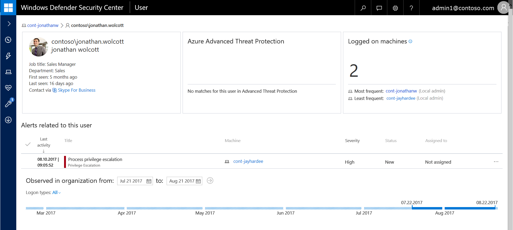

# Investigate a user account in Windows Defender ATP

**Applies to:**

- Windows 10 Enterprise
- Windows 10 Education
- Windows 10 Pro
- Windows 10 Pro Education
- Windows Defender Advanced Threat Protection (Windows Defender ATP)

[! include [Prerelease information](prerelease.md)]

## Investigate user account entities
Identify user accounts with the most active alerts (displayed on dashboard as "Users at risk") and investigate cases of potential compromised credentials, or pivot on the associated user account when investigating an alert or machine to identify possible lateral movement between machines with that user account.

You can find user account information in the following views:
- Security operations dashboard
- Alert queue
- Machine details page

A clickable user account link is available in these views, that will take you to the user account details page where more details about the user account are shown.

When you investigate a user account entity, you'll see:
- User account details, Azure Advanced Threat Protection alerts, and Logged on machines
- Alerts related to this user
- Observed in organization (machines logged on to)

The user account entity details, Azure Advanced Threat Protection alerts, and logged on machines sections display various attributes about the user account.

The user entity tile provides details about the user such as when the user was first and last seen. Depending on the integration features you enable, you'll see other details. For example, if you enable the Skype for business integration, you'll be able to contact the user from the portal. 

If you have enabled the Azure Advanced Threat Protection feature and there are alerts related to the user, you can click on the link that will take you to the Azure Advanced Threat Protection page where more information about the alerts are provided. The Azure Advanced Threat Protection tile also provides details such as the last AD site, total group memberships, and login failure associated with the user.

You'll also see a list of the machines that the user logged on to, and can expand these to see details of the logon events on each machine.

>[!NOTE]
>You’ll need to enable the integration between Windows Defender ATP and Azure Advanced Threat Protection to use this feature.

For more information on how to enable advanced features, see [Turn on advanced features](advanced-features-windows-defender-advanced-threat-protection.md).

The **Alerts related to this user** section provides a list of alerts that are associated with the user account. This list  is a filtered view of the [Alert queue](alerts-queue-windows-defender-advanced-threat-protection.md), and shows alerts where the user context is the selected user account, the date when the last activity was detected, a short description of the alert, the machine associated with the alert, the alert's severity, the alert's status in the queue, and who is assigned the alert.

The **Observed in organization** section allows you to specify a date range to see a list of machines where this user was observed logged on to, and the most frequent and least frequent logged on user account on each of these machines.

The machine health state is displayed in the machine icon and color as well as in a description text. Clicking on the icon displays additional details regarding machine health.

## Search for specific user accounts

1. Select **User** from the **Search bar** drop-down menu.
2. Enter the user account in the **Search** field.
3. Click the search icon or press **Enter**.

[IS THE BEHAVIOUR BELOW STILL TRUE? I TRIED TO SEARCH FOR USERS AND IT DOESN'T SEEM TO DISPLAY A LIST - PLEASE CHECK FOR TECHNICAL ACCURACY. THANKS!]

A list of users matching the query text is displayed. You'll see the user account's domain and name, when the user account was last seen, and the total number of machines it was observed logged on to in the last 30 days.

You can filter the results by the following time periods:
- 1 day
- 3 days
- 7 days
- 30 days
- 6 months

## Related topics
- [View the Windows Defender Advanced Threat Protection Security operations dashboard](dashboard-windows-defender-advanced-threat-protection.md)
- [View and organize the Windows Defender Advanced Threat Protection Alerts queue ](alerts-queue-windows-defender-advanced-threat-protection.md)
- [Investigate Windows Defender Advanced Threat Protection alerts](investigate-alerts-windows-defender-advanced-threat-protection.md)
- [Investigate a file associated with a Windows Defender ATP alert](investigate-files-windows-defender-advanced-threat-protection.md)
- [Investigate an IP address associated with a Windows Defender ATP alert](investigate-ip-windows-defender-advanced-threat-protection.md)
- [Investigate a domain associated with a Windows Defender ATP alert](investigate-domain-windows-defender-advanced-threat-protection.md)
- [View and organize the Windows Defender ATP Machines list](machines-view-overview-windows-defender-advanced-threat-protection.md)
- [Investigate machines in the Windows Defender ATP Machines list](investigate-machines-windows-defender-advanced-threat-protection.md)
- [Manage Windows Defender Advanced Threat Protection alerts](manage-alerts-windows-defender-advanced-threat-protection.md)
- [Take response actions in Windows Defender ATP](response-actions-windows-defender-advanced-threat-protection.md)
