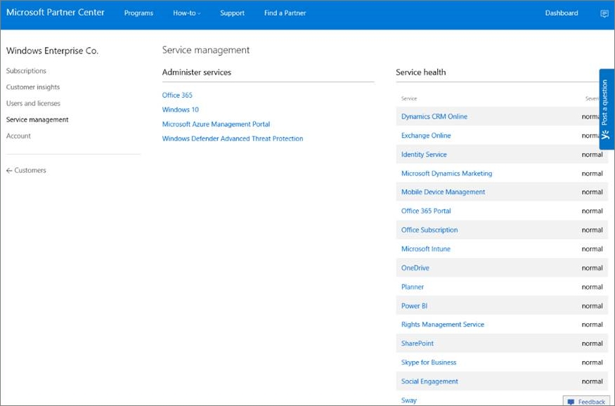
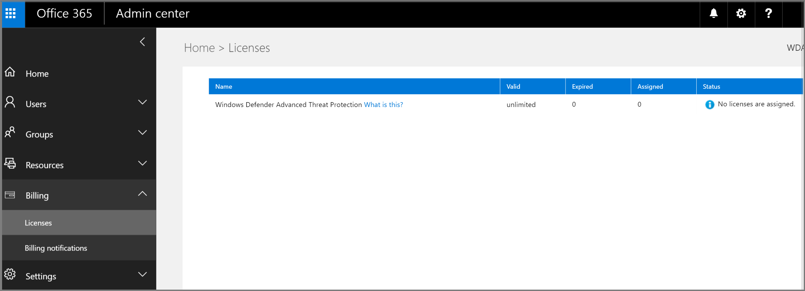
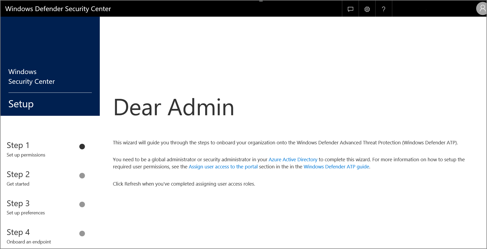
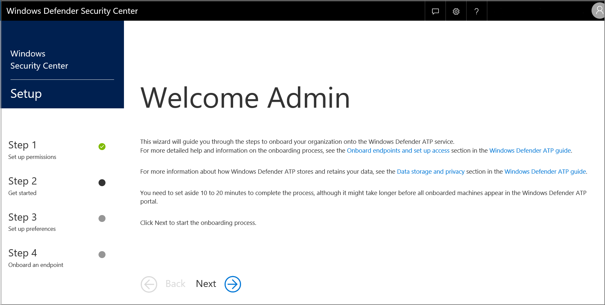
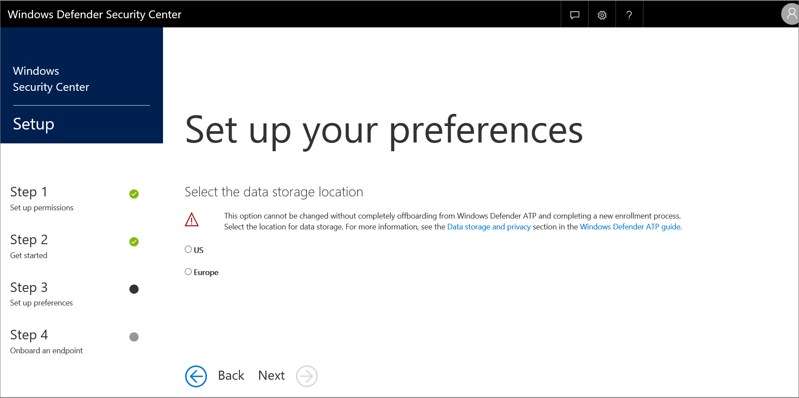
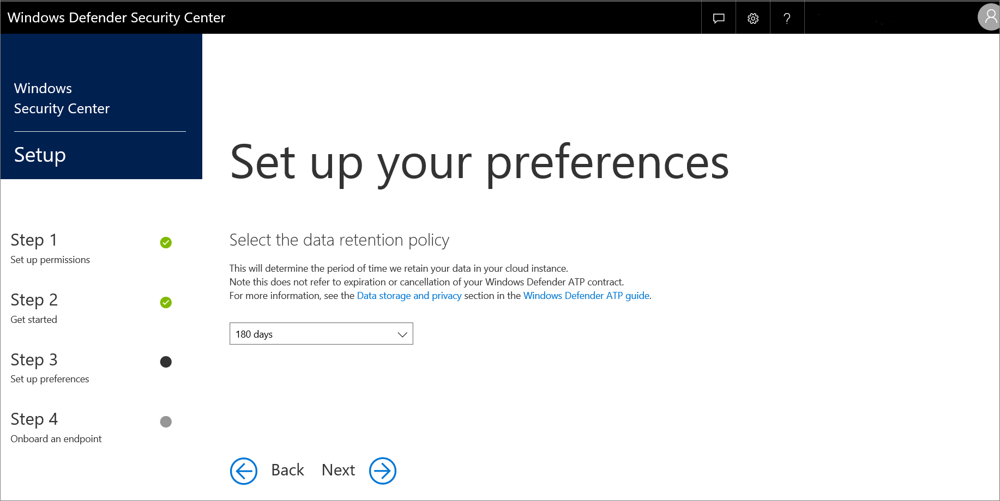
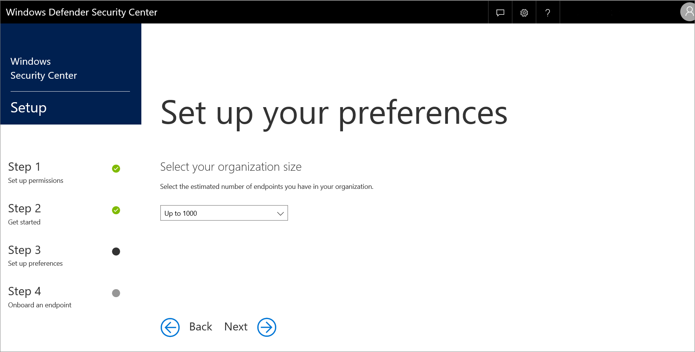
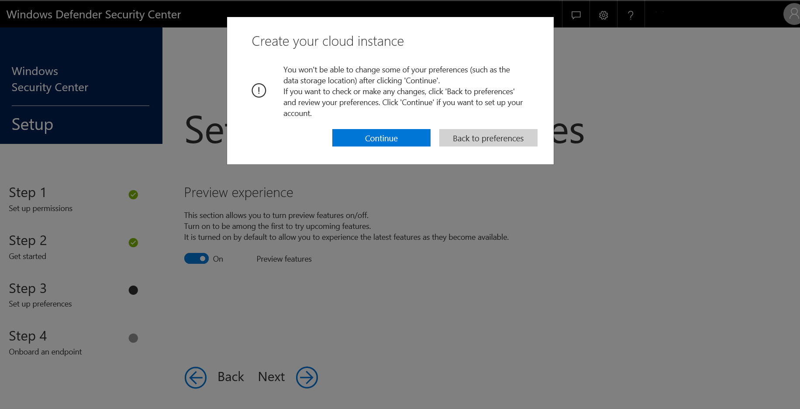
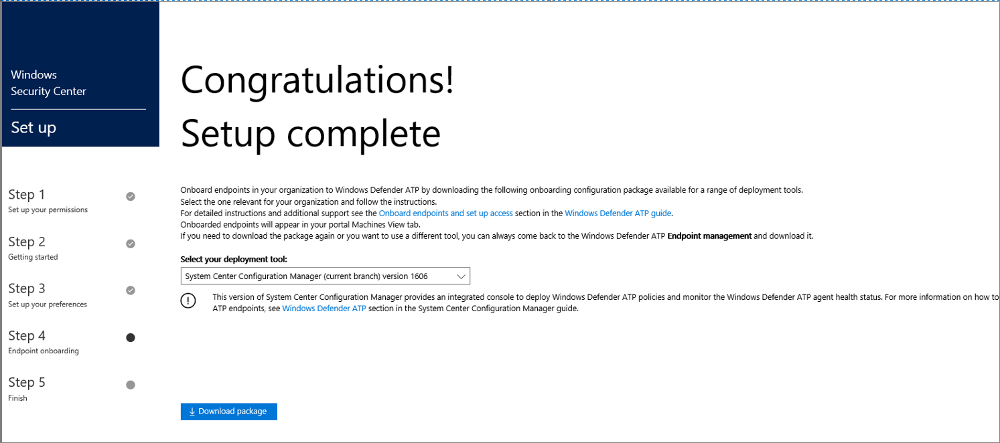

# Validating licensing provisioning and completing setup for Windows Defender ATP

**Applies to:**

- Windows 10 Enterprise
- Windows 10 Education
- Windows 10 Pro
- Windows 10 Pro Education
- Windows Defender Advanced Threat Protection (Windows Defender ATP)

[!include[Prerelease information](prerelease.md)]

## Gain access to provisioned licenses
The easiest way to gain access into which license is provisioned to the customer tenant and the license state is to check the O365 admin portal of the customer.

1. From the partner portal, click on the administrative service of Office 365 for the customer.

2. Clicking on the partner portal link will leverage the **admin on behalf** option and will give you access to the customer admin portal.

3. In the office admin portal navigate to **Billing** > **Licenses**

    - On the right side of the screen you will see all the provisioned licenses and their current state.

## Accessing the Windows Defender ATP Portal for the first time

When accessing the [Windows Defender ATP portal](https://SecurityCenter.Windows.com) for the first time there will be a wizard that will guide you through some initial steps. At the end of the setup wizard there will be a dedicated cloud instance of Windows Defender ATP that will be created.

1. Each time you access the portal you will need to validate that you are authorized to access the product. Only if you are not authorized will this **setup your permissions** step be relevant.

Once the authorization step completed will the **Welcome** screen be displayed.

2. The **Welcome** screen will provide some details as to what is about to occur in the setup wizard.

You will need to setup your preferences for the Windows Defender ATP Portal. 

3. When onboarding the service for the first time, you can choose to store your data in Microsoft Azure datacenters in Europe or United States. Once configured, you cannot change the location where your data is stored. This provides a convenient way to minimize compliance risk by actively selecting the geographic locations where your data will reside. Microsoft will not transfer the data from the specified geolocation.

> [!NOTE]
> This option cannot be changed without completely offboarding from Windows Defender ATP and completing a new enrollment process.

4. Windows Defender ATP will store data up to a period of 6 months in your cloud instance, you have the option to set the data retention period for a shorter timeframe during this step of the setup process.

> [!NOTE]
> This option can be changed at a later time.

5. You will need to indicate the size of your organization based on an estimate of the number of employees they currently employ.

> [!NOTE]
> The **organization size** question is not related to how many licenses were purchased for your organization. It is used by the service to optimize the creation of the data cluster for your organization.

6. The customer industry information is helpful in collecting data for the Windows Security Team, and while optional, would be useful if completed. 

> [!NOTE]
> This option can be changed at a later time.

7. Learn about new features in the Windows Defender ATP preview release and be among the first to try upcoming features by turning on the "Preview experience".

You'll have access to upcoming features which you can provide feedback on to help improve the overall experience before features are generally available.

- Toggle the setting between On and Off to choose Preview experience.

> [!NOTE]
> This option can be changed at a later time.

8. You will receive a warning notifying you that you won't be able to change some of your preferences once you click "Continue".

> [!NOTE]
> Some of these options can be changed at a later time in the Windows Defender ATP Portal.

9. A dedicated cloud instance of the Windows Defender ATP Portal is being created. This step will take an average of 5 minutes to complete.

10. You are almost done. You will now get the option to onboard endpoints in your organization by downloading a configuration policy package to onboard Windows10 machines to the service. This function is always accessible, as long there is a valid license for Windows Defender ATP in place.

For additional information on this process please see [configure endpoints](https://technet.microsoft.com/en-us/itpro/windows/keep-secure/configure-endpoints-windows-defender-advanced-threat-protection). 

## Related topics
- [Onboard and set up Windows Defender Advanced Threat Protection](onboard-configure-windows-defender-advanced-threat-protection.md)
- [Troubleshoot oboarding process and error messages](troubleshoot-onboarding-error-messages-windows-defender-advanced-threat-protection.md)