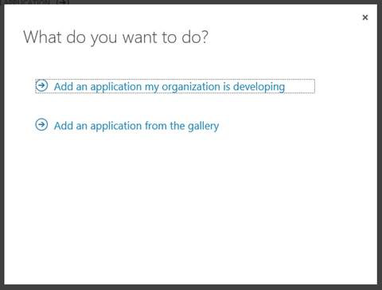

# Manage Windows Defender ATP alerts using the application program interface (APIs)

**Applies to:**

- Windows 10 Enterprise
- Windows 10 Education
- Windows 10 Pro
- Windows 10 Pro Education
- Windows Defender Advanced Threat Protection (Windows Defender ATP)

Windows Defender ATP supports the OAuth 2.0 protocol. Using the OAuth 2.0 Authentication flow, you can use programmatic APIs to take response actions and leverage the rich host-based collected information to enrich signals from other sources through the Microsoft Security Graph. For more information, see OAuth 2.0 Authorization Code Flow.

In general, you’ll need to take the following steps to use the APIs:
-	Create an app
-	Fetch a token
-	Run queries on the graph API

### Before you begin
Before using the APIs, you’ll need to create an app that you’ll use to authenticate against the graph. You’ll need to create a native app to use for the adhoc queries. 

**Create an app** 
1.	Log on to [Azure](https://manage.windowsazure.com).

2.	Navigate to **Active Directory**. 

3.	Select the tenant you want to register this app in - you can have several tenants. You are advised to have at least one separate development or test tenant in addition to a production tenant. 

4.	Go to the **Applications** tab and click **Add**.

5.	Select **Add an application my organization is developing**.

