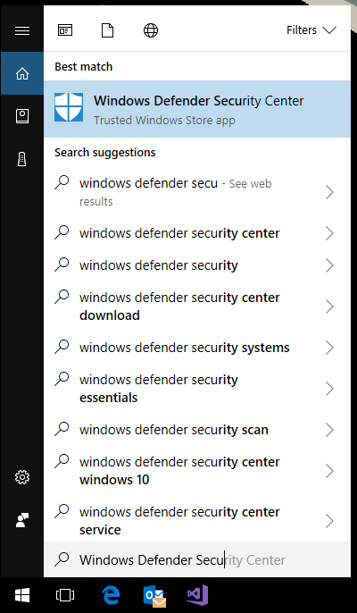
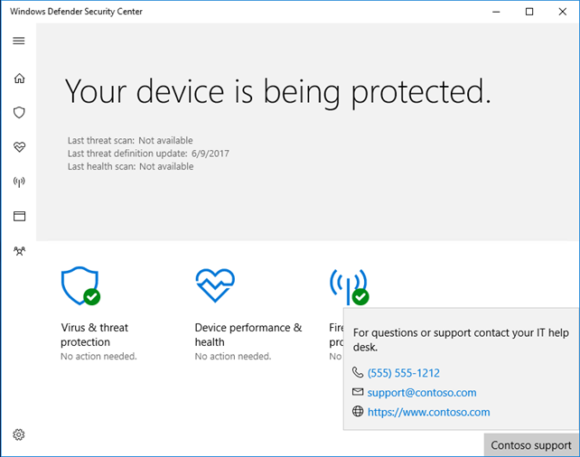
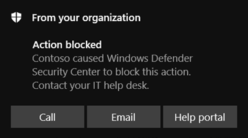

# The Windows Defender Security Center

**Applies to**

- Windows 10, version 1709

In Windows 10, version 1703 we introduced the new Windows Defender Security Center app, which brings together common Windows security features into one easy-to-use app.

Many settings that were previously part of the individual features and main Windows Settings have been combined and moved to the new app, which is installed out-of-the-box as part of Windows 10, version 1703.

The app includes the settings and status for the following security features:

- Virus & threat protection, including settings for Windows Defender Antivirus and Controlled folder access
- Device performance & health, which includes information about drivers, storage space, and general Windows Update issues
- Firewall & network protection, including Windows Defender Firewall
- App & browser control, covering Windows Defender SmartScreen settings and Exploit protection mitigations
- Family options, which includes access to parental controls along with tips and information for keeping kids safe online

In Windows 10, version 1709, we increased the scope of the app to also show information from third-party antivirus and firewall apps.

The Windows Defender Security Center app uses the [Security Center service](https://technet.microsoft.com/en-us/library/bb457154.aspx#EDAA) to provide the status and information on third-party antivirus and firewall products that are installed on the device. 

>[!IMPORTANT]
>Windows Defender AV and the Windows Defender Security Center app use similarly named services for specific purposes.  
>  
>The Windows Defender Security Center app uses the Windows Defender Security Center Service (*SecurityHealthService* or *Windows Security Health Servce*), which in turn utilizes the Security Center service ([*wscsvc*](https://technet.microsoft.com/en-us/library/bb457154.aspx#EDAA)) to ensure the app provides the most up-to-date information about the protection status on the endpoint, including protection offered by third-party antivirus products, Windows Defender Firewall, and other security protection.  
>  
>These services do not affect the state of Windows Defender AV. Disabling or modifying these services will not disable Windows Defender AV, and will lead to a lowered protection state on the endpoint, even if you are using a third-party antivirus product.  
>  
>Windows Defender AV will be [disabled automatically when a third-party antivirus product is installed and kept up to date](../windows-defender-antivirus/windows-defender-antivirus-compatibility.md).
>  
>Disabling the Windows Security Center service will not disable Windows Defender AV or [Windows Defender Firewall](https://docs.microsoft.com/en-us/windows/access-protection/windows-firewall/windows-firewall-with-advanced-security).  

> [!WARNING] 
> If you disable the Security Center service, or configure its associated Group Policy settings to prevent it from starting or running, the Windows Defender Security Center app may display stale or inaccurate information about any antivirus or firewall products you have installed on the device.  
>  
>It may also prevent Windows Defender AV from enabling itself if you have an old or outdated third-party antivirus, or if you uninstall any third-party antivirus products you may have previously installed. 
>  
>This will significantly lower the protection of your device and could lead to malware infection. 

## Open the Windows Defender Security Center app
- Right-click the icon in the notification area on the taskbar and click **Open**.

    
- Search the Start menu for **Windows Defender Security Center**.

    

> [!NOTE]
> Settings configured with management tools, such as Group Policy, Microsoft Intune, or System Center Configuration Manager, will generally take precedence over the settings in the Windows Defender Security Center. Review the settings for each feature in its appropriate library. Links for both home user and enterprise or commercial audiences are listed below.

## How the Windows Defender Security Center app works with Windows security features

The Windows Defender Security Center app operates as a separate app or process from each of the individual features, and will display notifications through the Action Center. 

It acts as a collector or single place to see the status and perform some configuration for each of the features.

Disabling any of the individual features (through Group Policy or other management tools, such as System Center Configuration Manager) will prevent that feature from reporting its status in the Windows Defender Security Center app. The Windows Defender Security Center app itself will still run and show status for the other security features.

> [!IMPORTANT] 
> Individually disabling any of the services will not disable the other services or the Windows Defender Security Center app.

For example, using a third-party antivirus will disable Windows Defender Antivirus. However, the Windows Defender Security Center app will still run, show its icon in the taskbar, and display information about the other features, such as Windows Defender SmartScreen and Windows Defender Firewall.

The presence of the third-party antivirus will be indicated under the **Virus & threat protection** section and third-party firewalls will be shown under the **Firewall & network protection** section in the Windows Defender Security Center app.

See the [Windows Defender Antivirus compatibility](https://docs.microsoft.com/en-us/windows/threat-protection/windows-defender-antivirus/windows-defender-antivirus-compatibility) topic for more information on how Windows Defender AV works with other antivirus apps, and what options are availble.

## More information

See the following links for more information on the features in the Windows Defender Security Center app:
- Windows Defender Antivirus
    - IT administrators and IT pros can get configuration guidance from the [Windows Defender Antivirus in the Windows Defender Security Center topic](https://docs.microsoft.com/en-us/windows/threat-protection/windows-defender-antivirus/windows-defender-security-center-antivirus) and the [Windows Defender Antivirus documentation library](https://docs.microsoft.com/en-us/windows/threat-protection/windows-defender-antivirus/windows-defender-antivirus-in-windows-10)
    - Home users can learn more at the [Virus & threat protection in Windows Defender Security Center topic at support.microsoft.com](https://support.microsoft.com/en-us/help/4012987/windows-10-virus-threat-protection-windows-defender-security-center)
- Device performance & health
    - It administrators and IT pros can [configure the Load and unload device drivers security policy setting](https://docs.microsoft.com/en-us/windows/device-security/security-policy-settings/load-and-unload-device-drivers), and learn how to [deploy drivers during Windows 10 deployment using System Center Configuration Manager](https://docs.microsoft.com/en-us/windows/deployment/deploy-windows-sccm/add-drivers-to-a-windows-10-deployment-with-windows-pe-using-configuration-manager)
    - Home users can learn more at the [Track your device and performance health in Windows Defender Security Center topic at support.microsoft.com](https://support.microsoft.com/en-us/help/4012986/windows-defender-track-your-device-performance-health)
- Windows Defender Firewall
    - IT administrators and IT pros can get configuration guidance from the [Windows Defender Firewall with Advanced Security documentation library](https://docs.microsoft.com/en-us/windows/access-protection/windows-firewall/windows-firewall-with-advanced-security)
    - Home users can learn more at the [Firewall & network protection in Windows Defender Security Center topic at support.microsoft.com](https://support.microsoft.com/en-us/help/4012988/windows-10-firewall-network-protection-windows-defender-security-center)
- Windows Defender SmartScreen
    - IT administrators and IT pros can get configuration guidance from the [Windows Defender SmartScreen documentation library](https://docs.microsoft.com/en-us/windows/threat-protection/windows-defender-smartscreen/windows-defender-smartscreen-overview)
    - Home users can learn more at the [App & browser control in Windows Defender Security Center topic at support.microsoft.com](https://support.microsoft.com/en-us/help/4013218/windows-10-app-browser-control-in-windows-defender)
- Family options, which includes access to parental controls along with tips and information for keeping kids safe online
    - Home users can learn more at the [Help protection your family online in Windows Defender Security Center topic at support.microsoft.com](https://support.microsoft.com/en-us/help/4013209/windows-10-protect-your-family-online-in-windows-defender)

## Customize the Windows Defender Security Center app for your organization

You can add information about your organization in a contact card to the Windows Defender Security Center app. This can include a link to a support site, a phone number for a help desk, and an email address for email-based support. 

This information will also be shown in some enterprise-specific notifications (including those for [Windows Defender Exploit Guard](/windows/threat-protection/windows-defender-exploit-guard/windows-defender-exploit-guard.md), the [Block at first sight feature](/windows/threat-protection/windows-defender-antivirus/configure-block-at-first-sight-windows-defender-antivirus.md), and [potentially unwanted applications](/windows/threat-protection/windows-defender-antivirus/detect-block-potentially-unwanted-apps-windows-defender-antivirus.md).

Users can click on the displayed information to easily initiate a support request:
- Clicking **Call** or the phone number will open Skype to start a call to the displayed number
- Clicking **Email** or the email address will create a new email in the machine's default email app address to the displayed email
- Clicking **Help portal** or the website URL will open the machine's default web browser and go to the displayed address

### Use Group Policy to enable and customize contact information

There are two stages to using the contact card and customized notifications. First, you have to enable the contact card or custom notifications (or both), and then you must specify at least a name for your organization and one piece of contact information.

This can only be done in Group Policy.

1.  On your Group Policy management machine, open the [Group Policy Management Console](https://technet.microsoft.com/library/cc731212.aspx), right-click the Group Policy Object you want to configure and click **Edit**.

3.  In the **Group Policy Management Editor** go to **Computer configuration**.

4.  Click **Policies** then **Administrative templates**.

5.  Expand the tree to **Windows components > Windows Defender Security Center > Enterprise Customization**.

6.  You enable the contact card and the customized notifications by configuring two separate Group Policy settings. They will both use the same source of information (explained in Steps 7 and 8), and you can enable both or only one or the other: 

    1. To enable the contact card, open the **Configure customized contact information** setting and set it to **Enabled**. Click **OK**.

    2. To enable the customized notifications, open the **Configure customized notifications** setting and set it to **Enabled**. Click **OK**.

7. After you've enabled the contact card or the customized notifications (or both), you must configure the **Specify contact company name** to **Enabled**. Enter your company or organization's name in the field in the **Options** section. Click **OK**.

8. To ensure the custom notifications or contact card appear, you must also configure at least one of the following settings by opening them, setting them to **Enabled** and adding the contact information in the field under **Options**:
    1. Specify contact email address of Email ID
    2. Specify contact phone number or Skype ID
    3. Specify contact website

9. Click **OK** after configuring each setting to save your changes. 

>[!IMPORTANT]
>You must specify the contact company name and at least one contact method - email, phone number, or website URL. If you do not specify the contact name and a contact method the customization will not apply: the contact card will not show, and notifications will not be customized.

>[!NOTE]
>The Windows Defender Security Center app is a client interface on Windows 10, version 1703. It is not the Windows Defender Security Center web portal that is used to review and manage [Windows Defender Advanced Threat Protection](https://docs.microsoft.com/en-us/windows/threat-protection/windows-defender-atp/windows-defender-advanced-threat-protection).

