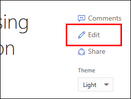
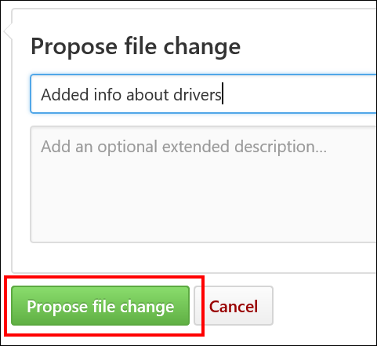

# Editing existing Windows IT professional documentation
You can now make suggestions and update existing, public content with a GitHub account and a simple click of a link.

>**Note** 
>At this time, only the English (en-us) content is available for editing.

**To edit a topic**

1. All contributors who are ***not*** a Microsoft employee must [sign a Microsoft Contribution Licensing Agreement (CLA)](https://cla.microsoft.com/) before contributing to any Microsoft repositories. 
If you've already contributed to Microsoft repositories in the past, congratulations! You've already completed this step.

2. Go to the page on TechNet that you want to update, and then click **Edit**.

    

3. Log into (or sign up for) a GitHub account.
    
    You must have a GitHub account to get to the page that lets you edit a topic.

4. Click the **Pencil** icon (in the red box) to edit the content.

    

5.	Using Markdown language, make your changes to the topic. For info about how to edit content using Markdown, see:
    - **If you're linked to the Microsoft organization in GitHub:** [Windows Open Publishing Guide Home](http://aka.ms/windows-op-guide)
    
    - **If you're external to Microsoft:** [Mastering Markdown](https://guides.github.com/features/mastering-markdown/) 

6.	Make your suggested change, and then click **Preview Changes** to make sure it looks correct.

       

7. When you’re done editing the topic, scroll to the bottom of the page, and then click **Propose file change** to create a fork in your personal GitHub account.

    

    The **Comparing changes** screen appears to see what the changes are between your fork and the original content.

8.	On the **Comparing changes** screen, you’ll see if there are any problems with the file you’re checking in.

    If there are no problems, you’ll see the message, **Able to merge**.

    

9.	Click **Create pull request**.

10.	Enter a title and description to give the approver the appropriate context about what’s in the request.

11.	Scroll to the bottom of the page, making sure that only your changed files are in this pull request. Otherwise, you could overwrite changes from other people.

12.	Click **Create pull request** again to actually submit the pull request.

    The pull request is sent to the writer of the topic and your edits are reviewed. If your request is accepted, updates are published to one of the following places:

    - [Windows 10](https://docs.microsoft.com/windows/windows-10)
    - [Microsoft Edge](https://docs.microsoft.com/microsoft-edge/deploy)    
    - [Surface](https://docs.microsoft.com/surface)
    - [Surface Hub](https://docs.microsoft.com/surface-hub)
    - [HoloLens](https://docs.microsoft.com/hololens)
    - [Microsoft Store](https://docs.microsoft.com/microsoft-store)
    - [Windows 10 for Education](https://docs.microsoft.com/education/windows)
    - [Windows 10 for SMB](https://docs.microsoft.com/windows/smb)
    - [Internet Explorer 11](https://docs.microsoft.com/internet-explorer)
    - [Microsoft Desktop Optimization Pack](https://docs.microsoft.com/microsoft-desktop-optimization-pack)