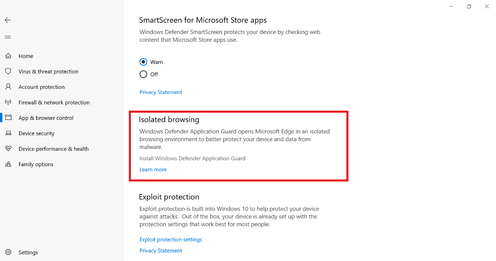
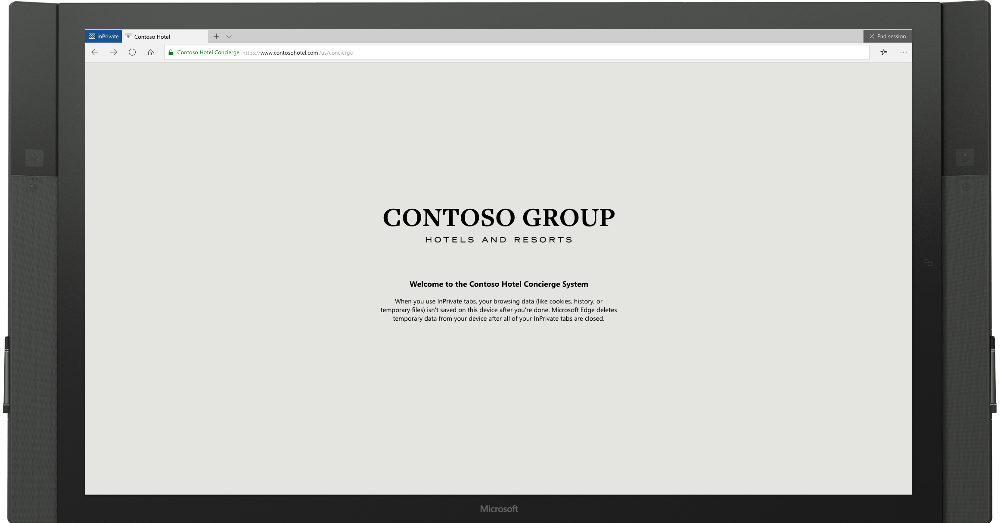
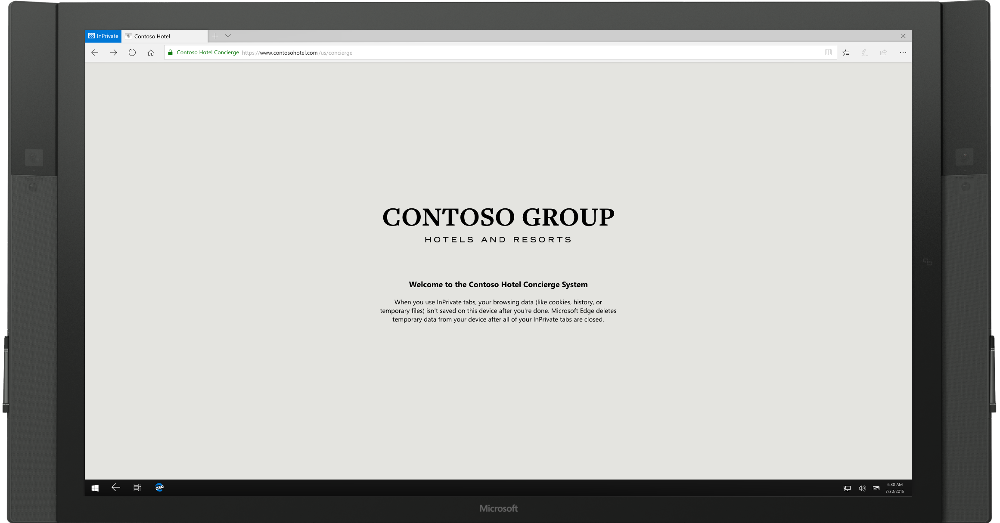
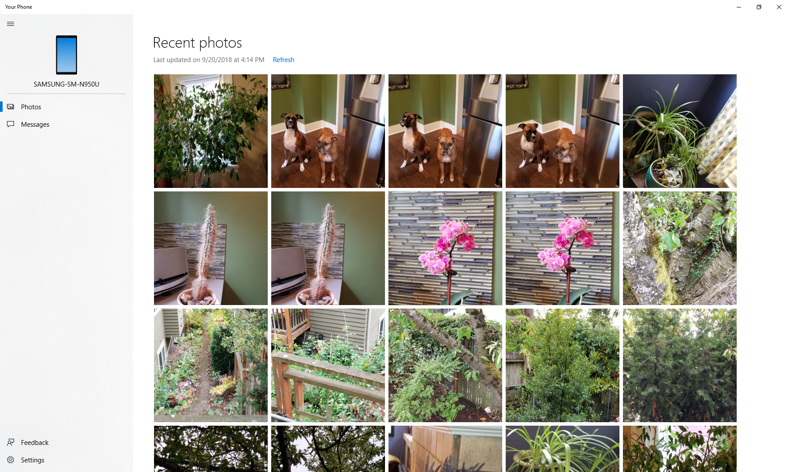

# What's new in Windows 10, version 1809 for IT Pros

>Applies To: Windows 10, version 1809, also known as Windows 10 October 2018 Update

In this article we describe new and updated features of interest to IT Pros for Windows 10, version 1809. This update also contains all features and fixes included in previous cumulative updates to Windows 10, version 1803. 

The following 3-minute video summarizes some of the new features that are available for IT Pros in this release.

&nbsp;

> [!video https://www.youtube.com/embed/hAva4B-wsVA]

## Deployment

### Windows Autopilot self-deploying mode

Windows Autopilot self-deploying mode enables a zero touch device provisioning experience. Simply power on the device, plug it into the Ethernet, and the device is fully configured automatically by Windows Autopilot. 

This self-deploying capability removes the current need to have an end user interact by pressing the “Next” button during the deployment process. 

You can utilize Windows Autopilot self-deploying mode to register the device to an AAD tenant, enroll in your organization’s MDM provider, and provision policies and applications, all with no user authentication or user interaction required. 

To learn more about Autopilot self-deploying mode and to see step-by-step instructions to perform such a deployment, [Windows Autopilot self-deploying mode](https://docs.microsoft.com/windows/deployment/windows-autopilot/self-deploying). 

### SetupDiag

[SetupDiag](/windows/deployment/upgrade/setupdiag.md) version 1.4 is released. SetupDiag is a standalone diagnostic tool that can be used to troubleshoot issues when a Windows 10 upgrade is unsuccessful. 

## Security

We’ve continued to work on the **Current threats** area in  [Virus & threat protection](https://docs.microsoft.com/windows/security/threat-protection/windows-defender-security-center/wdsc-virus-threat-protection), which now displays all threats that need action. You can quickly take action on threats from this screen: 

   

With controlled folder access you can help prevent ransomware and other destructive malware from changing your personal files. In some cases, apps that you normally use might be blocked from making changes to common folders like **Documents** and **Pictures**. We’ve made it easier for you to add apps that were recently blocked so you can keep using your device without turning off the feature altogether.

When an app is blocked, it will appear in a recently blocked apps list, which you can get to by clicking **Manage settings** under the **Ransomware protection** heading. Click **Allow an app through Controlled folder access**. After the prompt, click the **+** button and choose **Recently blocked apps**. Select any of the apps to add them to the allowed list. You can also browse for an app from this page.

We added a new assessment for the Windows time service to the **Device performance & health** section. If we detect that your device’s time is not properly synced with our time servers and the time-syncing service is disabled, we’ll provide the option for you to turn it back on.

We’re continuing to work on how other security apps you’ve installed show up in the **Windows Security** app. There’s a new page called **Security providers** that you can find in the **Settings** section of the app. Click **Manage providers** to see a list of all the other security providers (including antivirus, firewall, and web protection) that are running on your device. Here you can easily open the providers’ apps or get more information on how to resolve issues reported to you through **Windows Security**.

This also means you’ll see more links to other security apps within **Windows Security**. For example, if you open the **Firewall & network protection** section, you’ll see the firewall apps that are running on your device under each firewall type, which includes domain, private, and public networks).

### BitLocker

#### Silent enforcement on fixed drives

Through a Modern Device Management (MDM) policy, BitLocker can be enabled silently for standard Azure Active Directory (AAD) joined users. In Windows 10, version 1803 automatic BitLocker encryption was enabled for standard AAD users, but this still required modern hardware that passed the Hardware Security Test Interface (HSTI). This new functionality enables BitLocker via policy even on devices that don’t pass the HSTI. 

This is an update to the [BitLocker CSP](https://docs.microsoft.com/windows/client-management/mdm/bitlocker-csp), which was introduced in Windows 10, version 1703, and leveraged by Intune and others. 

This feature will soon be enabled on Olympia Corp as an optional feature.

####  Delivering BitLocker policy to AutoPilot devices during OOBE 

You can choose which encryption algorithm to apply automatic BitLocker encryption to capable devices, rather than automatically having those devices encrypt themselves with the default algorithm. This allows the encryption algorithm (and other BitLocker policies that must be applied prior to encryption), to be delivered before automatic BitLocker encryption begins. 

For example, you can choose the XTS-AES 256 encryption algorithm, and have it applied to devices that would normally encrypt themselves automatically with the default XTS-AES 128 algorithm during OOBE.

To achieve this, you must:

1. Configure the [encryption method settings](https://docs.microsoft.com/intune/endpoint-protection-windows-10#windows-encryption) in the Windows 10 Endpoint Protection profile to the desired encryption algorithm. 
2. [Assign the policy](https://docs.microsoft.com/intune/device-profile-assign) to your Autopilot device group. 
    - **IMPORTANT**: The encryption policy must be assigned to **devices** in the group, not users.
1. Enable the Autopilot [Enrollment Status Page](https://docs.microsoft.com/windows/deployment/windows-autopilot/enrollment-status) (ESP) for these devices. This is also important because if the ESP is not enabled, the policy will not apply when the device boots.

### Windows Defender Application Guard Improvements

Windows Defender Application Guard (WDAG) introduced a new user interface inside **Windows Security** in this release. Standalone users can now install and configure their Windows Defender Application Guard settings in Windows Security without needing to change registry key settings. 

Additionally, users who are managed by enterprise policies will be able to check their settings to see what their administrators have configured for their machines to better understand the behavior of Windows Defender Application Guard. This new UI improves the overall experience for users while managing and checking their Windows Defender Application Guard settings. As long as devices meet the minimum requirements, these settings will appear in Windows Security. For more information, see [Windows Defender Application Guard inside Windows Security App](https://techcommunity.microsoft.com/t5/Windows-Insider-Program/test/m-p/214102#M1709).

To try this:

1. Go to**Windows Security** and select **App & browser control**.
2. Under **Isolated browsing**, select **Install Windows Defender Application Guard**, then install and restart the device.
3. Select **Change Application Guard** settings.
4. Configure or check Application Guard settings.

See the following example:

### Windows Security Center

Windows Defender Security Center is now called **Windows Security Center**. 

You can still get to the app in all the usual ways – simply ask Cortana to open Windows Security Center(WSC) or interact with the taskbar icon. WSC lets you manage all your security needs, including **Windows Defender Antivirus** and **Windows Defender Firewall**. 

The WSC service now requires antivirus products to run as a protected process to register. Products that have not yet implemented this will not appear in the Windows Security Center user interface, and Windows Defender Antivirus will remain enabled side-by-side with these products. 

WSC now includes the Fluent Design System elements you know and love. You’ll also notice we’ve adjusted the spacing and padding around the app. It will now dynamically size the categories on the main page if more room is needed for extra info. We also updated the title bar so that it will use your accent color if you have enabled that option in **Color Settings**.

### Windows Defender Firewall now supports Windows Subsystem for Linux (WSL) processes

You can add specific rules for a WSL process in Windows Defender Firewall, just as you would for any Windows process. Also, Windows Defender Firewall now supports notifications for WSL processes. For example, when a Linux tool wants to allow access to a port from the outside (like SSH or a web server like nginx), Windows Defender Firewall will prompt to allow access just like it would for a Windows process when the port starts accepting connections. This was first introduced in [Build 17627](https://docs.microsoft.com/windows/wsl/release-notes#build-17618-skip-ahead).

### Microsoft Edge Group Policies

We introduced new group policies and Modern Device Management settings to manage Microsoft Edge. The new policies include enabling and disabling full-screen mode, printing, favorites bar, and saving history; preventing certificate error overrides; configuring the Home button and startup options; setting the New Tab page and Home button URL, and managing extensions. Learn more about the [new Microsoft Edge policies](https://aka.ms/new-microsoft-edge-group-policies).

### Windows Defender Credential Guard is supported by default on 10S devices that are AAD Joined

Windows Defender Credential Guard is a security service in Windows 10 built to protect Active Directory (AD) domain credentials so that they can't be stolen or misused by malware on a user's machine. It is designed to protect against well-known threats such as Pass-the-Hash and credential harvesting.

Windows Defender Credential Guard has always been an optional feature, but Windows 10-S turns this functionality on by default when the machine has been Azure Active Directory joined. This provides an added level of security when connecting to domain resources not normally present on 10-S devices. Please note that Windows Defender Credential Guard is available only to S-Mode devices or Enterprise and Education Editions. 

### Windows 10 Pro S Mode requires a network connection

A network connection is now required to set up a new device. As a result, we removed the “skip for now” option in the network setup page in Out Of Box Experience (OOBE). 

### Windows Defender ATP

[Windows Defender ATP](https://docs.microsoft.com/windows/security/threat-protection/windows-defender-atp/windows-defender-advanced-threat-protection) has been enhanced with many new capabilities. For more information, see the following topics:

- [Threat analytics](https://docs.microsoft.com/windows/security/threat-protection/windows-defender-atp/threat-analytics) 
Threat Analytics is a set of interactive reports published by the Windows Defender ATP research team as soon as emerging threats and outbreaks are identified. The reports help security operations teams assess impact on their environment and provides recommended actions to contain, increase organizational resilience, and prevent specific threats.

- [Custom detection](https://docs.microsoft.com/windows/security/threat-protection/windows-defender-atp/overview-custom-detections) 
 With custom detections, you can create custom queries to monitor events for any kind of behavior such as suspicious or emerging threats. This can be done by leveraging the power of Advanced hunting through the creation of custom detection rules. 

- [Managed security service provider (MSSP) support](https://docs.microsoft.com/windows/security/threat-protection/windows-defender-atp/mssp-support-windows-defender-advanced-threat-protection) 
Windows Defender ATP adds support for this scenario by providing MSSP integration. 
The integration will allow MSSPs to take the following actions:
Get access to MSSP customer's Windows Defender Security Center portal, fetch email notifications, and fetch alerts through security information and event management (SIEM) tools.

- [Integration with Azure Security Center](https://docs.microsoft.com/windows/security/threat-protection/windows-defender-atp/configure-server-endpoints-windows-defender-advanced-threat-protection#integration-with-azure-security-center) 
Windows Defender ATP integrates with Azure Security Center to provide a comprehensive server protection solution. With this integration Azure Security Center can leverage the power of Windows Defender ATP to provide improved threat detection for Windows Servers.

- [Integration with Microsoft Cloud App Security](https://docs.microsoft.com/windows/security/threat-protection/windows-defender-atp/microsoft-cloud-app-security-integration) 
Microsoft Cloud App Security leverages Windows Defender ATP endpoint signals to allow direct visibility into cloud application usage including the use of unsupported cloud services (shadow IT) from all Windows Defender ATP monitored machines.

- [Onboard Windows Server 2019](https://docs.microsoft.com/windows/security/threat-protection/windows-defender-atp/configure-server-endpoints-windows-defender-advanced-threat-protection#windows-server-version-1803-and-windows-server-2019)  
Windows Defender ATP now adds support for Windows Server 2019. You'll be able to onboard Windows Server 2019 in the same method available for Windows 10 client machines. 

- [Onboard previous versions of Windows](https://docs.microsoft.com/windows/security/threat-protection/windows-defender-atp/onboard-downlevel-windows-defender-advanced-threat-protection) 
Onboard supported versions of Windows machines so that they can send sensor data to the Windows Defender ATP sensor

## Kiosk setup experience

We introduced a simplified assigned access configuration experience in **Settings** that allows device administrators to easily set up a PC as a kiosk or digital sign. A wizard experience walks you through kiosk setup including creating a kiosk account that will automatically sign in when a device starts.

To use this feature, go to **Settings**, search for **assigned access**, and open the **Set up a kiosk** page. 

Microsoft Edge kiosk mode running in single-app assigned access has two kiosk types.

1. **Digital / Interactive signage** that displays a specific website full-screen and runs InPrivate mode.
2. **Public browsing** supports multi-tab browsing and runs InPrivate mode with minimal features available. Users cannot minimize, close, or open new Microsoft Edge windows or customize them using Microsoft Edge Settings. Users can clear browsing data and downloads, and restart Microsoft Edge by clicking **End session**. Administrators can configure Microsoft Edge to restart after a period of inactivity.

Microsoft Edge kiosk mode running in multi-app assigned access has two kiosk types. 

>[!NOTE]
>The following Microsoft Edge kiosk mode types cannot be setup using the new simplified assigned access configuration wizard in Windows 10 Settings.

**Public browsing** supports multi-tab browsing and runs InPrivate mode with minimal features available. In this configuration, Microsoft Edge can be one of many apps available. Users can close and open multiple InPrivate mode windows.

**Normal mode** runs a full version of Microsoft Edge, although some features may not work depending on what apps are configured in assigned access. For example, if the Microsoft Store is not set up, users cannot get books.

Learn more about [Microsoft Edge kiosk mode](https://docs.microsoft.com/microsoft-edge/deploy/microsoft-edge-kiosk-mode-deploy).

## Registry editor improvements

We added a dropdown that displays as you type to help complete the next part of the path. You can also press **Ctrl + Backspace** to delete the last word, and **Ctrl + Delete** to delete the next word.

## Faster sign-in to a Windows 10 shared pc

Do you have shared devices deployed in your work place? **Fast sign-in** enables users to sign in to a shared Windows 10 PC in a flash!

**To enable fast sign-in:**
1. Set up a shared or guest device with Windows 10, version 1809.
2. Set the Policy CSP, and the Authentication and EnableFastFirstSignIn policies to enable fast sign-in.
3. Sign-in to a shared PC with your account. You'll notice the difference!

    

## Web sign-in to Windows 10

Until now, Windows logon only supported the use of identities federated to ADFS or other providers that support the WS-Fed protocol. We are introducing “web sign-in,” a new way of signing into your Windows PC. Web Sign-in enables Windows logon support for non-ADFS federated providers (e.g.SAML).

**To try out web sign-in:**
1. Azure AD Join your Windows 10 PC. (Web sign-in is only supported on Azure AD Joined PCs).
2. Set the Policy CSP, and the Authentication and EnableWebSignIn polices to enable web sign-in. 
3. On the lock screen, select web sign-in under sign-in options.
4. Click the “Sign in” button to continue.

    

## Your Phone app

Android phone users, you can finally stop emailing yourself photos. With Your Phone you get instant access to your Android’s most recent photos on your PC. Drag and drop a photo from your phone onto your PC, then you can copy, edit, or ink on the photo.  Try it out by opening the **Your Phone** app. You’ll receive a text with a link to download an app from Microsoft to your phone. Android 7.0+ devices with ethernet or Wi-Fi on unmetered networks are compatible with the **Your Phone** app. For PCs tied to the China region, **Your Phone** app services will be enabled in the future.

For iPhone users, **Your Phone** app also helps you to link your phone to your PC. Surf the web on your phone, then send the webpage instantly to your computer to continue what you’re doing–-read, watch, or browse-- with all the benefits of a bigger screen. 

The desktop pin takes you directly to the **Your Phone** app for quicker access to your phone’s content. You can also go through the all apps list in Start, or use the Windows key and search for **Your Phone**. 

## Wireless projection experience

One of the things we’ve heard from you is that it’s hard to know when you’re wirelessly projecting and how to disconnect your session when started from file explorer or from an app. In Windows 10, version 1809, you’ll see a control banner at the top of your screen when you’re in a session (just like you see when using remote desktop). The banner keeps you informed of the state of your connection, allows you to quickly disconnect or reconnect to the same sink, and allows you to tune the connection based on what you are doing. This tuning is done via **Settings**, which optimizes the screen-to-screen latency based on one of the three modes:

* Game mode minimizes the screen-to-screen latency to make gaming over a wireless connection possible
* Video mode increases the screen-to-screen latency to ensure the video on the big screen plays back smoothly
* Productivity modes strikes a balance between game mode and video mode; the screen-to screen-latency is responsive enough that typing feels natural, while ensuring videos don’t glitch as often.

## Remote Desktop with Biometrics

Azure Active Directory and Active Directory users using Windows Hello for Business can use biometrics to authenticate to a remote desktop session.

To get started, sign into your device using Windows Hello for Business. Bring up **Remote Desktop Connection** (mstsc.exe), type the name of the computer you want to connect to, and click **Connect**. Windows remembers that you signed using Windows Hello for Business, and automatically selects Windows Hello for Business to authenticate you to your RDP session. You can also click **More choices** to choose alternate credentials. Windows uses facial recognition to authenticate the RDP session to the Windows Server 2016 Hyper-V server. You can continue to use Windows Hello for Business in the remote session, but you must use your PIN.

See the following example:

